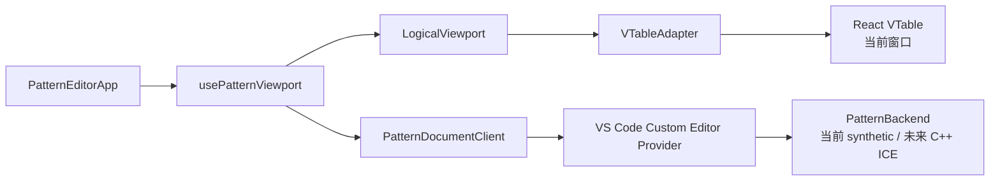
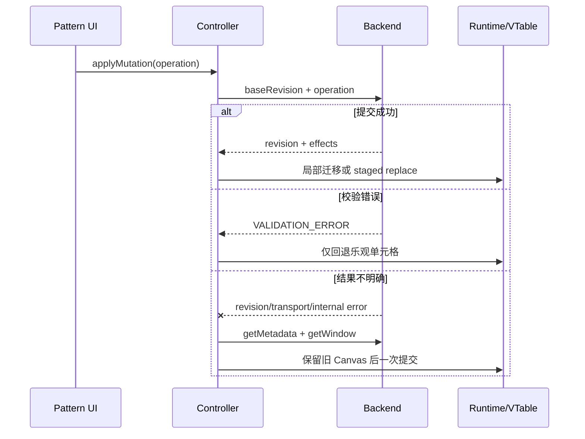

# Pattern VTable v22-lite：Plugin-First 亿级可编辑表格

这是 v22-lite 只读验证版的可编辑延伸，正式入口是 VS Code Custom Editor。
它验证前端只维护小窗口时，Pattern 文档能否完成亿级滚动、事务编辑、历史和
文件生命周期。浏览器入口只用于快速调试和可重复性能采样。

## 当前已经实现

- 0～3 亿 synthetic 逻辑行；默认 1 亿。
- VTable 同时只接收当前最多 1,000 行。
- 原生纵向逻辑 scrollbar＋VTable 横向 scrollbar。
- Go To、连续滚轮、Home/End、PageUp/PageDown。
- 双击编辑 Instruction、Comment 和 Signal。
- Insert、Delete、Update、Paste 共用一个 `applyMutation()`。
- Paste 在一次事务中同时更新已有行并在末尾越界新增。
- Cmd/Ctrl+A、C、V 可在 VS Code Webview 中工作。
- VS Code CustomDocumentEditEvent Undo/Redo。
- dirty、Save、Save As、Backup 和 Revert。
- mutation 后保持用户当前看到的数据并恢复横向位置。
- staged replacement：新窗口准备好前保留旧 Canvas。
- 独立 diagnostics、LogOutputChannel 和 single-flight 自动权威恢复。
- 同一 `.pat` 文档只允许一个 Pattern Editor。

## 当前边界

- 当前 backend 是 TypeScript synthetic 参考实现，不读取真实 UTD/`.pat`。
- synthetic 基础亿级数据不会物化，只保存 piece、插入行和稀疏修改。
- 真实产品由 C++ ICE 实现 `PatternBackend`。
- 当前列固定为 12 个 Signal，不能代表真实最大列数。
- synthetic Undo/Redo 使用参考快照，真实历史上限和内存策略由 C++ 决定。
- 本版不实现 Cycle 重算、Find/Replace、Failure、错误轨、Annotation、
  Sync Marker 或修改角标。
- 不考虑 Timing、Level、Test Table。

## 架构不变量



- 不使用 `DataSource/CachedDataSource`。
- React state 不保存窗口 rows。
- runtime 最多缓存三个窗口，VTable 只渲染其中一个。
- `rowKey` 是会话内 opaque 稳定身份，前端不得解析。
- revision、mutation、Undo/Redo 和保存真源都在 backend。
- adapter 不导入 Pattern 字段或业务 operation。
- 无法确认写结果时不重试 mutation，只读取 metadata 和权威窗口。

## 缓存

默认值：

```text
windowSize = 1000
windowShift = 500
guardRows = 150
cacheWindowLimit = 3
```

缓存 key 是 `revision:windowStartVectorIndex`。相同 key 的 pending 请求复用
Promise；活跃缓存硬上限为前窗、当前窗、后窗三个 entry。结构 mutation 和
批量 Paste 读取新 revision 的权威窗口；单行编辑优先原子迁移重叠缓存，失败
时回退到 staged 权威同步。React state 只接收状态摘要。

## 运行和构建

```bash
pnpm install
pnpm dev
```

浏览器快速调试：

```text
http://127.0.0.1:5173/?rows=0
http://127.0.0.1:5173/?rows=10000
http://127.0.0.1:5173/?rows=100000000
http://127.0.0.1:5173/?rows=100000000&delay=100&perf=1
```

插件调试：

1. 用 VS Code 打开本目录。
2. 按 `F5` 启动 Extension Development Host。
3. 打开 `examples/acceptance` 中的 `.pat`。
4. 必要时执行
   `Reopen With... -> Pattern Editor Lite Editable (.pat)`。

本轮不新增或运行单元测试，构建使用：

```bash
pnpm build:webview
pnpm build:extension
```

完整人工验收：

- [功能、快捷键和生命周期](./MANUAL_TEST_GUIDE.md)
- [1 亿行性能与内存](./docs/acceptance/PERFORMANCE_ACCEPTANCE_GUIDE.md)
- [验收数据](./examples/acceptance/README.md)
- [面向领导和所有后端的改造说明](./docs/pattern-large-data-refactor-overview.md)
- [前端与对接后端技术方案](./docs/v22-lite-markdown-technical-solution.md)

## 推荐阅读顺序

业务迁移按顺序阅读：

1. `src/shared/protocol.ts`：行模型、revision、统一 mutation。
2. `src/extension/patternBackend.ts`：未来 C++ ICE 实现合同。
3. `src/pattern-domain/patternTableBinding.ts`：Pattern 列与通用表格映射。
4. `src/webview/patternReadClient.ts`：Webview 请求桥。
5. `src/webview/usePatternViewport.ts`：业务 controller、恢复和历史。
6. `src/webview/PatternTable.tsx`：Pattern 配置注入公共 Surface。
7. `src/webview/PatternEditorApp.tsx`：插件页面装配。
8. `src/extension/patternEditorProvider.ts`：请求路由和文件生命周期。

稳定核心通常只需理解接口：

9. `src/pattern-large-data-vtable/index.ts`：稳定迁移入口。
10. `src/pattern-large-data-vtable/DocumentTableSurface.tsx`。
11. `src/pattern-large-data-vtable/vtableAdapter.ts`。
12. `src/pattern-large-data-vtable/logicalViewport.ts`。
13. `src/pattern-large-data-vtable/logicalViewportMath.ts`。
14. `src/diagnostics/index.ts`：独立诊断入口。

`src/dev-only`、`examples/acceptance` 和性能探针只用于学习与验证，不迁移到
真实 Pattern Webview。尤其不要从 runtime 内部开始阅读。

## Mutation 与恢复数据流



更多迁移差异见
[CHANGES_FROM_READONLY.md](./CHANGES_FROM_READONLY.md)，未来功能接入点见
[FUTURE_EXTENSION_POINTS.md](./FUTURE_EXTENSION_POINTS.md)。
