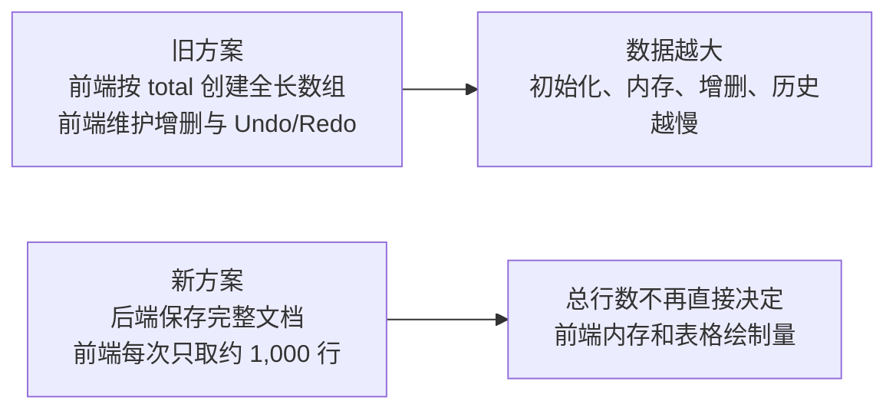
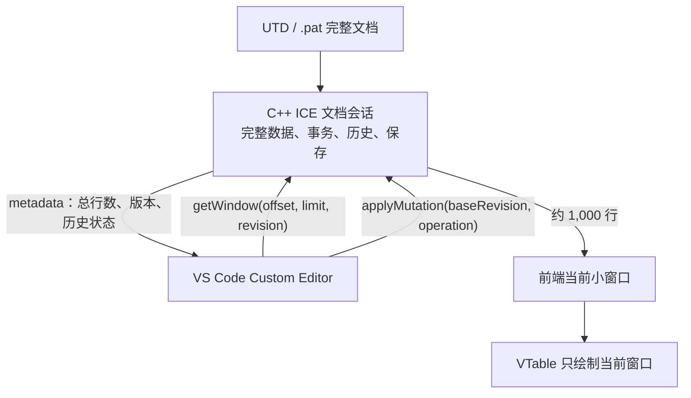
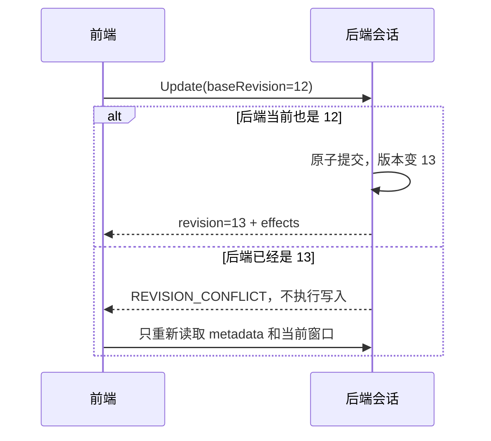
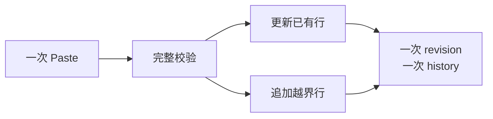
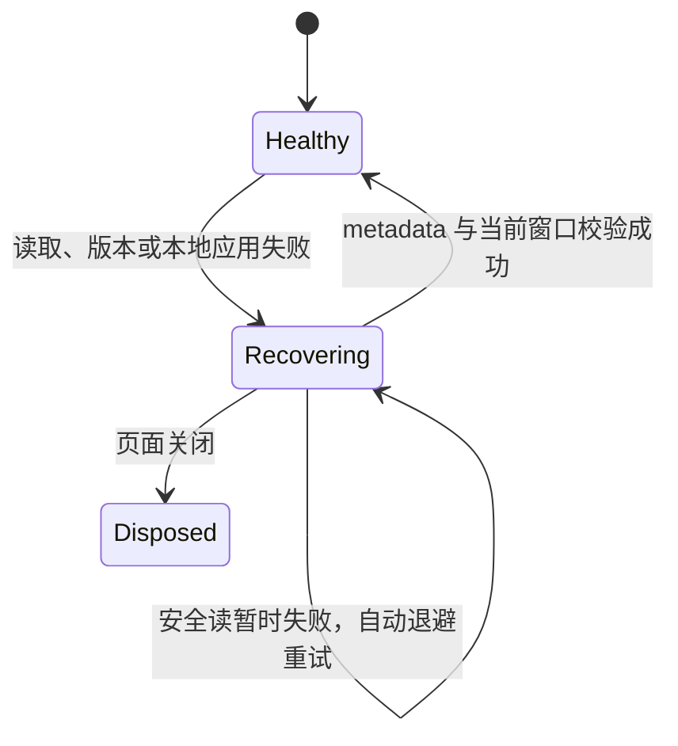

# Pattern 超大数据编辑器改造说明

> 面向：领导、Pattern 后端、平台后端及相关负责人  
> 目的：统一说明为什么要改、前后端如何分工、哪些关键问题必须共同确认  
> 范围：Pattern；Timing 不直接采用本方案

## 1. 先说结论

这次改造不是“把旧表格换成 VTable”，而是把 Pattern 从“前端拥有整份数据”
改成“后端拥有完整文档、前端按需查看和编辑一小段数据”。



方案的核心不是让浏览器“装下 1 亿行”，而是让浏览器始终只处理当前看得见的
小窗口。完整数据、事务、历史、静态 Cycle 计算和保存都由后端文档会话负责。

这为后续工作打下基础：

- Pattern 可以面对千万到亿级 Vector，而不创建同等长度的前端数组。
- Insert、Delete、Update、Paste 统一成为后端事务。
- Undo/Redo 从前端搬到后端，避免两套数据状态。
- 静态 Cycle 由掌握完整数据的后端统一计算。
- 将来接入 C++ ICE 和真实 UTD/`.pat` 时，前端表格架构不需要重写。

## 2. 为什么现有 Datasource 方案不可持续

当前 Pattern 前端已经实现了表格功能，但 Datasource 初始化会根据 `total`
创建一个同等长度的空数组。表格只画可见行，并不代表这个数组不存在。

### 2.1 数据量带来的问题

假设文件有 1 亿行：

```text
文件有 1 亿行
    ↓
前端先创建 1 亿个数组位置
    ↓
再维护行对象、字符串、索引、选择和历史
    ↓
初始化时间和内存都随 total 增长
```

即使数组元素最初为空，JavaScript 数组、后续对象、索引和复制操作仍会产生显著
成本。VTable 的虚拟绘制只能减少屏幕绘制量，不能自动消除前端全长数据结构。

### 2.2 增删改与历史带来的问题

当数据存在前端全长数组中：

- 在前面插入或删除行，后面的逻辑位置都会变化。
- 大数组 `splice`、复制、重新索引和状态更新会越来越慢。
- 前端自己实现 Undo/Redo，需要保存大量变化前后的状态。
- 后端文件与前端状态可能同时成为“真源”，发生错误时难以判断以谁为准。
- 静态 Cycle 可能受到前面任意行、matchLoop 和结构变化影响，当前小区域无法独立算对。

因此，继续优化同一个全长 Datasource 只能延后问题，不能消除问题。

## 3. 新方案如何工作

### 3.1 用“看书”理解小窗口

完整 Pattern 像一本有 1 亿行的书：

- 后端保管整本书。
- 前端只拿当前正在看的几页。
- 用户滚动到别处时，再向后端取另一小段。
- 用户修改内容时，把修改请求交给后端完成。
- 后端返回新的版本号和实际影响范围。



### 3.2 前端实际保留多少数据

默认配置是：

```text
当前窗口：1,000 行
前后相邻窗口：各 1,000 行
活跃缓存硬上限：3 个窗口
VTable 同时绘制：1 个窗口
```

相邻窗口有重叠，因此实际不同逻辑位置通常少于 3,000 行。前端内存主要取决于
窗口大小、列数、单行对象和字符串大小，而不再与 1 亿这个总行数成正比。

## 4. 这次改造为什么不只是 UI 工作

表面上用户仍然看到一张表，实际需要共同处理六类问题：

| 领域 | 必须解决的问题 |
| --- | --- |
| 数据访问 | 后端按位置和数量读取窗口，不能要求前端持有全量 |
| 稳定身份 | 行前面发生增删后，仍能找到原来那条数据 |
| 事务 | Paste 可能同时更新旧行和新增行，必须一次成功或一次失败 |
| 派生计算 | 静态 Cycle 可能受全局结构影响，必须由后端重算 |
| 历史与保存 | Undo/Redo、dirty、Save 基线必须由同一文档会话维护 |
| 错误恢复 | 后端暂时失败或版本不一致时，不能白屏、跳动或重复写入 |

所以本次改造需要前端、C++ ICE 和文档会话一起确认协议与行为，不能只由前端
替换一个组件后结束。

## 5. 前端与后端职责

### 5.1 前端负责

- 显示当前窗口，并提供纵向、横向和键盘导航。
- 根据用户位置请求小窗口。
- 收集编辑、插入、删除和 Paste 意图。
- 把稳定行标识和用户输入交给后端，不自行解释稳定标识。
- 根据后端返回的影响范围保持用户当前看到的数据。
- 显示 dirty、Undo/Redo 可用状态和操作结果。
- 读取失败时保留当前画面，自动重新读取权威状态。

### 5.2 后端文档会话负责

- 保存完整 Pattern 文档，是唯一数据真源。
- 按 `offset + limit` 返回窗口。
- 生成并维护会话内稳定的 `rowKey`。
- 校验请求基于的版本，拒绝过期写入。
- 原子完成 Insert、Delete、Update 和 Paste。
- 计算当前位置显示序号和静态 Cycle。
- 维护 Undo/Redo 历史、dirty 状态和保存基线。
- Save、Revert、Reload 时与 UTD/`.pat` 协作。
- 返回本次事务实际影响了哪些行和单元格。

### 5.3 双方都不应该做的事

- 前端不创建与 `total` 等长的空数组。
- 前端不维护第二套 Undo/Redo 历史。
- 前端不根据 `rowKey` 猜测行位置。
- 后端不要求前端提交完整文档才能修改一个单元格。
- 写操作失败或响应不确定时，前端不自动重发同一事务。

## 6. 关键字段中文解释

以下字段需要前后端共同确认。名称可以在正式 ICE 接口中调整，但含义不能模糊。

| 字段 | 中文含义 | 谁维护 | 重要规则 |
| --- | --- | --- | --- |
| `total` / `totalVectors` | 当前文档总行数 | 后端 | Insert/Delete 后变化 |
| `offset` / `startVectorIndex` | 本次窗口从第几行开始，0 表示第一行 | 前端请求、后端校验 | 不是行身份 |
| `limit` / `vectorCount` | 本次最多读取多少行 | 前端请求 | 不是结束位置 |
| `rowKey` | 当前打开会话中一条数据的稳定身份 | 后端 | 前端只能保存、比较和回传 |
| `displaySeq` / `vectorIndex` | 当前显示位置 | 后端按窗口计算 | 前面增删后可以变化 |
| `cycleText` / `staticCycle` | 表格显示的静态 Cycle | 后端计算 | 前端不做全局推导 |
| `metadata` | 文档摘要 | 后端 | 包含总行数、版本、dirty、历史状态 |
| `revision` | 当前文档版本号 | 后端 | 每次有效事务推进一次 |
| `baseRevision` | 写操作开始时前端认为的版本 | 前端提交 | 与当前版本不同则拒绝写入 |
| `expectedRevision` | 读取窗口期望的版本 | 前端提交 | 防止新旧窗口混在一起 |
| `effects` | 本次事务实际插入、删除或更新的范围 | 后端 | 前端据此保持当前视图 |
| `isDirty` | 当前内容是否与保存基线不同 | 后端 | Save 成功后重新计算 |
| `canUndo` | 当前是否可以撤销 | 后端 | 前端只控制按钮状态 |
| `canRedo` | 当前是否可以重做 | 后端 | 新写入通常清空 Redo 分支 |

### 6.1 `rowKey` 与显示位置为什么必须分开

假设原来第 100 行前面插入 5 行：

```text
同一条业务数据：
修改前显示为第 100 行
修改后显示为第 105 行
rowKey 保持不变
```

显示位置发生变化是正确结果。若把位置当身份，编辑、选中、删除和 Undo 都可能
指向错误数据。

### 6.2 `revision` 为什么必须存在



版本校验能阻止旧窗口上的操作覆盖新数据。即使产品限定同一文档只有一个编辑器，
Undo、Redo、Revert、超时响应和异步请求仍会产生新旧版本交错。

## 7. 重要业务场景

### 7.1 打开 1 亿行文档

1. 前端读取 metadata，知道总行数和版本。
2. 前端只请求首个小窗口。
3. 后端不把完整文档序列化给 Webview。
4. VTable 只绘制当前窗口。

### 7.2 滚动到很远的位置

1. 原生纵向滚动条表示整个逻辑文档。
2. 前端换算出目标位置。
3. 从缓存或后端取得目标窗口。
4. 新窗口准备完成后一次替换，不先清空旧表格。

### 7.3 当前显示区域前发生 Insert/Delete

用户首行正在看原来的第 100 行：

- 前面插入 5 行：同一条数据变为第 105 行，画面跟随它向下 5 行。
- 前面删除 5 行：同一条数据变为第 95 行，画面跟随它向上 5 行。
- 当前看到的数据被删除：显示删除位置之后的数据。
- 删除后总数据不足一屏：向前补齐，尽量显示完整一屏。

前端不要求后端返回“应该跳到哪一行”的主观字段。后端返回客观 `effects`，
前端根据修改前看到的位置和新总行数完成显示位置调整。

### 7.4 Paste 同时更新和新增

从倒数几行开始粘贴时，粘贴矩阵可能先覆盖已有行，随后超过文件末尾。



它必须是一个事务：

- 全部合法才提交。
- 任一单元格非法则全部不修改。
- 一次 Undo 同时恢复旧单元格并删除新增行。
- 不能由前端依次调用 Update 和 Insert，否则中间失败会产生半完成状态。

### 7.5 静态 Cycle 重算

静态 Cycle 可能受以下信息影响：

- 前面 Vector 的 Cycle 累积。
- Insert/Delete 造成的整体位置变化。
- matchLoop 静态结构。
- 一次 Paste 带来的多行变化。

前端只拥有当前小窗口，无法可靠知道窗口外的依赖，因此静态 Cycle 必须由后端
计算并在窗口响应中返回 `cycleText/staticCycle`。动态运行态 Cycle 属于后续
独立业务设计，不由本次前端窗口机制推导。

### 7.6 Undo/Redo 和 Save

- 每次有效 mutation 形成一个后端历史事务。
- VS Code 的 Undo/Redo 命令调用后端会话历史。
- 前端只重新读取后端返回的新版本窗口。
- Save 成功后后端更新保存基线。
- Save 后是否仍能 Undo、Undo 后是否 dirty，由后端历史与保存基线共同决定。

## 8. Corner Case 矩阵

| 场景 | 预期行为 | 主要责任方 |
| --- | --- | --- |
| 在当前区域前插入 | 保持原来看到的那条数据，显示位置增加 | 后端 effects＋前端位置调整 |
| 在当前区域前删除 | 保持原来看到的那条数据，显示位置减少 | 后端 effects＋前端位置调整 |
| 删除当前可见数据 | 落到删除区起点附近，不白屏 | 双方 |
| 删除后不足一屏 | 从更前位置请求，尽量补满一屏 | 前端 |
| Paste 更新并追加 | 一个事务、一个版本、一次 Undo | 后端 |
| Paste 中一个值非法 | 整次拒绝，零副作用 | 后端 |
| 静态 Cycle 大范围变化 | 后端按完整依赖重算，前端不猜 | 后端 |
| mutation 后立即 Undo | 完整恢复事务前状态 | 后端 |
| Save 后 Undo/Redo | dirty 与历史状态准确 | 后端 |
| 读取旧版本窗口迟到 | 丢弃，不能覆盖新画面 | 前端 |
| revision 冲突 | 不执行旧写入，前端自动重新读取 | 双方 |
| 后端暂时不可用 | 保留当前画面、暂停写入、自动重试读取 | 前端 |
| 写响应不确定 | 不自动重发写入，只查询权威状态 | 前端＋后端 |
| 滚到最后一行 | 最后一行完整可见 | 前端 |
| 页面关闭仍有请求 | 忽略迟到结果并停止重试 | 前端 |
| 外部直接修改源文件 | 不自动监听；用户主动 Revert/Reload | 产品约束 |

## 9. 自动恢复为什么必须存在

窗口读取和事务提交跨越 Webview、Extension Host、ICE 和 C++ 会话。即使没有
多人同时编辑，也可能遇到超时、迟到响应、Undo/Redo 改变版本或暂时不可用。

恢复策略是：



- 保留当前 Canvas 和纵横位置，不显示空表或遮挡式 loading。
- 恢复期间暂停新的写入和 Undo/Redo。
- 只自动重试 metadata/window 等安全读。
- Insert/Delete/Update/Paste 和 Undo/Redo 绝不自动重复执行。
- 多个同时发生的错误共用一次恢复过程。
- 持续失败时采用 0.5 秒、1 秒、2 秒、5 秒、之后每 5 秒重试。
- 错误记录到 VS Code `Pattern Editor Lite` 输出通道，不记录行或单元格内容。

这能覆盖大部分日常网络、进程通信和版本错误，但不等于解决 C++ 进程崩溃后的
事务状态丢失。若要进一步保证“写请求超时后到底有没有提交”，后端未来需要
`mutationId`、事务状态查询和持久化保证。

## 10. Pattern 与 Timing 的关系

Pattern 和 Timing 不采用同一套完整方案。

Pattern 面对亿级 Vector，需要压缩纵向滚动、重叠窗口和三窗口缓存。Timing
预计约 10 万行，直接套用这套 runtime 会增加协议、调试和维护成本。

Timing 可以复用：

- VS Code Custom Editor 生命周期骨架。
- diagnostics 模块。
- Webview 请求配对方式。
- VTable Surface、基础 adapter 和 Clipboard 处理。
- “后端真源＋版本校验”的设计原则。

Timing 不默认复用：

- Pattern 的亿级压缩滚动。
- Pattern 三窗口缓存。
- Pattern 的 rowKey/displaySeq/Cycle 协议。
- Pattern 的 Paste 越界新增和结构变更位置调整。

Timing 表头下方的搜索行是固定 UI 行，不是业务数据。本次只记录参考，不在
Pattern 中实现。


## 11. 改造价值

| 旧问题 | 新方案带来的变化 |
| --- | --- |
| total 越大，前端初始化越慢 | 前端只初始化当前小窗口 |
| 前端内存与完整文档规模绑定 | 内存主要与窗口和单行大小绑定 |
| 大数组增删和重新索引成本高 | 结构变化由后端文档结构完成 |
| 前端 Undo/Redo 占用内存且易双真源 | 历史由后端会话统一维护 |
| 静态 Cycle 在局部窗口无法算全 | 后端基于完整文档计算 |
| 错误时可能重载、跳动或重复操作 | 保留画面，只重试安全读 |
| 将来接 C++ 需要重写前端 | 替换 Backend 实现和业务字段即可 |

## 12. 需要共同确认的决策

1. C++ 文档会话是否能按 `offset + limit + expectedRevision` 读取窗口。
2. `rowKey` 的会话稳定范围、长度和生成方式由后端决定，前端不解析。
3. Insert/Delete/Update/Paste 是否都通过一个原子 mutation 入口。
4. Paste 的最大行数、单元格数、只读列和非法值规则。
5. 静态 Cycle 的依赖、重算范围和返回字段。
6. Undo/Redo 历史条数或内存预算，以及 Save 基线语义。
7. 写请求超时后的 `mutationId` 和事务状态查询是否进入 C++ 后续计划。
8. Revert/Reload 是否明确放弃未保存修改，且不自动监听外部文件变化。
9. 最大真实 Signal 列数和单行 payload，用于后续真实环境测量。

## 13. 建议宣讲顺序

1. 先演示现有全长 Datasource 为什么随 `total` 增长。
2. 用“整本书与当前几页”解释前端小窗口。
3. 展示前端、C++ ICE 和文件的职责图。
4. 用 Insert/Delete、Paste 和静态 Cycle 说明它不是简单 UI 改造。
5. 解释 revision、rowKey、Undo/Redo 和保存基线。
6. 最后说明自动恢复、剩余风险和需要共同确认的接口决策。

更详细的接口和时序见
[Pattern 大数据 VTable 技术方案](./v22-lite-markdown-technical-solution.md)。
