# Pattern 亿级可编辑表格技术方案

> 文档定位：技术方案宣讲稿与前后端对接依据  
> 适用范围：VS Code Custom Editor、Webview、VTable、C++ ICE Server  
> 方案目标：支持亿级 Vector 的滚动、编辑、Paste、Undo/Redo、Save 和静态 Cycle

---

## 文档说明

本文区分三种状态，后文不混用：

| 名称 | 含义 |
| --- | --- |
| **现有方案** | 使用 `CachedDataSource`，同时在前端维护与总行数相关的数据结构 |
| **v22-lite 参考实现** | GitHub 中用于验证窗口化滚动、事务编辑和 VS Code 生命周期的 TypeScript synthetic 实现 |
| **生产目标方案** | 由 C++ ICE Server 管理真实 Pattern、修改历史、静态 Cycle 和文件读写 |

v22-lite 已验证的是前端窗口化架构，不代表真实 UTD/`.pat` 文件、C++ ICE 传输、最大 Signal 列数和生产历史存储已经完成。

---

## 方案结论

本方案的核心结论是：

> **ICE Server 管理完整、可编辑的 Pattern；VS Code Extension 负责请求转发和编辑器生命周期；Webview 只保留当前位置附近的少量窗口；VTable 只接收当前窗口。**

无论 Pattern 是一亿还是三亿条 Vector，前端都不创建与总行数等长的行数组。总行数只用于计算逻辑位置和全局滚动范围。

---

# 1. 现有方案如何工作，以及为什么需要重构

## 1.1 现有方案的数据链路

现有方案可以简化为：

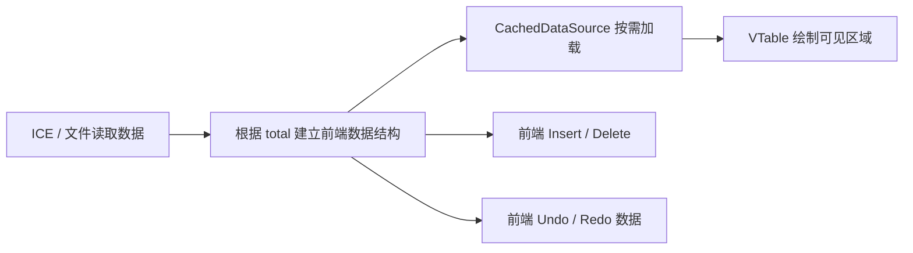

`CachedDataSource` 本身不是问题。它适合异步加载、分页、只读或中等规模数据。

问题在于当前组合方式：

> **`CachedDataSource` + 与总行数相关的前端数据结构 + 前端结构编辑和历史数据。**

当 Pattern 达到亿级时，VTable 虽然只绘制屏幕附近的单元格，但上游数据结构的初始化、修改和历史维护仍然由前端承担。

## 1.2 VTable 虚拟绘制不等于完整数据虚拟化

VTable 的虚拟绘制解决的是：

- 屏幕附近需要绘制多少单元格；
- Canvas 当前需要处理多少可见内容；
- 滚动时是否重复绘制全部数据。？？？

它不能自动消除：

- 与 `totalVectors` 相关的前端数组或索引；
- 大数组中间 Insert/Delete 的移动成本；
- Undo/Redo 保存的数据；
- 静态 Cycle 对完整 Pattern 上下文的依赖。

因此，VTable 绘制得少，不代表前端只保存了少量数据。

## 1.3 按总行数创建超长数组的问题

如果根据 `totalVectors` 创建同等长度的前端数组，当 `totalVectors = 100,000,000` 时，即使真实行尚未加载，前端也已经承担一亿个位置的初始化和维护成本。

主要影响包括：

- 首次打开时间；
- Webview 内存；
- `CachedDataSource` 初始化及其上游索引维护；
- Reload 时的重复初始化；
- 多个 Pattern 页面同时打开时的总内存；
- 垃圾回收期间的页面停顿。

## 1.4 大数组中间 Insert/Delete 的问题

普通数组在中间 Insert/Delete 时，需要调整后面大量位置。数据越大，操作时间、临时内存和主线程卡顿风险越高。

对于 Pattern，结构修改还会同时影响：

- 后续 Vector 的显示位置；
- 当前页面应读取的范围；
- 静态 Cycle；
- Undo/Redo 数据；
- 已缓存窗口；
- 修改前已经发出、但尚未返回的读取请求。

因此，亿级 Pattern 的结构修改不能继续依赖前端超长数组完成。

## 1.5 Undo/Redo 不能保存完整 Pattern 快照

一次单元格修改和一次大范围 Paste 的数据量完全不同。只规定“最多保存 100 条历史”，不能准确控制内存。

生产方案中：

- VS Code 记录用户操作的先后顺序；
- ICE Server 保存真正用于撤销和重做的数据变化；
- Webview 不保存完整历史；
- 每条历史只保存恢复操作所需的记录，不保存完整 Pattern 快照。

## 1.6 静态 Cycle 不能由局部窗口完整计算

静态 Cycle 可能依赖当前窗口以外的 Instruction。Webview 只有当前位置附近的数据，无法保证计算上下文完整。

如果由前端按窗口计算，可能出现：

- 窗口边界缺少前置 Instruction，导致 Cycle 起点错误；
- Insert/Delete 后无法确定需要向前或向后补读多少数据；
- 两个重叠窗口使用了不同上下文，得到不同结果；
- Undo/Redo 或 Reload 后，页面显示的 Cycle 与 ICE Server 当前版本不一致。？？？

因此：

> **静态 Cycle 必须由 ICE Server 根据完整 Pattern 或完整依赖摘要计算，Webview 只显示 `cycleText`。**

## 1.7 Webview 或 Extension 内存超限会发生什么

Webview 和 Extension Host 运行在不同上下文中，不能把某台开发机的测试结果写成固定内存上限。实际可用内存会受到以下因素影响：

- VS Code、Electron 和 Node.js 版本；
- 操作系统和机器内存；
- 其他扩展和页面的占用；
- 同时打开的 Pattern 页面数量；
- Signal 列数、字符串长度和 Canvas 资源；
- 是否存在未释放的 listener、Promise、缓存或历史对象。

内存压力通常不是突然发生，而是逐步恶化：

| 阶段 | Webview 可能表现 | Extension Host 可能表现 |
| --- | --- | --- |
| 内存持续增长 | GC 变频繁，滚动、编辑和绘制开始卡顿 | 请求转发、序列化和事件处理变慢 |
| 接近运行时可用上限 | 长时间无响应、白屏、Webview 内容被重新加载或崩溃 | V8 花更多时间回收内存，Extension Host 无响应 |
| 无法继续分配内存 | 当前页面状态可能丢失，未保存画面无法继续使用 | Extension Host 可能退出或被 VS Code 重启，未完成请求中断 |
| 系统整体内存不足 | VS Code 和其他应用都可能明显卡顿 | 进程可能被操作系统终止 |

内存超限后的影响不只是一张表变慢：

- Webview 中尚未提交的输入可能丢失；
- Extension Host 中正在执行的请求可能中断；
- 同一 Extension Host 中的其他扩展也可能受到影响；
- 如果当前不支持 Hot Exit Backup，异常退出时未保存修改可能丢失。

本方案不依赖“把内存上限调大”解决问题，而是从结构上限制前端数据量：

- VTable 最多接收当前一页；
- Webview 最多缓存三个窗口；
- React state 不保存窗口 rows；
- Extension 不长期保存 Pattern 行；
- 完整 Pattern、历史和静态 Cycle 由 ICE Server 管理。

---

# 2. 新方案总体架构

## 2.1 一句话说明

> ICE Server 保存完整文档和所有已提交修改；Webview 只读取当前位置附近的小窗口，VTable 只显示当前窗口。

## 2.2 总体架构

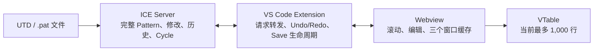

Webview 不直接访问 ICE Server。请求和响应都经过 Extension：

```text
Webview ⇄ VS Code Extension ⇄ ICE Client ⇄ ICE Server
```

## 2.3 各层职责

| 能力 | Webview | VS Code Extension | ICE Server |
| --- | --- | --- | --- |
| 绘制表格、焦点和选区 | 负责 | 不负责 | 不负责 |
| 全局滚动位置换算 | 负责 | 不负责 | 不负责 |
| 缓存前/当前/后三个窗口 | 负责 | 不负责 | 不负责 |
| 保存完整 Pattern | 不保存 | 不保存完整行数组 | 负责 |
| 生成和查找 `rowKey` | 不生成、不解析 | 原样转发 | 负责 |
| 计算静态 Cycle | 只显示 | 原样转发 | 负责 |
| 收集 Insert/Delete/Update/Paste | 负责 | 转发 | 校验并整笔执行 |
| Undo/Redo | 刷新结果窗口 | 接收 VS Code 命令 | 执行真实撤销/重做 |
| Save/Save As | 不直接写文件 | 处理 Custom Editor 生命周期 | 写入 Pattern 文件 |
| Reload | 清理页面状态并刷新 | 接收 VS Code 命令 | 丢弃未保存状态并重读文件 |
| 错误日志 | 上报安全上下文 | 补充请求上下文并写日志 | 返回明确错误码 |

## 2.4 v22-lite 参考实现与生产目标的边界

| 能力 | v22-lite 参考实现 | 生产目标方案 |
| --- | --- | --- |
| 数据来源 | TypeScript synthetic backend | 真实 C++ ICE / UTD / `.pat` |
| 亿级数据 | 使用 piece 和稀疏修改验证逻辑行 | 使用生产级索引和编辑会话 |
| 前端窗口 | 已实现 | 沿用 |
| 三窗口缓存 | 已实现 | 沿用并按真实列数验收 |
| `CachedDataSource` | 新方案不使用 | 不使用它表示完整 Pattern |
| Mutation | 已实现统一入口 | ICE Server 事务执行 |
| `mutationId` | 尚未实现 | 必须补充 |
| Instruction Search | 尚未实现 | ICE Server 全文搜索 |
| Cycle 重算 | 尚未实现 | ICE Server 计算 |
| Save/Reload | synthetic 文件生命周期 | ICE Server 真实文件会话 |
| Hot Exit Backup | 不支持 | 当前方案仍不支持，产品需接受未保存数据风险 |

当前 `patternEditorProvider.ts` 在参考入口中仍会先读取示例文件 bytes，Save 时也会调用 synthetic backend 的 `serialize()`。这只用于验证 Custom Editor 生命周期，不能作为生产版已经实现真实亿级文件分页打开和保存的证明。

## 2.5 架构不变量

后续实现和评审必须保证：

1. React state 不保存窗口 rows。
2. VTable 同时只接收当前窗口 records。
3. 前端活跃缓存不超过三个窗口。
4. Insert/Delete/Update/Paste 由 ICE Server 校验并提交。
5. `revision`、Undo/Redo、静态 Cycle 和文件内容以 ICE Server 为准。
6. Webview 不解析 `rowKey`。
7. 无法确认写请求是否成功时，不直接重复发送同一修改。
8. 新窗口准备完成前保留旧 Canvas，避免白屏。

---

# 3. 小窗口读取与三页缓存

## 3.1 文档基本信息

Webview 首先只读取文档元数据：

```ts
type PatternMetadata = {
  totalVectors: number;
  revision: number;
};
```

| 字段 | 含义 |
| --- | --- |
| `totalVectors` | 当前 Pattern 的 Vector 总数 |
| `revision` | 当前打开文档的数据版本；有效修改、Undo 或 Redo 成功后递增 |

`totalVectors` 用于计算逻辑位置和滚动范围，不用于创建同等长度的前端数组。

## 3.2 读取一页数据

```ts
type PatternWindowRequest = {
  startVectorIndex: number;
  vectorCount: number;
  expectedRevision: number;
};

type PatternWindowResponse = {
  totalVectors: number;
  revision: number;
  startVectorIndex: number;
  rows: PatternRenderRow[];
};
```

读取流程：

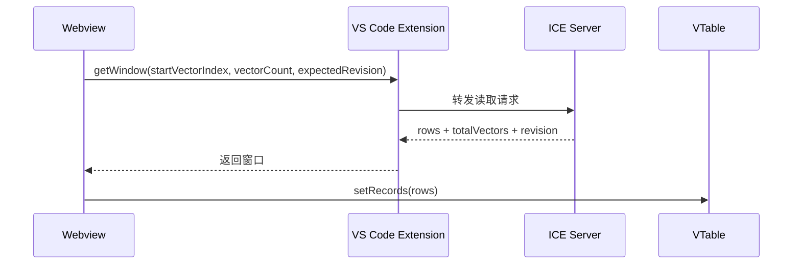

Extension 不解析 Pattern 行，也不长期保留窗口数据。它只负责把请求转给对应文档会话，并将响应返回给原请求。

## 3.3 打开文件时只读取第一页

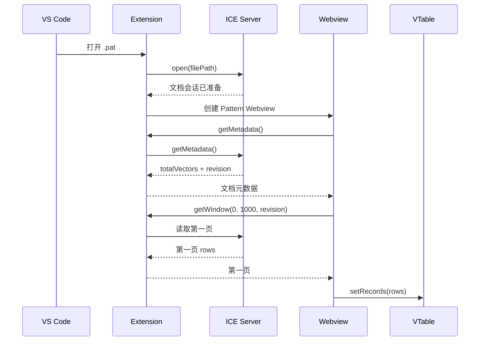

这个流程不会创建 `totalVectors` 长度的数组。空文件返回 `totalVectors = 0` 和空窗口，用户仍可通过 Insert 创建第一批数据。

## 3.4 三窗口参数

v22-lite 当前参考参数：

```text
windowSize = 1000
windowShift = 500
guardRows = 150
cacheWindowLimit = 3
```

| 参数 | 含义 |
| --- | --- |
| `windowSize` | 一个窗口最多读取 1,000 行 |
| `windowShift` | 相邻窗口起点移动 500 行 |
| `guardRows` | 距窗口边缘还有 150 行时提前准备下一窗口 |
| `cacheWindowLimit` | 最多保留前一窗、当前窗、后一窗 |

相邻窗口有 500 行重叠：

```text
窗口 A：0 ───────────────────────── 999
窗口 B：              500 ───────────────────────── 1499
窗口 C：                           1000 ─────────────────────── 1999

          └──── 500 行重叠 ────┘
```

重叠的目的不是重复显示，而是让用户接近窗口边缘时，下一窗口已经包含当前可见数据，从而降低 `setRecords()` 后的位置变化。

## 3.5 缓存 key 和请求去重

缓存 key：

```text
revision:startVectorIndex
```

例如：

```text
12:49500
```

表示 revision 12、从第 49,500 条 Vector 开始的窗口。

规则：

- 同一个 key 已经完成读取时，直接使用缓存；
- 同一个 key 正在读取时，后续调用共享同一个 Promise；
- 缓存超过三个窗口后，移除最早且不再需要的窗口；
- Insert/Delete/Paste 产生新 revision 后，旧 revision 的窗口不能继续复用；
- 单行 Update 可以将重叠缓存中的同一 `rowKey` 迁移到新 revision；迁移失败时重新读取当前窗口。

## 3.6 防止旧请求覆盖新页面

每次窗口切换都有内部 `switchId`。响应返回时至少检查：

1. 当前页面是否已经销毁；
2. 响应是否仍属于最后一次窗口切换；
3. 响应的 `revision` 是否等于当前期望版本；
4. `startVectorIndex` 和返回行数是否符合原请求。

例如：

```text
用户先跳到第 10,000 行    → 发出请求 A
用户立即跳到第 100,000,000 行 → 发出请求 B
请求 B 先返回并显示
请求 A 后返回             → 因 switchId 已过期而丢弃
```

旧请求可以完成网络返回，但不能覆盖当前页面。

## 3.7 隐藏页面与缓存

当前使用 `retainContextWhenHidden: true`。用户在多个 Pattern 页面之间切换时，每个隐藏页面可以保留：

- VTable 实例；
- 当前滚动位置；
- 选区；
- 最多三个窗口缓存。

它避免反复重建，但会使内存随打开页面数量增加。因此必须用真实 Signal 列数测试多个页面，而不能只测试单页面。

---

# 4. 亿级滚动如何实现

## 4.1 不是三根可见滚动条

实现中有三个与纵向位置有关的概念，但页面上不是三根可见纵向滚动条。

准确说法是：

> **一根全局纵向滚动条、一套隐藏的页内纵向位置，再加一根 VTable 横向滚动条。**

```text
┌──────────────────────── Webview ────────────────────────┐
│                                                        │
│  ┌──────────── VTable：当前最多 1,000 行 ────────────┐ │
│  │ 表头                                               │ │
│  │                                                    │ │  ← 全局纵向滚动条
│  │ 当前窗口 records                                   │█│     用户可见
│  │                                                    │█│     代表完整 Pattern
│  │ VTable 页内 scrollTop                              │█│
│  │ 位置存在，但 VTable 自带纵向滚动条不显示           │ │
│  └────────────────────────────────────────────────────┘ │
│  ←──────────── VTable 横向滚动条，可见 ─────────────→  │
└────────────────────────────────────────────────────────┘

logicalScrollTopPx：
JavaScript 中记录的完整 Pattern 理论位置，不是页面上的滚动条。
```

## 4.2 三种纵向位置

| 名称 | 是否可见 | 作用 |
| --- | --- | --- |
| `scrollbarScrollTopPx` | 用户通过全局纵向滚动条操作 | 有限 DOM 高度中的实际滚动距离 |
| `logicalScrollTopPx` | 不可见，是 JavaScript 数值 | 表示完整 Pattern 中的理论位置 |
| `localScrollTopPx` | VTable 内部位置，滚动条隐藏 | 表示目标位置在当前窗口 records 内的偏移 |

三者关系：

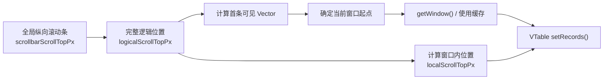

## 4.3 为什么需要全局逻辑位置

如果每行高度为 28px，一亿行的理论高度约为：

```text
100,000,000 × 28px = 2,800,000,000px
```

浏览器不能可靠地用一个数十亿像素高的 DOM 元素完成滚动。v22-lite 将原生 spacer 高度限制在约：

```text
16,000,000px
```

再把有限的滚动距离按比例映射到完整逻辑位置。

## 4.4 纵向位置映射的三种数据规模

这三种模式是同一套滚动算法在不同数据规模下的表现，不是三套滚动条。

| 模式 | 使用条件 | 换算方式 |
| --- | --- | --- |
| `single-window` | 总数据不超过一个窗口 | 不切换 records，直接使用当前窗口 |
| `direct-pixel` | 完整逻辑高度不超过安全 DOM 高度 | 原生像素位置与逻辑像素位置基本一致 |
| `compressed` | 完整逻辑高度超过安全 DOM 高度 | 将完整逻辑位置按比例压缩到有限 spacer 高度 |

ICE Server 不需要知道当前使用哪种模式。它始终只接收：

```text
getWindow(startVectorIndex, vectorCount, expectedRevision)
```

## 4.5 一亿行定位示例

假设：

```text
总行数：100,000,000
行高：28px
完整理论高度：2,800,000,000px
DOM spacer 高度：约 16,000,000px
窗口大小：1,000 行
```

用户拖动全局纵向滚动条，定位到第 50,000,000 行：

```text
全局纵向滚动条位置
        ↓ 按比例换算
logicalScrollTopPx ≈ 50,000,000 × 28px
        ↓
首条可见 Vector ≈ 50,000,000
        ↓
计算窗口起点，例如 49,999,500
        ↓
读取 49,999,500 ～ 50,000,499
        ↓
目标行位于窗口中的第 500 行
        ↓
localScrollTopPx ≈ 500 × 28px = 14,000px
```

VTable 始终只知道当前 1,000 行，不知道完整数据有一亿行。

## 4.6 鼠标、键盘和 Go To 如何保持一致

### 拖动全局纵向滚动条

```text
outer scroll → logicalScrollTopPx → 当前窗口 → localScrollTopPx
```

### 鼠标滚轮

Webview 拦截纵向滚轮，将 `deltaY` 加到 `logicalScrollTopPx`，再更新全局滚动条和当前窗口。

### 键盘方向键

方向键移动选区由 VTable 处理。当选区越过当前可见边缘，VTable 的页内位置发生变化。adapter 监听 VTable 公开的 `scroll` 事件，将页内位置反算成全局逻辑位置：

```text
当前窗口起点 × 行高 + VTable scrollTop
        ↓
新的 logicalScrollTopPx
        ↓
同步全局纵向滚动条
```

### Home、End、PageUp、PageDown

这些按键直接修改 `logicalScrollTopPx`，然后复用同一套窗口切换流程。

### Go To

Go To 将目标 `vectorIndex` 换算为逻辑像素位置，不依赖 VTable 原生亿级 `scrollTo`。

## 4.7 横向滚动

横向滚动完全由 VTable 管理，不参与亿级纵向压缩。

窗口切换、结构修改、Undo/Redo 和 Reload 后，Webview 会恢复原来的 `horizontalScrollLeftPx`，避免用户在大量 Signal 列之间横向跳回开头。

---

# 5. 行身份、逻辑位置、revision 和静态 Cycle

## 5.1 `rowKey` 和 `vectorIndex` 不能互相替代

```ts
type PatternRenderRow = {
  rowKey: string;
  vectorIndex: number;
  cycleText: string;
  instruction: string;
  comment: string;
  signalValues: Record<string, string>;
};
```

| 字段 | 含义 |
| --- | --- |
| `rowKey` | 当前文档会话中，这条数据的稳定身份 |
| `vectorIndex` | 这条数据当前排在第几个位置，0-based |

例如，在某条数据前插入五行：

- 该数据的 `rowKey` 不变；
- 该数据的 `vectorIndex` 增加五。

因此：

> `rowKey` 回答“是哪一条数据”，`vectorIndex` 回答“现在排在哪里”。

## 5.2 `rowKey` 规则

生产 ICE Server 建议保证：

- 原始行根据不可变源片段身份和片段内位置生成；
- 新增行使用会话内单调递增 ID 或唯一 ID；
- Insert/Delete 不改变仍然存在的行的 `rowKey`；
- ICE Server 维护 `rowKey` 到当前数据位置的索引；
- Webview 只能比较和回传，不解析其格式；
- `rowKey` 只要求在当前打开文档会话内稳定。

Reload 或重新打开文件后允许重新生成 `rowKey`，因此必须清除旧选区和旧窗口缓存。

## 5.3 revision 解决版本混用

读取请求携带：

```text
expectedRevision
```

修改请求携带：

```text
baseRevision
```

正常修改满足：

```text
baseRevision == ICE Server 执行前 revision
新 revision == previousRevision + 1
```

revision 的作用是防止：

- 旧窗口和新窗口混在一起；
- 修改基于过期数据执行；
- Undo/Redo 后继续使用旧缓存；
- Reload 后旧请求覆盖新会话。

如果读取版本不一致，ICE Server 返回 `REVISION_CONFLICT`，Webview 重新读取最新元数据和当前窗口。

## 5.4 静态 Cycle 的版本要求

ICE Server 是静态 Cycle 的唯一计算者。以下操作完成后，新 revision 返回的窗口必须包含对应版本的 `cycleText`：

- Insert/Delete；
- 影响 Cycle 的单元格修改；
- Paste；
- Undo/Redo；
- Reload。

Webview 不推测哪些窗口的 Cycle 发生变化。结构修改后直接读取新 revision 的当前窗口。

## 5.5 Instruction Search

Instruction Search 必须由 ICE Server 搜索完整 Pattern，不能由 Webview 逐页读取。

建议接口：

```ts
type FindInstructionRequest = {
  expectedRevision: number;
  query: string;
  startVectorIndex: number;
  includeStart: boolean;
  direction: "next" | "previous";
};

type FindInstructionResponse = {
  revision: number;
  match: null | {
    rowKey: string;
    vectorIndex: number;
  };
  wrapped: boolean;
};
```

第一阶段规则：

- 只搜索 Instruction；
- 普通子字符串匹配；
- 默认忽略大小写；
- 支持上一个和下一个；
- 到末尾或开头时最多环绕一次；
- 不返回完整匹配列表；
- 找到后跳转到 `vectorIndex` 并选中 Instruction 单元格；
- 搜索期间 revision 变化时，旧结果作废。

---

# 6. Insert、Delete、Update 和 Paste

## 6.1 一个入口，四种明确操作

```ts
type PatternMutationOperation =
  | {
      kind: "insertRows";
      atVectorIndex: number;
      count: number;
    }
  | {
      kind: "deleteRows";
      rowKeys: string[];
    }
  | {
      kind: "updateCells";
      changes: PatternCellChange[];
    }
  | {
      kind: "paste";
      startRowKey: string;
      columns: PatternEditableColumnId[];
      values: string[][];
    };
```

四种操作共用 `applyMutation()`，统一处理：

- revision 校验；
- 参数校验；
- 事务提交；
- Undo 历史；
- 错误处理；
- 日志和恢复。

保留不同 `kind`，因为四种操作的校验、影响范围和 Undo 数据不同。

## 6.2 一笔操作要么全部成功，要么全部失败

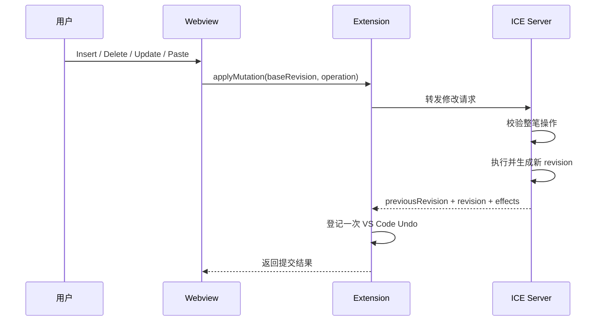

“整笔执行”表示：

- 任一值非法，整笔操作不生效；
- 不允许只提交合法单元格；
- Paste 覆盖已有行和追加新行只产生一次 revision；
- Undo 时一次恢复整笔操作。

## 6.3 修改返回结果

```ts
type PatternMutationResponse = {
  previousRevision: number;
  revision: number;
  totalVectors: number;
  effects: PatternMutationEffect[];
  updatedRows?: PatternRenderRow[];
  message: string;
};
```

| 字段 | 含义 |
| --- | --- |
| `previousRevision` | ICE Server 执行前版本 |
| `revision` | 执行后版本 |
| `effects` | 实际更新、插入或删除的位置范围 |
| `updatedRows` | 可以安全进行局部更新时返回的完整新行 |

如果操作没有产生实际变化，可以不增加 revision。

## 6.4 不同修改采用不同刷新方式

| 操作 | 成功后的 Webview 处理 |
| --- | --- |
| 单个单元格 Update | 使用 ICE Server 返回的完整新行，替换三个缓存窗口中相同 `rowKey` 的行 |
| 批量 Update | 清理旧 revision 窗口，重新读取当前窗口 |
| Insert/Delete/Paste | 保持原逻辑位置，清除选区，读取新 revision 的当前窗口 |

单行局部更新必须满足：

- revision 只前进一次；
- ICE Server 返回完整新行；
- 当前窗口仍存在于缓存；
- 可以在所有重叠窗口中按 `rowKey` 找到并替换。

任一条件不满足，就放弃局部优化，重新读取权威窗口。

## 6.5 Paste 为什么必须单独作为一种操作

Paste 可能同时：

- 覆盖已有行；
- 越过文件末尾；
- 连续追加新行；
- 修改多个列；
- 影响静态 Cycle。

如果拆成 Update 和 Insert 两次请求，第一次成功、第二次失败时，用户的一次粘贴会只完成一半。

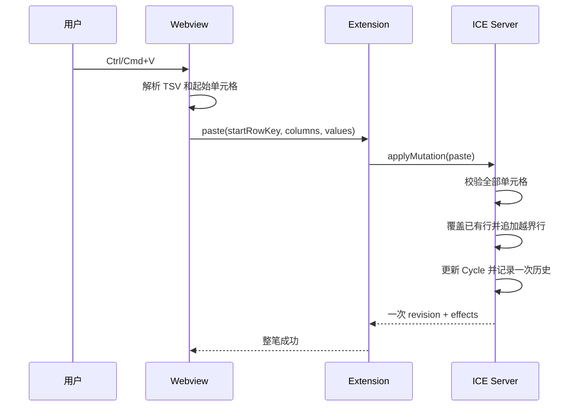

TSV 使用 Tab 分隔列、换行分隔行。`columns` 由当前表格列和起始单元格计算，用户不直接提供列 ID。

建议规则：

- 必须从已有行开始粘贴；
- 超过文件末尾的部分由 ICE Server 连续追加；
- 不能跨过不存在的中间行；
- 空单元格表示写入空字符串；
- 不能覆盖只读列；
- 矩阵不规则或任一值非法时，整笔拒绝；
- 最大总行数由产品容量决定；
- 单次 Paste 行数和单元格数设置独立上限；
- 已有行 `rowKey` 不变，新增行获得新 `rowKey`。

是否追加新行必须由 ICE Server 根据最新 `totalVectors` 判断，不能由可能过期的前端元数据决定。

## 6.6 结构变化后的视图行为

本方案保持的是“原逻辑位置”，不是“原来那条数据始终固定在屏幕顶部”。

操作前记录：

- 第一条可见数据的逻辑位置；
- 该行顶部已经滚出屏幕的像素；
- VTable 横向 `scrollLeft`。

### 在当前位置前插入三行

```text
操作前第一条可见位置：100
在位置 100 前插入 3 行
操作后第一条可见位置：仍为 100
原来位置 100 的数据变为位置 103，因此在屏幕中下移 3 行
```

### 在当前位置前删除三行

```text
操作前第一条可见位置：100
在位置 100 前删除 3 行
操作后第一条可见位置：仍为 100
原来位置 100 的数据变为位置 97，因此自然移出屏幕顶部
```

其他规则：

- Insert/Delete/Paste 后清除选区；
- 结构型 Undo/Redo 后清除选区；
- 单单元格 Update 可以保留仍有效的选区；
- Reload 清除选区；
- 横向位置保持不变；
- 删除后不足一屏时，逻辑位置钳位到末尾并向前补足；
- 新窗口准备完成前不清空 VTable records。

## 6.7 ICE 已提交，但前端更新失败

如果 ICE Server 已提交成功，但 Webview 更新缓存或 VTable 失败：

- 不能再次发送同一修改；
- 立即将本地 revision 推进到服务端返回值；
- 读取最新元数据和当前窗口；
- 用 ICE Server 已提交的结果恢复页面。

这是“前端显示失败”，不是“后端修改失败”。

---

# 7. Undo/Redo、Save、Reload 和关闭文件

## 7.1 VS Code 与 ICE Server 如何配合 Undo/Redo

每次有效修改成功后：

1. ICE Server 提交修改并返回新 revision；
2. Extension 向 VS Code 登记一次可撤销操作；
3. 用户执行 Undo/Redo 时，VS Code 回调 Extension；
4. Extension 调用 ICE Server 的 `undo()` 或 `redo()`；
5. Webview 读取新 revision 的当前窗口。

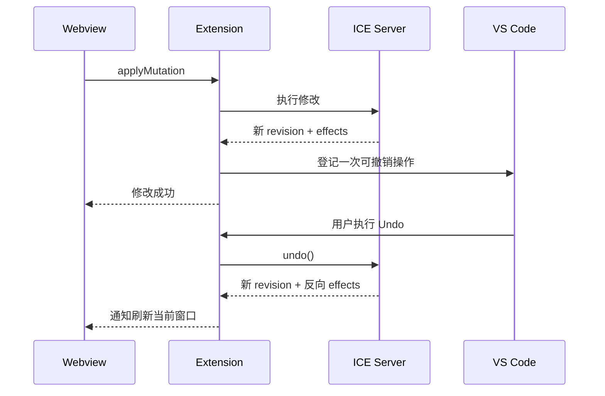

VS Code 管理操作顺序，ICE Server 管理真实数据变化。两者不能各自独立维护一份可编辑 Pattern。

## 7.2 大历史按空间管理

历史不保存完整 Pattern 快照，只保存恢复所需的数据，例如：

- 被修改单元格的旧值；
- 插入片段；
- 删除片段；
- Paste 覆盖的旧值和追加范围；
- 必要的 Cycle 变化摘要。

建议策略：

```text
最近、较小的历史
    → 保存在内存中的紧凑 delta

较早或较大的历史
    → 写入当前文档会话的临时历史文件

文档关闭或 Reload
    → 清理该会话临时历史
```

不能只在 ICE Server 静默删除“超过 100 条”的历史，因为 VS Code 可能仍保留对应 Undo 命令。需要截断时，VS Code 与 ICE Server 必须共同确认截断点。

## 7.3 Save

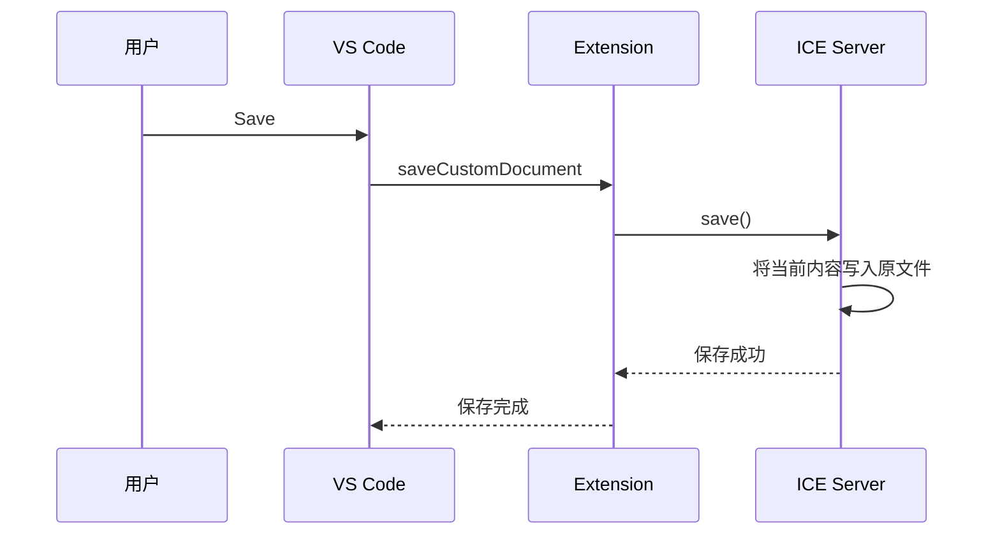

只有 ICE Server 明确确认写入成功，VS Code 才能清除未保存圆点。

Save 不清空 Undo/Redo。用户保存后仍可 Undo；Undo 改变当前内容后，VS Code 应重新显示未保存状态。

## 7.4 Save As

Save As 将 VS Code 提供的新路径交给 ICE Server。

方案要求：

- 不在 Webview 中重新创建完整数据；
- 写入成功前，不改变当前文档身份；
- 写入失败时保留当前编辑会话；
- 写入成功后，Extension 与 ICE Server 必须采用同一种文档身份策略。

生产接入时需要在以下两种方式中选择一种：

1. 当前 ICE 文档会话切换到新路径；
2. VS Code 关闭或保留原会话，并按新路径建立新会话。

不能同时执行两种方式，否则会产生重复会话、路径和未保存状态不一致。

## 7.5 Reload

Reload 表示放弃未保存修改，并从原文件重新读取：

1. Extension 接收 `revertCustomDocument()`；
2. ICE Server 丢弃未保存修改和当前会话历史；
3. ICE Server 重读原文件；
4. Webview 保留旧画面，等待新元数据和窗口准备；
5. 新窗口一次替换旧窗口；
6. 清除选区和旧缓存；
7. 尽量保留合理的逻辑位置和横向位置。

Reload 期间，旧 revision 的迟到请求必须被丢弃。

## 7.6 关闭文件

- 没有未保存修改：直接关闭并释放 Webview、缓存和 ICE 文档会话；
- 存在未保存修改：由 VS Code 提示保存、放弃或取消；
- 选择保存：Save 成功后关闭；
- 选择放弃：丢弃 ICE Server 会话修改后关闭；
- 关闭后重新打开：建立新会话，不保留上次 Undo/Redo。

## 7.7 隐藏页面和异常退出

`retainContextWhenHidden: true` 用内存换取页面切换体验。每个隐藏页仍占用 VTable、选区、滚动状态和最多三个窗口缓存。

当前方案不支持 VS Code Hot Exit Backup：

- `backupCustomDocument()` 因接口要求存在；
- 实现明确返回不支持；
- 不展开或传输完整 Pattern；
- 不写完整 Pattern 备份文件；
- 不从 `backupId` 恢复。

因此 VS Code、Extension Host、Webview 或系统异常退出时，未保存修改可能丢失。这个限制必须在产品验收和用户提示中明确。

---

# 8. 超时、mutationId、自动恢复和日志

## 8.1 基本原则

读取失败和写入结果不明确，不能使用同一套重试策略。

- 读取不修改数据，可以重试；
- 写操作可能已经提交，不能直接重发；
- Undo/Redo、Save、Reload 会改变历史、文件或会话状态，不自动重复执行；
- 恢复过程中保留旧画面，不先清空 records；
- 无法确认权威状态时暂停新的写操作。

## 8.2 请求分类

| 类别 | 是否自动重试 | 超时后的页面行为 |
| --- | --- | --- |
| 元数据、窗口读取 | 可以重试安全读取 | 保留旧表格，暂停依赖新数据的写入 |
| Instruction Search | 新搜索取消旧搜索，不重复并发 | 提示搜索未完成，表格仍可编辑 |
| Mutation | 不直接重发 | 查询 `mutationId` 状态 |
| Undo/Redo、Save、Reload | 不自动重复执行 | 保留页面，读取最新状态并提示错误 |

具体秒数和退避间隔属于部署参数，不作为架构固定值。建议统一配置并通过真实 ICE 延迟测试确定。

## 8.3 mutationId 解决“到底有没有成功”

生产请求必须增加唯一 `mutationId`：

```ts
type PatternMutationRequest = {
  mutationId: string;
  baseRevision: number;
  operation: PatternMutationOperation;
};
```

Extension 生成 UUID。ICE Server 在执行前登记该 ID，并保证：

> 同一个 `mutationId` 无论到达多少次，最多执行一次。

状态查询：

```ts
type MutationStatusResponse =
  | { status: "processing" }
  | { status: "committed"; response: PatternMutationResponse }
  | { status: "rejected"; error: PatternRequestError }
  | { status: "notFound" };
```

| 状态 | 含义 | 前端处理 |
| --- | --- | --- |
| `processing` | 已接收，尚未完成 | 退避后继续查询，不重发 |
| `committed` | 已成功提交 | 使用原提交结果并读取最新窗口 |
| `rejected` | 明确拒绝，未修改数据 | 显示错误并恢复本地输入 |
| `notFound` | ICE Server 确认未收到 | 是否使用同一 ID 重发由产品策略决定 |

## 8.4 状态查询只用于异常路径

正常成功或明确失败时，不查询 mutation 状态。

只有发生超时、连接中断或响应丢失，无法判断是否提交时，才启动临时查询链：

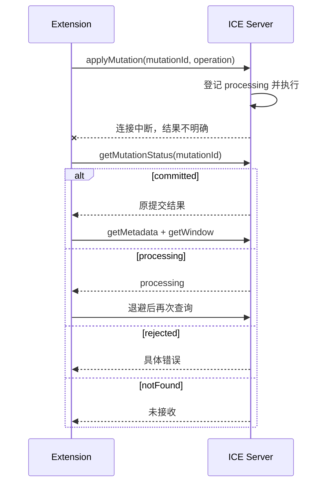

约束：

- 每个文档最多一条状态查询链；
- 查询期间暂停新写操作；
- 状态查询必须是轻量 O(1) 查表，不能扫描 Pattern；
- 状态记录至少保留到文档会话关闭；
- ICE Server 能主动通知完成时，优先使用通知，查询只作为兜底。

## 8.5 自动恢复按失败类型处理

| 失败情况 | 处理 |
| --- | --- |
| 输入值或只读列校验失败 | 恢复本地旧值，显示错误，不刷新整页 |
| 元数据或窗口读取失败 | 保留旧表格，自动重试安全读取 |
| Mutation 结果不明确 | 查询 `mutationId`，不直接重复写入 |
| ICE 已成功、前端应用失败 | 读取最新元数据和当前窗口，一次替换 |
| revision 冲突 | 读取最新 revision 和当前窗口 |
| ICE Server 暂时不可用 | 页面进入只读恢复状态，保留旧画面 |

恢复期间：

- 不将 VTable records 设置为空；
- 不使用覆盖整个表格的 Loading 遮罩；
- 暂停新的写操作；
- 保留横向位置和原逻辑位置；
- 恢复成功后解除只读状态。

## 8.6 日志链路


建议记录：

- 错误 ID、时间、命令和阶段；
- `requestId`、`mutationId`、revision、窗口起点；
- ICE error code、message 和 stack；
- 状态查询结果；
- 自动恢复成功或最终失败；
- Webview 和 Extension 的安全内存摘要。

禁止记录：

- 单元格内容；
- 完整行数据；
- Paste 文本；
- 完整窗口响应；
- UTD 或 `.pat` 文件内容。

正常滚动、绘制和 cache hit 不写日志。相同错误应在时间窗口内合并，避免错误风暴进一步占用内存和 I/O。

---

# 9. 内存边界和性能验收

## 9.1 前端硬边界

生产实现必须具有可检查的硬边界：

| 项目 | 边界 |
| --- | --- |
| VTable records | 当前最多 1,000 行 |
| 活跃窗口缓存 | 最多 3 个 |
| React state | 不保存窗口 rows |
| Extension | 不长期保存窗口和完整 Pattern |
| Pending 同页读取 | 相同 key 共享 Promise |
| 结构修改后缓存 | 不复用旧 revision 窗口 |
| 单次 Paste | 设置行数和单元格数上限 |
| 历史 | 按内存预算转移到会话临时文件 |

这些边界比“总行数支持一亿”更重要。总行数增大时，前端内存不应线性增长。

## 9.2 不能只测 JavaScript heap

内存验收至少同时观察：

- Webview JavaScript heap；
- Webview 进程 RSS；
- Extension Host heap 和 RSS；
- Canvas、ArrayBuffer 和外部内存；
- 缓存 entry 数量；
- pending Promise；
- listener 和定时器数量；
- 关闭页面后的资源释放。

仅看 `heapUsed` 不能代表 VTable Canvas、C++ 对象和进程总内存。

## 9.3 关键验收场景

### 首次打开一亿逻辑行

检查：

- 没有创建一亿行数组；
- 首屏最多 1,000 records；
- 缓存不超过三个窗口；
- 页面可以快速进入可交互状态；
- Extension 不接收完整 Pattern 行数组。

### 随机 Go To

依次跳转头部、中部、末尾和多个随机位置，检查：

- 目标位置正确；
- 迟到请求不覆盖最后一次目标；
- 新窗口准备前旧 Canvas 保持可见；
- 横向位置不意外归零；
- cache 始终不超过三窗。

### 连续滚动和键盘

混合使用：

- 鼠标滚轮；
- 拖动全局纵向滚动条；
- 方向键；
- PageUp/PageDown；
- Home/End；
- 横向滚动；
- 不同 VS Code zoom。

检查：

- 全局和页内位置同步；
- 没有白屏、明显跳动和错误窗口覆盖；
- 最后一行和底部网格线完整。

### 修改和历史

检查：

- 每个用户动作只提交一次；
- revision 单调递增；
- Paste 覆盖和追加只产生一次历史；
- Save 后 Undo 能恢复未保存状态；
- 结构操作后保持原逻辑位置；
- 修改失败不会重复执行。

### 15 分钟内存稳定性

交替执行随机 Go To、滚动、编辑、Paste 和 Undo/Redo，手动 GC 后检查：

- 内存不随访问过的逻辑行数量线性增长；
- 缓存仍最多三窗；
- 没有持续增长的 rows、Promise、listener 或 timer；
- Heap Snapshot 中不存在无法释放的页面对象。

### 多个隐藏 Pattern 页面

至少打开 5 个页面，分别滚到不同位置后反复切换：

- 每页仍只保留三窗；
- 内存随页面数增长，但不随每个文件总行数线性增长；
- 返回页面时滚动和选区恢复；
- 关闭页面后对应资源可以释放。

## 9.4 接近内存风险时的产品行为

由于没有适用于所有机器的固定内存数字，产品应以“预算和趋势”管理：

- 定义支持的最大同时打开 Pattern 页面数量，并通过真实机器验收；
- Webview 或 Extension 内存持续异常增长时记录告警；
- 新建页面前发现资源压力时，提示用户关闭不使用的 Pattern 页面；
- 不自动丢弃有未保存修改的页面；
- 发生 Webview 重新加载或 Extension Host 重启后，明确提示未保存数据风险；
- 不把提高 Node/V8 堆上限作为主要解决方案。

---

# 10. ICE Server 落地要求

## 10.1 ICE Server 必须提供的最低能力

- `getMetadata()`；
- `getWindow(offset, limit, expectedRevision)`；
- `findPosition(rowKey)`；
- 按位置 Insert；
- 按 `rowKey` 或区间 Delete；
- 批量 Update 和 Paste；
- `mutationId` 幂等状态表；
- Undo/Redo delta；
- 子树行数或等价位置统计；
- 静态 Cycle 依赖摘要或快速重算入口；
- Instruction Search；
- Save、Save As、Reload 和 Close；
- 会话历史和临时文件清理。

## 10.2 内存编辑会话建议使用 Piece Tree / Rope 类结构

推荐模型：

```text
不可变的原始 Pattern
        +
平衡的 Piece Tree / Rope
        +
每个子树保存行数和 Cycle 相关摘要
```

Piece Tree、Rope 和“带子树行数的平衡树”表示同一类设计方向，不要求实现三套结构。

最低要求：

- 叶子引用原始文件片段或新增缓冲区；
- Insert 通过切分和拼接节点完成；
- Delete 通过移除或缩短片段完成；
- 子树行数支持按逻辑位置快速定位；
- `rowKey` 索引支持按稳定身份定位；
- Cycle 摘要支持局部更新或快速重算；
- 原始文件不因每次修改而整体复制。

具体使用 AVL、Red-Black Tree、B-Tree 形态或其他平衡结构，由 C++ 团队结合现有基础库评审。

## 10.3 B+ Tree 是可选的磁盘索引层

如果真实文件过大，打开时不能建立完整内存索引，或需要下次打开复用持久索引，可以增加 B+ Tree：

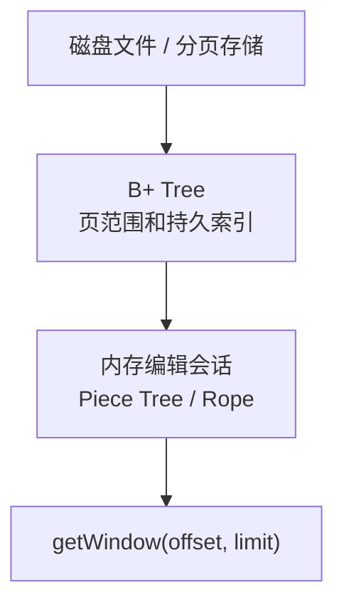

B+ Tree 适合：

- 按磁盘页读取；
- 保存持久索引；
- 快速定位大文件区间；
- 降低重新打开文件的全量扫描成本。

它不替代 Webview 窗口协议，也不表示第一阶段必须同时实现两棵树。

建议顺序：

1. 先完成正确的内存编辑会话；
2. 测量真实文件打开、索引和内存成本；
3. 只有确实需要磁盘分页或持久索引时，再增加 B+ Tree。

## 10.4 建议生产接口

```ts
interface PatternBackend {
  open(filePath: string): PatternMetadata;
  getMetadata(): PatternMetadata;
  getWindow(request: PatternWindowRequest): PatternWindowResponse;
  findInstruction(
    request: FindInstructionRequest
  ): FindInstructionResponse;
  applyMutation(
    request: PatternMutationRequest
  ): PatternMutationResponse;
  getMutationStatus(
    mutationId: string
  ): MutationStatusResponse;
  undo(): PatternHistoryResponse;
  redo(): PatternHistoryResponse;
  save(destination?: string): void;
  reload(): PatternMetadata;
  close(): void;
}
```

## 10.5 ICE Server 必须保证

- 当前会话内，仍存在的行 `rowKey` 稳定；
- revision 单调递增；
- 页面响应属于请求的 `expectedRevision`；
- 一笔修改全部成功或全部不生效；
- Paste 覆盖和追加只产生一次 revision 和一次历史；
- Undo/Redo 同时恢复结构、单元格和静态 Cycle；
- 无变化操作可以不增加 revision；
- 相同 `mutationId` 不会执行两次；
- 状态查询不扫描 Pattern；
- 错误响应不包含敏感行内容；
- Save 成功后文件内容与当前 revision 对应；
- Reload 后旧 revision 的请求不能重新进入当前会话。

## 10.6 分阶段落地

### 第一阶段：固定协议和窗口架构

- 对齐 `PatternMetadata`、`PatternWindowRequest/Response`；
- 对齐 `rowKey` 和 revision；
- 真实 ICE 提供 `getWindow()`；
- 使用真实最大 Signal 列数完成滚动和内存验收。

### 第二阶段：接入编辑事务

- Insert/Delete/Update/Paste；
- 整笔校验和提交；
- `effects` 和 `updatedRows`；
- 结构修改后的窗口刷新；
- 单行局部缓存迁移。

### 第三阶段：历史和文件生命周期

- Undo/Redo；
- Save、Save As、Reload、Close；
- 会话临时历史；
- VS Code 未保存状态对齐。

### 第四阶段：生产异常处理

- `mutationId`；
- 状态查询或服务端完成通知；
- 超时和自动恢复；
- 日志和错误码；
- ICE 暂时不可用时的只读恢复。

### 第五阶段：搜索、Cycle 和磁盘优化

- Instruction Search；
- 静态 Cycle 摘要；
- 真实文件打开性能；
- 必要时增加 B+ Tree 或持久索引。

---

# 11. 重要场景验收表

| 场景 | 必须保证 |
| --- | --- |
| 当前区域前插入行 | 保持原逻辑位置，原数据自然下移 |
| 当前区域前删除行 | 保持原逻辑位置，原数据自然上移 |
| 删除后不足一屏 | 向前补足，不出现大片空白 |
| Paste 同时覆盖和追加 | 一笔操作、一次 revision、一次 Undo |
| Paste 中有非法值 | 整笔拒绝，不部分提交 |
| 静态 Cycle 大范围变化 | 新窗口的 Cycle 与新 revision 一致 |
| Mutation 成功但响应丢失 | 不直接重发，通过 `mutationId` 确认 |
| ICE 成功但前端更新失败 | 读取权威元数据和当前窗口 |
| Save 后 Undo | 允许 Undo，并恢复未保存状态 |
| Reload 时旧窗口请求晚到 | 旧请求不能覆盖新会话 |
| ICE Server 暂时不可用 | 保留旧画面，暂停写入并重试安全读取 |
| 最后一行 | 行高、文字和底部网格线完整 |
| 页面隐藏后再显示 | 保留滚动、选区和交互状态 |
| 页面关闭时仍有请求 | 停止 timer，迟到结果不更新页面 |
| Webview 内存超限 | 页面可能重载或崩溃，明确提示未保存风险 |
| Extension Host 内存超限 | 请求可能中断，Host 可能重启，不能假设写入失败 |
| VS Code 或系统异常退出 | 当前无 Hot Exit Backup，未保存修改可能丢失 |

---

# 附录 A：错误分类

| code | 含义 | Webview / Extension 处理 |
| --- | --- | --- |
| `VALIDATION_ERROR` | 输入、字段、选区或容量不合法 | 显示错误，局部回退，不刷新整页 |
| `REVISION_CONFLICT` | 请求基于旧版本 | 读取最新元数据和当前窗口 |
| `NOT_FOUND` | `rowKey` 在当前文档不存在 | 提示并读取最新状态 |
| `TIMEOUT` | ICE 调用超时 | 按读取、Mutation 或生命周期请求分类处理 |
| `INTERNAL_ERROR` | ICE Server 内部失败 | 记录日志；读取可恢复，写入先确认状态 |

---

# 附录 B：VS Code API 名称

| VS Code API | 本文中的业务含义 |
| --- | --- |
| `CustomEditorProvider` | Pattern 自定义编辑器入口 |
| `CustomDocumentEditEvent` | Extension 通知 VS Code 已完成一次可撤销操作 |
| `saveCustomDocument()` | Save |
| `saveCustomDocumentAs()` | Save As |
| `revertCustomDocument()` | Reload：丢弃未保存修改并重读原文件 |
| `backupCustomDocument()` | Hot Exit 接口；当前方案明确不支持 |
| `retainContextWhenHidden` | 页面隐藏时保留 Webview 上下文 |

---

# 附录 C：v22-lite 源码阅读顺序

业务接入建议按以下顺序：

1. `src/shared/protocol.ts`：行结构、revision、窗口读取和统一 Mutation。
2. `src/extension/patternBackend.ts`：真实 C++ ICE 需要实现的边界。
3. `src/pattern-domain/patternTableBinding.ts`：Pattern 字段和表格列映射。
4. `src/webview/patternReadClient.ts`：Webview 请求 Extension。
5. `src/webview/usePatternViewport.ts`：修改、恢复和页面状态。
6. `src/webview/PatternTable.tsx`：列配置接入公共表格区域。
7. `src/webview/PatternEditorApp.tsx`：插件页面装配。
8. `src/extension/patternEditorProvider.ts`：请求转发、Undo/Redo 和文件生命周期。

稳定基础设施通常只需要理解接口：

9. `src/pattern-large-data-vtable/index.ts`
10. `src/pattern-large-data-vtable/DocumentTableSurface.tsx`
11. `src/pattern-large-data-vtable/vtableAdapter.ts`
12. `src/pattern-large-data-vtable/logicalViewport.ts`
13. `src/pattern-large-data-vtable/logicalViewportMath.ts`
14. `src/diagnostics/index.ts`

不迁移到真实产品 Webview：

- `src/dev-only/syntheticPatternBackend.ts`
- `src/dev-only/syntheticPatternStore.ts`
- `examples/acceptance`

---

# 附录 D：术语表

| 术语 | 含义 |
| --- | --- |
| 窗口 / window | Webview 一次从 ICE Server 读取的一小段连续 Vector |
| 当前窗口 | 当前交给 VTable 的 records |
| 三窗口缓存 | 前一窗、当前窗和后一窗 |
| `logicalScrollTopPx` | 完整 Pattern 中的理论纵向位置，不是滚动条 |
| 全局纵向滚动条 | 用户可见、代表整个 Pattern 的原生滚动条 |
| 页内纵向位置 | VTable 当前 records 内部的 `scrollTop`，滚动条不显示 |
| `rowKey` | 当前会话内一条数据的稳定身份 |
| `vectorIndex` | 一条数据当前的逻辑位置 |
| revision | 当前打开文档的数据版本 |
| effects | ICE Server 实际提交所影响的位置范围 |
| staged replacement | 新窗口准备好后一次替换，准备期间保留旧 Canvas |

---

# 附录 E：参考资料

- [VTable 异步懒加载说明](https://visactor.io/vtable/guide/data/async_data)
- [VS Code Custom Editor API](https://code.visualstudio.com/api/extension-guides/custom-editors)
- [VS Code Webview API](https://code.visualstudio.com/api/extension-guides/webview)
- [VS Code Extension Host](https://code.visualstudio.com/api/advanced-topics/extension-host)
- [Node.js CLI：V8 heap options](https://nodejs.org/api/cli.html)
- GitHub：`a306796405/huge-vtable`

---

# 宣讲建议

建议按照下面的顺序讲解，而不是逐章朗读全文：

1. 现有 `CachedDataSource` 方案是怎么工作的；
2. VTable 虚拟绘制为什么没有解决完整数据的内存问题；
3. 新方案为什么把完整 Pattern 放到 ICE Server；
4. 前端为什么始终只需要一页和三个窗口缓存；
5. 用滚动结构图和一亿行数字例子解释全局、逻辑和页内位置；
6. 用一次 Paste 说明事务、revision 和 Undo/Redo；
7. 最后说明内存超限、异常恢复和 ICE Server 的落地任务。

宣讲结束时，听众应能回答四个问题：

> 现有方案为什么撑不住亿级编辑？  
> 完整 Pattern 最终由谁管理？  
> 前端为什么只需要最多 1,000 行？  
> 一亿行如何通过有限高度的全局纵向滚动条完成定位？
