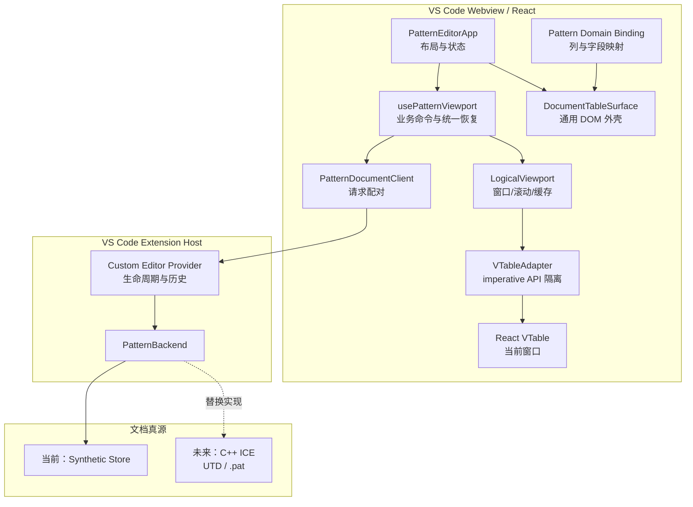
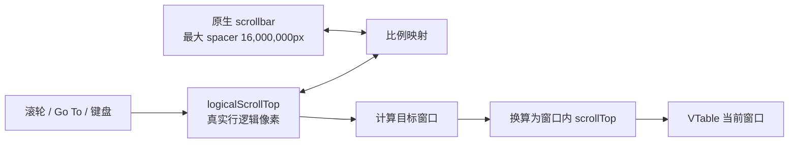
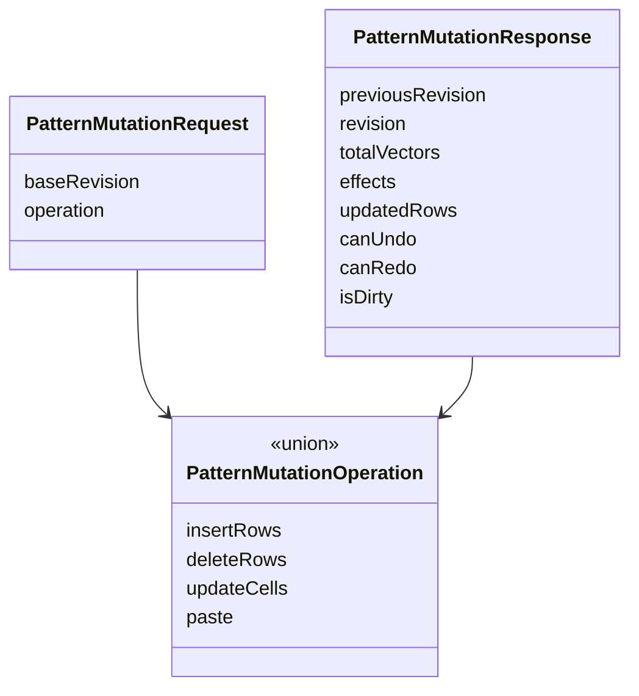
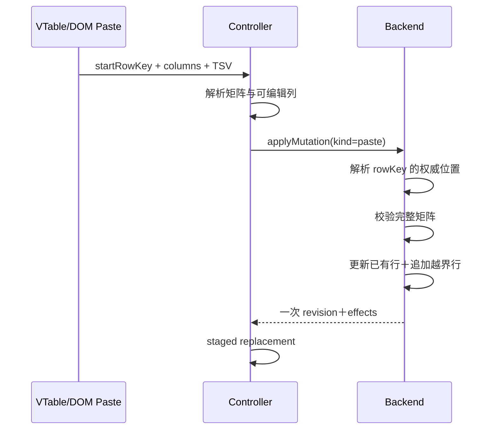
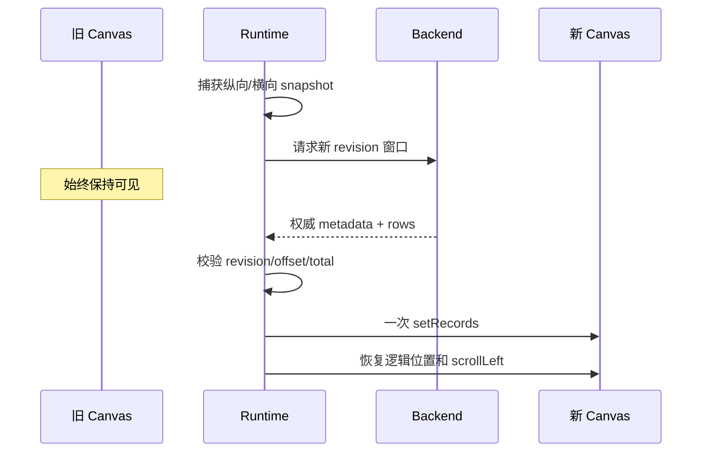
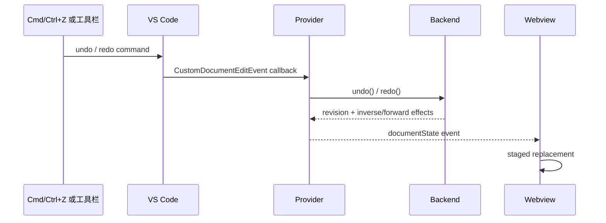
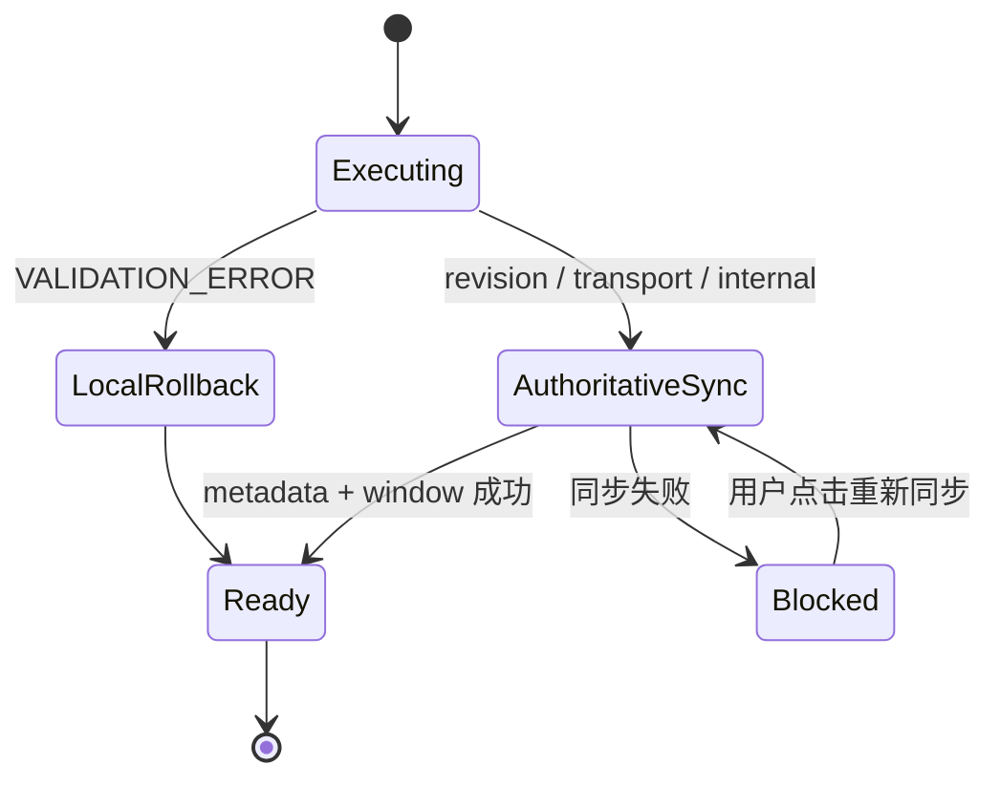
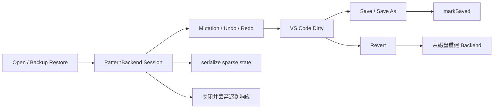
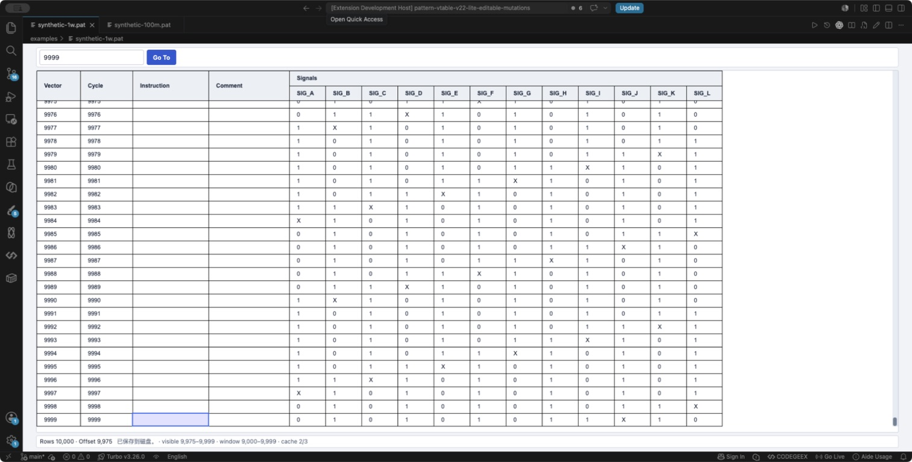
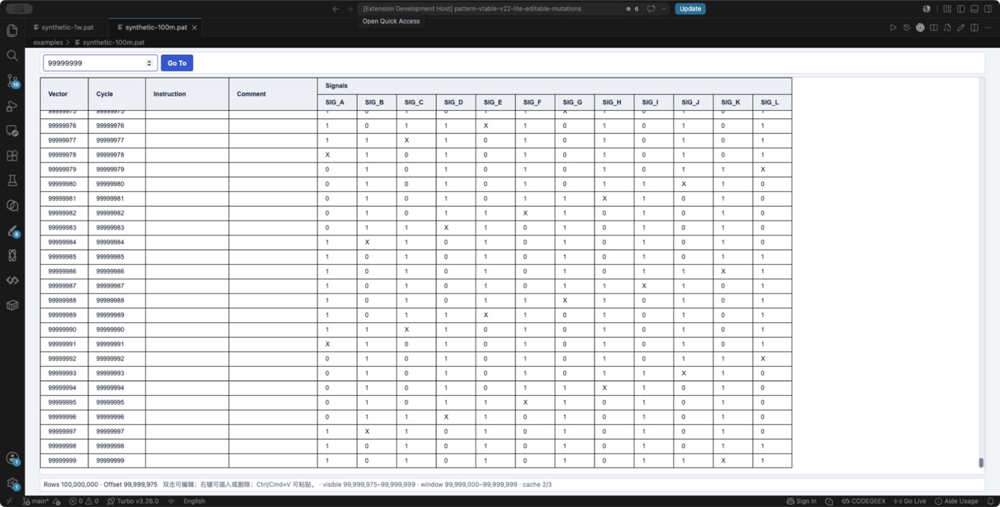

# Pattern Editor v22-lite 亿级可编辑表格技术方案

> 文档状态：技术方案定稿，人工验收结论待填写  
> 产品入口：VS Code Custom Editor  
> 当前参考 backend：TypeScript synthetic  
> 目标 backend：C++ ICE＋UTD/`.pat`  
> 当前 commit：验收时填写

## 1. 一页结论

Pattern Editor 不应把 1 亿行加载到浏览器，也不应让 React 或 VTable 成为
文档真源。本方案把前端定位为“小窗口编辑器”：

```text
1 亿逻辑行
   ↓ getWindow(offset, limit, revision)
最多三个 1,000 行缓存窗口
   ↓
VTable 当前只渲染一个窗口
```

当前验证结果具备以下能力：

| 能力 | 方案 |
| --- | --- |
| 亿级纵向滚动 | 原生有限 scrollbar 映射到逻辑像素 |
| 横向滚动 | VTable 自身 scrollbar |
| 前端内存 | 与总行数解耦，取决于窗口、列数和单行大小 |
| 编辑 | 统一 `applyMutation()` 事务 |
| Paste | 一次事务同时更新已有行和末尾新增 |
| 身份 | opaque `rowKey`，位置变化不改身份 |
| 显示序号 | 后端窗口物化时按逻辑位置计算 |
| 历史 | VS Code CustomDocumentEditEvent＋backend Undo/Redo |
| 一致性 | revision 校验＋旧响应丢弃 |
| 失败恢复 | 保留旧 Canvas，single-flight 权威同步 |
| 保存 | Custom Editor Save/Save As/Revert/Backup |

核心判断：**总行数不再决定前端内存；当前窗口的行数、列数、对象大小和后端
延迟才决定实际体验。**

## 2. 问题与约束

### 2.1 真实产品条件

- 最终运行在 VS Code Custom Editor。
- 表格使用 React VTable。
- 数据真源是 C++ ICE 文档会话。
- 数据来自 UTD/`.pat`，不使用数据库。
- 同一个文档只允许一个编辑器，不处理多视图同步。
- 源文件被外部修改后不自动监视，用户主动 Revert/Reload。
- 前端不得维护完整 Pattern。

### 2.2 为什么常规前端表格方案不成立

若前端持有 1 亿行，即使每行只占 100 字节，也至少需要约 10GB 原始数据，
尚未计算 JavaScript 对象、字符串、索引、React 和 VTable 开销。更重要的是：

- 插入一行会使后续位置整体变化。
- 全量数组 splice、复制和 diff 无法稳定工作。
- Undo/Redo、保存和 revision 很容易出现双真源。
- VTable 虚拟渲染只能减少 DOM/Canvas 绘制，不能消除全量数据内存。

因此本方案虚拟化的不是 DOM，而是**文档数据访问本身**。

## 3. 总体架构



### 3.1 各层职责

| 层 | 负责 | 不负责 |
| --- | --- | --- |
| `editor-core` | 逻辑滚动、窗口缓存、VTable API | Pattern 字段、业务 mutation |
| `editor-shell` | 通用 Surface、client/controller 装配 | synthetic 数据生成 |
| Pattern binding | 列定义、字段映射、乐观值回退 | 窗口缓存、ICE |
| Provider | VS Code 请求路由、Save、Revert、Backup、历史 | 行结构算法 |
| Backend | revision、mutation、history、serialize | UI 和 VTable |
| `dev-only` | synthetic、故障注入、性能探针 | 真实产品运行 |

## 4. 亿级逻辑滚动

### 4.1 逻辑坐标与 scrollbar 坐标分离

1 亿行、28px 行高对应约 28 亿逻辑像素，不能直接创建同高度 DOM。
runtime 使用两个坐标系：



核心映射：

```text
scrollbarTop / maxScrollbarTop
    =
logicalTop / maxLogicalTop
```

- 小数据时映射接近真实像素。
- 数据超过浏览器安全高度时自动压缩到 1,600 万像素 spacer。
- 滚轮始终增加真实逻辑像素，不会因压缩比例一次跳过大量行。
- Go To 直接设置逻辑位置，不依赖拖动精度。

### 4.2 窗口选择

默认参数：

```text
rowHeight = 28
windowSize = 1000
windowShift = 500
guardRows = 150
cacheWindowLimit = 3
```

窗口在首可见行之前保留 150 行保护区，并按 500 行对齐。用户接近窗口边缘前，
runtime 已切到重叠窗口，减少明显等待。

## 5. 三窗口缓存


规则：

- key 为 `revision:windowStartVectorIndex`。
- 相同 key 的并发请求共享同一个 Promise。
- resolved 和 pending 都计入最多三个 entry。
- 淘汰 pending 后，底层请求可以晚到，但不能重新写回活跃视图。
- response 必须匹配 expected revision、offset 和 totalVectors。
- 新窗口成功前不清空旧 records。
- React state 只保存 rows、offset、revision、loading 等摘要。

由于窗口彼此重叠，缓存最多物化约 3,000 条记录，但实际不同逻辑位置通常更少。
内存仍受单行 Signal 数量和字符串大小影响，因此真实列规模必须实测。

## 6. 身份、位置与 revision

### 6.1 rowKey

`rowKey` 是打开会话内稳定身份：

- 插入或删除前面的行不会改变现有行 rowKey。
- 前端只能比较和回传，不能解析出 offset。
- 编辑、选择、Delete、Paste 和历史都使用 rowKey。

### 6.2 vectorIndex/display sequence

显示 Vector 是当前位置，不是主键。结构 mutation 后由权威窗口重新计算。
因此“同一条数据从 Vector 5 变成 Vector 10”是正确行为。

### 6.3 revision

每个有效事务推进一次 revision：

```text
读取窗口：expectedRevision
写入事务：baseRevision
成功响应：previousRevision + revision + effects
```

旧 revision 的 pending response 即使晚到，也不能覆盖新视图。

## 7. 统一 Mutation 与 Paste 事务



### 7.1 Paste

Paste 不拆成“先 Update、再 Insert”：



固定约束：

- 必须从已有选中行开始。
- 空单元格覆盖为空字符串。
- 只读列、越过最后一列、不规则矩阵整次拒绝。
- 单次最多 10,000 行、100,000 单元格。
- 新增行由 backend 默认行工厂补齐未粘贴字段。
- 一次 Undo 同时撤销更新和新增。
- 关闭 VTable 内建 Paste 写入，避免当前窗口先被截断修改。

## 8. 视口锚定与无闪动刷新

结构 mutation 前记录：

```text
firstVisibleVectorIndex
intraRowOffsetPx
horizontalScrollLeftPx
```

后端返回客观 effects，runtime 映射锚点：

- 锚点前插入 N 行：目标逻辑位置加 N。
- 锚点前删除 N 行：目标逻辑位置减 N。
- 锚点自身被删除：落到删除区起点。
- 新数据不足一屏：按新最大滚动范围向前补齐。



“无闪动”的定义是：不白屏、不用 loading 遮住表格、不发生非预期纵横跳动。
正常的数据内容变化是事务结果，不属于闪动。

## 9. VS Code Clipboard 与 Undo/Redo

### 9.1 Clipboard

VTable 默认 Clipboard API 在 Electron Webview 权限环境中并不稳定，因此：

- Surface 保持可聚焦。
- adapter 监听原生 `copy`/`paste` 事件。
- Copy 使用 VTable 公开选区和 `getCopyValue()`。
- Paste 读取同步 `clipboardData`，交给 controller 形成一次事务。
- adapter 只输出通用 Table event，不包含 Pattern operation。

### 9.2 Undo/Redo

Webview 不维护第二套历史栈：



当前 synthetic 历史用于验证语义；生产版本的条数、内存、合并策略和保存基线
属于 C++ backend，不需要前端先行实现。

## 10. 统一错误恢复与日志

### 10.1 分类



- 校验错误：恢复乐观单元格，不重载。
- revision/传输/内部错误：不重试写操作，只读取权威 metadata 和窗口。
- 同时发生的恢复复用一个 Promise。
- 恢复期间禁止新的写入和历史操作。
- 恢复失败保留旧表格，进入 blocked，用户手动重试。

### 10.2 日志

VS Code `Pattern Editor Lite` LogOutputChannel 记录：

```text
错误 ID
command / phase
revision / window offset
错误 code / message / stack
RECOVERED 或 blocked 结果
```

不记录：

```text
单元格内容
完整行
剪贴板 TSV
整个窗口 records
```

用户可以用状态栏错误 ID在 Output 中定位同一次失败和恢复。

## 11. Custom Editor 生命周期



- Provider 负责 VS Code 文件生命周期。
- backend 只有在写盘成功后才更新保存基线。
- Revert 明确放弃未保存内容并从磁盘重建会话。
- Backup 序列化稀疏 synthetic 状态，不展开亿级基础行。
- 不自动侦测磁盘外部变化；用户手动 Revert/Reload。
- `supportsMultipleEditorsPerDocument=false`，不保留跨视图广播分支。

## 12. 组件迁移边界

### 整体复制

- `src/core/logicalViewport.ts`
- `src/core/logicalViewportMath.ts`
- `src/core/vtableAdapter.ts`
- `src/editor-shell/DocumentTableSurface.tsx`
- controller 中通用的 staged recovery 模式
- Custom Editor Provider 生命周期骨架

### 按 Pattern 业务替换

- 行模型和 editable column ID。
- Pattern 列与 editor。
- domain binding。
- Webview client 消息接入。
- `PatternBackend` 的 C++ ICE 实现。
- 产品工具栏和状态信息。

### 不复制

- `src/dev-only/syntheticPatternBackend.ts`
- `src/dev-only/syntheticPatternStore.ts`
- `src/dev-only/performanceProbe.ts`
- `examples/acceptance`
- synthetic Person/Pattern 生成规则

当前不发布独立 npm 组件库。先以内聚目录迁移，等第二个真实使用方出现且 API
稳定后，再把 Surface＋adapter＋runtime 提取为包；提前发布只会增加版本和调试
成本，不会提升性能。

## 13. 性能验证

### 13.1 方法

项目提供：

- `examples/acceptance/04-compressed-100m.pat`
- 浏览器 `?perf=1` 探针。
- 请求延迟 0/20/100/300ms。
- `patternPerf.reset()/print()/report()`。
- 功能、生命周期和性能验收文档。
- CSV 结果模板。

测试重点：

| 维度 | 场景 |
| --- | --- |
| 定位 | 首屏、随机 Go To、末行 |
| 滚动 | 连续滚轮、Page、拖 scrollbar |
| 写入 | Edit、Insert、Delete、Paste |
| 历史 | Undo/Redo |
| 稳定性 | 15 分钟 heap、长任务、帧间隔 |
| 插件 | Clipboard、zoom、Save/Revert/Backup |

### 13.2 待验收结果

| 指标 | 目标 | 实际 |
| --- | ---: | ---: |
| 最大 VTable records | 1,000 | 待填写 |
| 最大活跃 cache | 3 | 待填写 |
| `getWindow` P95（delay=0） | ≤ 50ms | 待填写 |
| long task P95 | ≤ 200ms | 待填写 |
| 15 分钟 GC 后 heap 增长 | ≤ 20% | 待填写 |
| 白屏次数 | 0 | 待填写 |
| 非预期位置跳动 | 0 | 待填写 |

当前结论只能覆盖 synthetic＋12 Signals。真实 C++ ICE、真实最大 Signal 数和
真实 `.pat` 解码必须在接入后重新测量。

## 14. 当前截图证据

### VS Code 10,000 行最后一行



### VS Code 1 亿行最后一行



截图只能证明对应环境的末行布局，不代替完整快捷键、生命周期和性能验收。

## 15. 风险与后续优先级

### P0：Mark Done 前

1. 按人工指南完成 VS Code Clipboard、Mutation、Undo/Redo 和视口锚定。
2. 完成 Save、Save As、Revert、Backup、关闭和请求中断验收。
3. 完成 1 亿行性能与 15 分钟内存记录。
4. 将本文件第 13.2 节和文档顶部状态回填为“验收通过”或记录阻塞项。

### P1：真实 Pattern 接入

1. 实现 C++ ICE `PatternBackend`。
2. 使用真实窗口 payload 和最大 Signal 数复测。
3. 定义 C++ Undo/Redo 历史预算和保存基线。
4. 替换领域模型、列、binding 和产品页面。

### P2：后续产品功能

- Cycle 静态/动态语义。
- Find/Replace。
- failing cycle 单元格标红和四周错误导航轨。
- 修改角标和保存基线展示。
- VTable 升级、bundle 拆分、独立组件包。

这些功能不影响当前“亿级窗口架构是否成立”的判断。

## 16. 宣讲建议

建议按 15 分钟组织：

1. **2 分钟：问题**——1 亿行为什么不能进入前端数组。
2. **3 分钟：架构**——前端小窗口、backend 真源、VTable renderer。
3. **3 分钟：滚动与缓存**——逻辑坐标、三窗口、末行。
4. **3 分钟：编辑一致性**——统一 mutation、Paste、revision、Undo/Redo。
5. **2 分钟：可靠性**——staged replacement、错误 ID、权威恢复。
6. **2 分钟：结果与迁移**——性能数据、C++ ICE 替换边界、后续计划。

推荐现场 Demo：

```text
打开 1 亿行
→ Go To 99,999,999
→ 水平拖到最后 Signal
→ 编辑与 Paste
→ Undo/Redo
→ 打开一次性故障文件并重新同步
→ 展示 Pattern Editor Lite Output 日志
```

## 17. Mark Done 签署

```text
方案评审：
功能验收：
性能验收：
生命周期验收：
真实 C++ ICE 验收：不在本阶段 / 已完成
阻塞问题：
最终结论：
日期：
```

关联材料：

- [项目 README](../README.md)
- [人工验收指南](../MANUAL_TEST_GUIDE.md)
- [性能验收指南](./acceptance/PERFORMANCE_ACCEPTANCE_GUIDE.md)
- [验收数据](../examples/acceptance/README.md)
- [后续扩展边界](../FUTURE_EXTENSION_POINTS.md)
