# Pattern 亿级可编辑表格技术方案

> 适用读者：第一次参与本项目的前端开发、ICE Server 开发和技术负责人
>
> 当前验证实现：VS Code Custom Editor + React VTable + TypeScript 参考后端
>
> 产品目标：VS Code Custom Editor + React VTable + C++ ICE Server

本文从问题背景开始，依次说明数据如何读取、如何修改、如何撤销和保存，以及
失败后怎样恢复。第一次阅读建议按章节顺序进行，不需要先理解源码中的组件名。

---

## 1. 方案要解决的问题

Pattern 可能包含上亿条 Vector，同时还需要支持滚动、单元格编辑、Insert、
Delete、Paste、Undo/Redo、Save 和静态 Cycle。它不是一个只读报表，也不是
把所有数据交给浏览器后只解决绘制速度的问题。

当前方案的主要风险来自以下几方面。

### 1.1 按总行数创建超长数组

现有实现会根据 `total` 创建同等长度的前端数组，再由 VTable
DataSource/CachedDataSource 按需填充数据。如果 `total = 100,000,000`，即使
真实行尚未加载，前端也已经创建了一个拥有一亿个位置的大数组。

这个过程会影响：

- 页面首次打开的时间；
- Webview 的内存占用；
- DataSource 初始化和索引维护；
- 页面重新加载时的重复初始化成本；
- 同时打开多个 Pattern 页面时的总内存。

VTable 只绘制屏幕附近的单元格，可以降低绘制成本，但不能消除这个超长数组
本身的初始化和维护成本。

### 1.2 大数组中间插入和删除

普通数组在中间 Insert/Delete 时，需要调整后面大量位置。数据越大，操作时间、
临时内存和页面卡顿风险越高。

对于 Pattern，结构修改还会同时影响：

- 后续 Vector 的显示位置；
- 静态 Cycle；
- 当前页面应显示哪一段数据；
- Undo/Redo 所需的历史信息；
- 已缓存页面和仍在执行的旧请求。

因此，亿级 Pattern 的结构修改不适合继续依赖前端超长数组完成。

### 1.3 Undo/Redo 会继续增加前端压力

如果 Undo/Redo 由前端保存大数组快照或大量修改副本，历史越多，内存增长越
明显。一次单元格修改和一次大范围 Paste 的数据量也完全不同，单纯限制为
“最多保存 100 条”无法准确控制内存。

新方案中：

- VS Code 负责记录用户操作的先后顺序；
- ICE Server 保存真正用于撤销和重做的数据变化；
- Webview 不保存完整历史和完整 Pattern。

### 1.4 Webview 和 Extension 都不适合承载完整 Pattern

Webview 与 Extension Host 运行在不同进程中。可用内存会受到机器配置、
VS Code/Electron 版本、其他插件、同时打开页面数量、Pattern 列数和字符串
长度影响，不能用某一台开发机的测试结果作为固定容量。

大量行从 Extension 发送到 Webview 时，还会经历序列化、跨进程传输和
反序列化。即使内存暂时足够，也可能造成明显停顿。

本方案从结构上限制前端数据量：

- Webview 每次只读取一页；
- VTable 同时只显示一页；
- 前端最多缓存三页；
- Extension 只负责请求转发和 VS Code 生命周期；
- 完整文档由 ICE Server 管理。

### 1.5 静态 Cycle 不能由局部页面完整计算

静态 Cycle 可能依赖当前页面以外的 Instruction、循环结构或其他 Pattern
语义。前端只有当前位置附近的一页数据，无法保证计算所需的上下文完整。

如果前端计算静态 Cycle，可能出现：

- 页面边界处结果错误；
- Insert/Delete 后不知道应该重新读取多大的范围才能完成计算；
- 不同页面分别计算，得到的结果不一致；
- Undo/Redo 或 Reload 后显示结果与 ICE Server 内部数据不一致。

因此静态 Cycle 必须由 ICE Server 根据完整 Pattern 计算。前端只显示
`cycleText`，不把 Cycle 计算结果作为自己的数据来源。

### 1.6 失败和请求返回顺序会放大一致性问题

仅让前端和 ICE Server 都保存一份可编辑数据，会遇到以下问题：

| 场景 | 可能出现的问题 |
| --- | --- |
| 修改请求超时，但 ICE Server 已完成 | 前端误以为失败并再次发送，导致重复修改 |
| 用户已经滚到新位置，旧页面请求才返回 | 旧数据覆盖当前页面 |
| Reload 与旧请求同时进行 | 已丢弃的未保存数据重新出现在画面中 |
| ICE Server 修改成功，前端更新缓存失败 | 文件内容已变化，但画面仍是旧值 |
| Save 失败 | 页面可能错误地显示为已保存 |
| 页面关闭时仍有请求 | 迟到结果继续操作已经销毁的 Webview |

正确边界是：

> ICE Server 管理完整、可编辑的 Pattern；Webview 是只持有少量页面数据的
> 编辑界面。

---

## 2. 为什么现有 DataSource 使用方式不适合亿级可编辑 Pattern

VTable 的 DataSource/CachedDataSource 是官方异步数据方案，可以作为一个整体
理解：VTable 通过 DataSource 按需获取数据，只绘制当前可见区域。它本身没有
错误，也适合许多分页、只读或中等规模场景。

本次重构针对的是 Pattern 当前的组合方式：

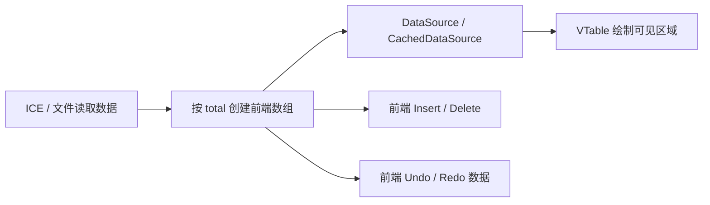

当完整数组同时承担位置索引、编辑、结构修改和历史数据时，VTable 减少的只是
屏幕绘制量，数组初始化、数组移动、历史保存和跨进程传输仍由前端承担。

新方案不是替换 VTable，而是改变 VTable 上游的数据管理方式：

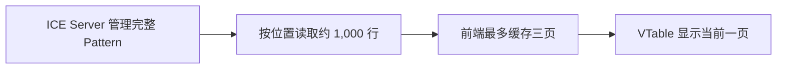

VTable 仍然负责高效绘制和表格交互，但不再通过一个与总行数等长的前端数组
代表完整 Pattern。

---

## 3. 新方案的核心思路

一句话说明：

> ICE Server 保存完整文档和所有修改；Webview 只读取当前位置附近的一小页，
> VTable 也只接收这一小页。

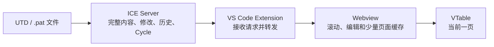

请求的返回方向与上图相反，但每一步仍沿原路径返回；Webview 不直接连接
ICE Server。

总行数可以是一亿或三亿，一次页面读取仍然只返回例如 1,000 行。总行数主要
用于计算逻辑位置和滚动范围，不决定前端要创建多少行对象。

本方案遵守四条边界：

1. React state 不保存页面 rows。
2. VTable 同时只接收当前一页 records。
3. Insert/Delete/Update/Paste 由 ICE Server 整笔处理。
4. revision、Undo/Redo、静态 Cycle 和文件保存结果以 ICE Server 为准。

---

## 4. 一次读取和一次修改经过哪些层

### 4.1 读取一页数据

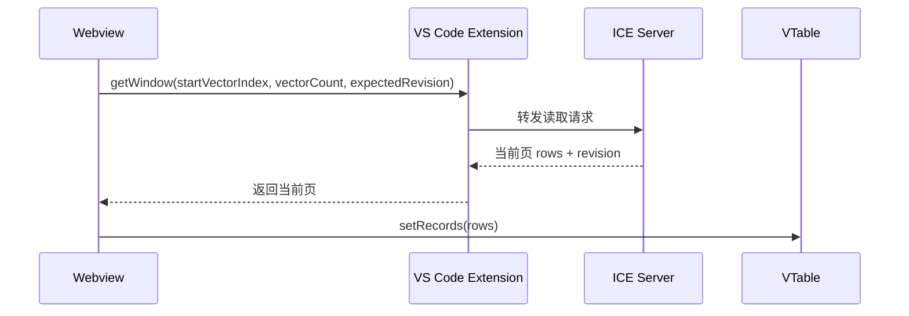

Extension 不解析 Pattern 行，也不长期保存当前页。它只负责接收 Webview 请求、
调用 ICE Server，并把结果返回给对应请求。

### 4.2 提交一次修改

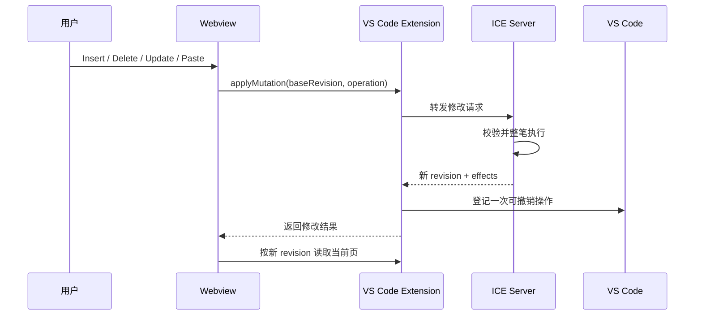

“整笔执行”表示一次操作要么全部成功，要么全部不生效。例如 Paste 同时覆盖
已有行并追加新行时，不能只完成其中一部分。

---

## 5. Webview、Extension 与 ICE Server 的职责

| 能力 | Webview | VS Code Extension | ICE Server |
| --- | --- | --- | --- |
| 绘制表格和处理焦点 | 负责 | 不负责 | 不负责 |
| 将纵向滚动位置换算为逻辑位置 | 负责 | 不负责 | 不负责 |
| 缓存当前附近三页 | 负责 | 不负责 | 不负责 |
| 保存完整 Pattern | 不保存 | 不保存完整行数组 | 负责 |
| 生成和查找 `rowKey` | 不生成、不解析 | 原样转发 | 负责 |
| 计算静态 Cycle | 只显示 | 原样转发 | 负责 |
| 发起 Insert/Delete/Update/Paste | 负责收集用户输入 | 接收并转发 | 校验并整笔执行 |
| Undo/Redo | 刷新结果页面 | 接收 VS Code 命令 | 执行真实撤销/重做 |
| Save/Save As | 不直接写文件 | 处理 VS Code 生命周期 | 写入 Pattern 文件 |
| Reload | 清选区并刷新页面 | 接收 VS Code 命令 | 丢弃未保存状态并重读文件 |
| 错误日志 | 上报错误编号和安全上下文 | 补充上下文并写日志 | 返回明确错误码 |

两个容易混淆的点：

- Webview 不能直接访问 ICE Server，所有调用都经过 Extension。
- `retainContextWhenHidden: true` 只保留页面交互状态，不表示 Webview 保存了
  完整 Pattern。

---

## 6. 接口中的关键数据

### 6.1 文档基本信息

```ts
type PatternMetadata = {
  totalVectors: number;
  revision: number;
};
```

| 字段 | 含义 |
| --- | --- |
| `totalVectors` | 当前 Pattern 一共有多少条 Vector |
| `revision` | 当前打开文档的数据版本；每次有效修改、Undo 或 Redo 成功后递增 |

Webview 不维护 `isDirty`、`canUndo` 或 `canRedo`。标签页圆点、Undo/Redo 命令和
Save 后的状态由 VS Code Custom Editor 生命周期管理。

### 6.2 按范围读取一页数据

```ts
type PatternWindowRequest = {
  startVectorIndex: number;
  vectorCount: number;
  expectedRevision: number;
};

type PatternWindowResponse = {
  totalVectors: number;
  revision: number;
  startVectorIndex: number;
  rows: PatternRenderRow[];
};
```

| 字段 | 含义 |
| --- | --- |
| `startVectorIndex` | 从第几条 Vector 开始，0 表示第一条 |
| `vectorCount` | 最多读取多少条，不是结束位置 |
| `expectedRevision` | Webview 期望读取的数据版本 |
| `rows` | ICE Server 返回的当前页数据 |

`expectedRevision` 可以防止把不同版本的页面混在一起。如果版本不一致，
ICE Server 返回 `REVISION_CONFLICT`，Webview 再读取最新文档基本信息和当前页。

### 6.3 行数据结构

```ts
type PatternRenderRow = {
  rowKey: string;
  vectorIndex: number;
  cycleText: string;
  instruction: string;
  comment: string;
  signalValues: Record<string, string>;
};
```

| 字段 | 含义 |
| --- | --- |
| `rowKey` | 当前打开文档内，这条数据的稳定身份 |
| `vectorIndex` | 当前逻辑位置，前面 Insert/Delete 后会变化 |
| `cycleText` | ICE Server 计算完成的静态 Cycle 显示文本 |
| `instruction/comment/signalValues` | Pattern 的可显示或可编辑字段 |

`rowKey` 回答“是哪条数据”，`vectorIndex` 回答“现在排在什么位置”，两者不能
互相替代。

### 6.4 修改请求和返回结果

```ts
type PatternMutationRequest = {
  baseRevision: number;
  operation: PatternMutationOperation;
};

type PatternMutationResponse = {
  previousRevision: number;
  revision: number;
  totalVectors: number;
  effects: PatternMutationEffect[];
  updatedRows?: PatternRenderRow[];
  message: string;
};
```

| 字段 | 含义 |
| --- | --- |
| `baseRevision` | 用户开始这次操作时看到的版本 |
| `previousRevision` | ICE Server 执行前的版本 |
| `revision` | ICE Server 执行后的版本 |
| `effects` | 实际更新了哪些位置、插入或删除了多少行 |
| `updatedRows` | 局部更新成功后可直接返回的完整新行 |

正常修改满足：

```text
baseRevision == ICE Server 执行前 revision
新 revision == previousRevision + 1
```

如果操作没有产生任何变化，可以不增加 revision。

---

## 7. 打开文件与按范围读取第一页

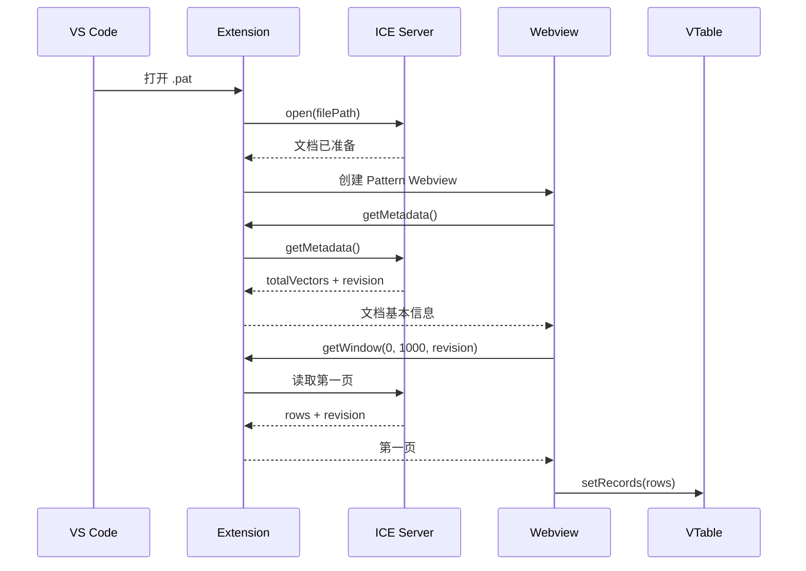

这一流程不会创建 `totalVectors` 长度的数组。空文件返回
`totalVectors = 0` 和空页，但仍然可以通过 Insert 创建第一批数据。

当前设置 `retainContextWhenHidden: true`。用户在多个 Pattern 页面间切换时，
VTable、滚动位置、选区和当前三页缓存不会反复重建。代价是每个隐藏页面仍会
占用一定内存，因此需要用真实列数和真实行大小测试同时打开多个文件的情况。

---

## 8. 三种纵向位置、三种滚动情况和三页缓存

### 8.1 不是三根可见纵向滚动条

实现中有三个与纵向位置有关的概念，但只有两套真实纵向滚动机制：

| 名称 | 形式 | 作用 |
| --- | --- | --- |
| `logicalScrollTopPx` | JavaScript 数值 | 表示完整 Pattern 中的理论像素位置 |
| outer scroll | 用户可见的原生纵向滚动条 | 提供从第一条到最后一条的整体导航 |
| `localScrollTopPx` | VTable 当前页内部的纵向位置 | 控制当前 records 在 VTable 内显示哪一部分 |

VTable 还单独管理横向滚动条，它与亿级纵向位置换算无关。

滚动关系如下：

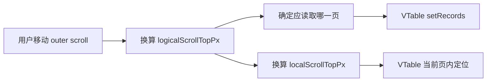

键盘上下移动导致 VTable 内部纵向滚动时，adapter 会监听 VTable 的公开
`scroll` 事件，再反向更新 `logicalScrollTopPx` 和 outer scroll，保证键盘和
鼠标滚动看到的是同一个整体位置。

### 8.2 三种滚动情况

浏览器能够可靠使用的 DOM 滚动高度有限。当前实现使用约
`16,000,000px` 作为安全高度：

| 模式 | 使用条件 | 位置换算 |
| --- | --- | --- |
| `single-window` | 数据不超过一页 | 不需要切换 records，直接在当前页滚动 |
| `direct-pixel` | 完整逻辑高度不超过约 16,000,000px | outer scroll 的像素距离与完整逻辑距离一致 |
| `compressed` | 完整逻辑高度超过约 16,000,000px | 将完整逻辑位置按比例映射到有限滚动高度 |

三种情况只改变 Webview 如何换算纵向位置。ICE Server 始终使用同一套
`getWindow(startVectorIndex, vectorCount, expectedRevision)`，不需要知道当前
页面处于哪一种滚动情况。

### 8.3 三页缓存参数

```text
windowSize = 1000
windowShift = 500
guardRows = 150
cacheWindowLimit = 3
```

| 参数 | 含义 |
| --- | --- |
| `windowSize` | 一页最多读取 1,000 行 |
| `windowShift` | 下一页起点向前移动 500 行 |
| `guardRows` | 距当前页边缘还有 150 行时提前准备下一页 |
| `cacheWindowLimit` | 最多保留前一页、当前页、后一页，共三页 |

因为 `windowSize = 1000`、`windowShift = 500`，相邻页面有 500 行重叠。换页前后
都能找到当前可见数据，VTable 执行 `setRecords()` 后更容易恢复到相同局部位置，
减少位置变化。

缓存 key 为：

```text
revision:startVectorIndex
```

如果同一页已经在读取，后续需要这页的操作会等待这次读取完成，不会再向
ICE Server 发起一份相同请求。实现中表现为多个调用共享同一个进行中的
Promise。

超过三页后，最早且不再需要的页面会被移除。Insert/Delete/Paste 等结构修改
产生新 revision 后，旧 revision 的页面不会继续复用。

### 8.4 如何防止旧请求覆盖新页面

每次页面切换都会增加一个内部请求序号。响应返回时同时检查：

1. 它是否属于当前页面切换请求；
2. 它的 revision 是否仍是当前 revision；
3. 返回起点和行数是否符合请求。

例如用户快速从第 1 万行跳到第 1 亿行，第 1 万行的请求即使更晚返回，也只能
被丢弃，不能覆盖第 1 亿行的画面。

---

## 9. rowKey、逻辑位置和静态 Cycle

### 9.1 rowKey 的生成和使用

生产 ICE Server 建议使用以下规则：

- 原始行：根据不可变源片段身份和源片段内位置生成；
- 新增行：使用当前打开文档内单调递增 ID，或 128-bit 唯一 ID；
- Insert/Delete 不改变仍然存在的行的 `rowKey`；
- ICE Server 维护 `rowKey` 到当前数据位置的索引；
- Webview 只能比较和回传 `rowKey`，不能解析其格式；
- 只要求当前打开文档期间稳定。

Reload、关闭后重新打开文件时允许重新生成 `rowKey`。因此 Reload 必须清除旧
选区和旧页面缓存。

### 9.2 逻辑位置

`vectorIndex` 是 0-based 当前位置。某条数据前面插入五行后，它的
`vectorIndex` 增加五；删除前面五行后，它的 `vectorIndex` 减少五。

显示序号或 Vector 编号根据当前位置计算，不能写入 `rowKey`。否则前面插入
一行就需要修改后面所有行的身份。

### 9.3 静态 Cycle

ICE Server 是静态 Cycle 的唯一计算者。以下操作完成后，新 revision 的页面
必须携带对应版本的 `cycleText`：

- Insert/Delete；
- 影响 Cycle 的单元格修改；
- Paste；
- Undo/Redo；
- Reload。

Webview 不推测哪些页面的 Cycle 发生变化。结构修改后，它按新 revision 重新
读取当前页。

---

## 10. Insert、Delete、Update 和 Paste

### 10.1 一个入口，四种明确操作

```ts
type PatternMutationOperation =
  | { kind: "insertRows"; atVectorIndex: number; count: number }
  | { kind: "deleteRows"; rowKeys: string[] }
  | { kind: "updateCells"; changes: PatternCellChange[] }
  | {
      kind: "paste";
      startRowKey: string;
      columns: PatternEditableColumnId[];
      values: string[][];
    };
```

四种操作共用 `applyMutation()`，使 revision 校验、日志、错误处理和历史登记
走同一条流程；`kind` 仍然保留，因为每种操作的校验和 Undo 数据不同。

### 10.2 Paste 为什么单独作为一种操作

Paste 可能同时覆盖已有行并在文件末尾追加新行。如果拆成 Update 和 Insert
两次请求，第一次成功、第二次失败时，用户的一次粘贴就只完成了一半。

Paste 必须作为一笔操作交给 ICE Server：

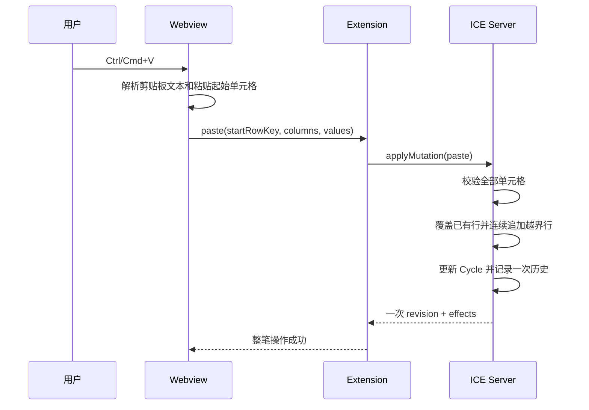

TSV 是剪贴板常用的纯文本格式：Tab 分隔列，换行分隔行。用户不会手工提供
`columnId`。VTable adapter 取得当前选中的起始单元格，Webview 再根据表格列
定义生成 `columns`；解析后的二维单元格文本放在 `values` 中。

```text
SIG_A<Tab>SIG_B 的下一列
0<Tab>1
1<Tab>X
```

上面的 `<Tab>` 表示制表符，解析结果是两行两列的 `values`。

当前规则：

- 必须从已有行开始粘贴；
- 超过文件末尾的部分由 ICE Server 连续追加；
- 不能从第 100 行直接创建第 200 行，中间留下不存在的数据；
- 剪贴板中的空单元格表示把目标值清为空字符串；
- 不允许覆盖只读列；
- 矩阵不规则或任一值非法时，整笔 Paste 不生效；
- 最大总行数由产品容量决定；
- 单次最多 10,000 行、100,000 个单元格；
- 已有行 `rowKey` 不变，新增行获得新 `rowKey`。

是否追加新行必须由 ICE Server 根据最新 `totalVectors` 判断。前端看到的
`totalVectors` 可能已经过期，不能用它决定最终写入结果。

一次 Paste 只登记一条历史。因此 Undo 这次 Paste 时，ICE Server 同时恢复被
覆盖的旧值，并删除这次 Paste 追加的新行。

### 10.3 不同修改采用不同刷新方式

| 操作 | 成功后的 Webview 处理 |
| --- | --- |
| 单个单元格 Update | ICE Server 返回更新后的完整行；前端替换三个缓存页中相同 `rowKey` 的行 |
| 批量 Update | 清理旧 revision 页面并重新读取当前页 |
| Insert/Delete/Paste | 保持原逻辑位置，清除选区，按新 revision 重新读取当前页 |

单个单元格只改变一行，且 ICE Server 返回了完整新行时，前端可以确认局部替换
是安全的。结构修改会改变后续位置和 Cycle，前端不自行计算每个缓存行的新
位置，直接读取 ICE Server 在新 revision 下返回的当前页。

如果 ICE Server 已成功，但前端替换缓存或 VTable records 失败，前端不能再次
发送同一修改。正确处理是读取最新文档基本信息和当前页，使画面恢复到
ICE Server 已经提交的结果。

---

## 11. 结构变化后的视图行为

本方案保持“原逻辑位置”，不是把原来第一条数据固定在屏幕顶部。

结构操作前，Webview 记录：

- 第一条可见数据的逻辑位置；
- 该行顶部已经滚出屏幕的像素；
- VTable 横向 `scrollLeft`。

提交后仍从原逻辑位置读取新 revision：

```text
操作前第一条可见位置：100
在位置 100 前插入 3 行
操作后第一条可见位置：仍为 100
原来位置 100 的数据变为位置 103，因此在屏幕中下移 3 行
```

删除同理：

```text
操作前第一条可见位置：100
在位置 100 前删除 3 行
操作后第一条可见位置：仍为 100
原来位置 100 的数据变为位置 97，因此上移并离开屏幕顶部
```

这样符合普通表格在当前区域之前增加或减少数据时的视觉结果。

其他规则：

- Insert/Delete/Paste 后清除选区，因为原选区可能已经指向不同位置；
- 结构型 Undo/Redo 后清除选区；
- 单单元格 Update 和只涉及单元格的 Undo/Redo 保留仍有效的选区；
- Reload 清除选区；
- 横向位置保持不变；
- 新数据不足一屏时，逻辑位置会钳位到末尾，并向前补足可显示的行；
- 页面切换和恢复期间不先清空 VTable records，因此不会出现白屏。

---

## 12. Instruction Search

本节是接口设计，当前代码尚未实现。

Instruction Search 必须由 ICE Server 搜索完整 Pattern。Webview 只有当前页，
不能为了搜索而逐页读取全部数据。

```ts
type FindInstructionRequest = {
  expectedRevision: number;
  query: string;
  startVectorIndex: number;
  includeStart: boolean;
  direction: "next" | "previous";
};

type FindInstructionResponse = {
  revision: number;
  match: null | {
    rowKey: string;
    vectorIndex: number;
  };
  wrapped: boolean;
};
```

第一阶段规则：

- 只搜索 Instruction；
- 使用普通子字符串匹配；
- 默认忽略大小写；
- 不支持正则表达式；
- 支持“上一个”和“下一个”；
- 到达末尾或开头时只环绕一次；
- 不返回完整匹配列表，避免匹配数量过大；
- 找到后 Webview 跳转到 `vectorIndex`，再选中 Instruction 单元格；
- 搜索期间 revision 变化时，旧结果作废。

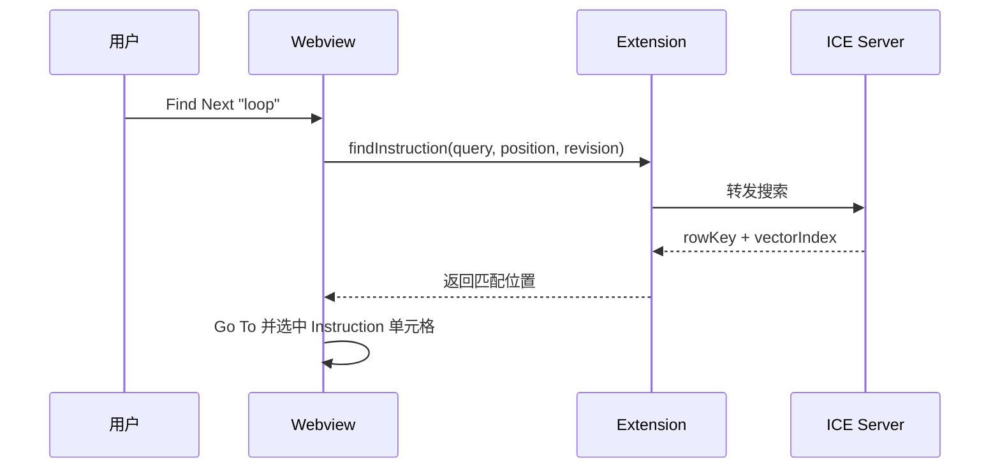

搜索建议 30 秒超时。用户发起新搜索时取消旧搜索，不自动并发发送相同搜索。
搜索超时只提示“搜索未完成”，不清空当前表格，也不影响继续编辑。

---

## 13. Undo/Redo 与大历史存储

### 13.1 VS Code 与 ICE Server 如何配合

每次有效修改成功后，Extension 通知 VS Code：“刚刚完成了一次可以撤销的
操作”。VS Code 记录操作顺序，并在用户按下 Undo/Redo 时回调 Extension；
真正的数据恢复由 ICE Server 完成。

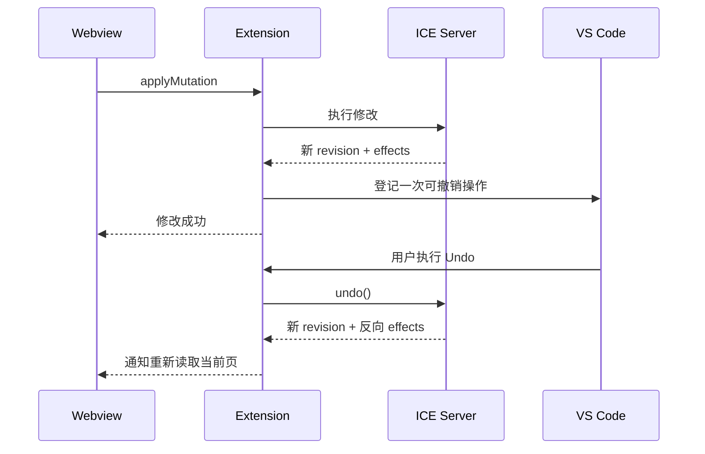

Webview 不保存历史栈，也不发送 `canUndo`、`canRedo` 或 `isDirty`。用户统一使用
VS Code 菜单和快捷键。

### 13.2 大量历史如何限制

不能在 ICE Server 中直接删除“超过 100 条”的历史，因为 VS Code 可能仍然
保留这些命令并在之后请求 Undo。

建议按占用空间管理，而不是只按条数管理：

```text
最近使用、占用较小的历史
    → 保存在内存中的紧凑修改记录

较早或占用较大的历史
    → 写入当前文档专用的临时历史文件

文档关闭或 Reload
    → 清理该文档的临时历史和旧会话历史
```

一条历史只保存恢复操作所需的数据，例如被修改的旧值、插入片段或删除片段，
不保存完整 Pattern 快照。内存预算达到阈值后，将较早历史内容转移到临时文件，
但保留可以按历史 ID 找回它的轻量索引。

如果产品需要彻底截断历史，必须让 VS Code 侧和 ICE Server 侧共同确认截断点，
不能只在 ICE Server 静默删除。本阶段不做固定条数截断，可以在后端数据结构
和真实操作规模确定后单独实现。

### 13.3 Save 与历史

Save 表示当前内容已经成功写入文件，不需要清空 Undo/Redo。用户保存后仍可以
Undo；一旦内容再次被编辑，VS Code 会重新显示未保存圆点。

---

## 14. Save、Save As、Reload 和关闭文件

### 14.1 Save

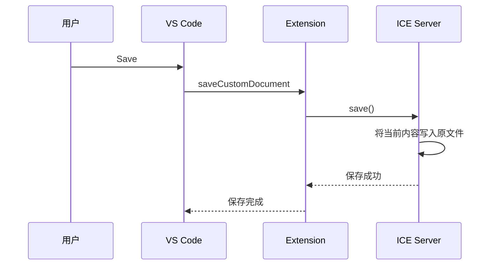

只有 ICE Server 确认写入成功，VS Code 才能清除标签页未保存圆点。保存失败时，
当前编辑状态和画面必须保留。

当前 TypeScript 参考实现仍通过 `serialize()` 产生验证文件内容；生产 C++
方案应由 ICE Server 直接完成大文件写入，避免把完整 Pattern 传给 Webview。

### 14.2 Save As

Save As 与 Save 的区别是目标文件路径不同。Extension 接收 VS Code 提供的新
路径并交给 ICE Server 保存。保存成功后，VS Code 按 Custom Editor 生命周期
处理目标文件；Webview 不需要先清空表格或重新创建超长数组。

产品需要在对接时确认：Save As 后当前 ICE 文档身份是否切换到新路径。如果
切换，ICE Server 和 Extension 应一起更新文档路径；如果 VS Code 重新打开目标
文件，则按普通打开流程建立新会话。两种方式只能选择一种并保持一致。

### 14.3 Reload

Reload 表示放弃未保存修改，并从原文件重新读取：

1. Extension 接收 VS Code 的重新加载命令；
2. ICE Server 丢弃当前未保存的内存修改和旧历史；
3. ICE Server 重新读取原文件；
4. Webview 保留旧画面，等待新文档基本信息和当前页准备完成；
5. 新页面一次替换旧页面；
6. 清除旧选区，保留合理逻辑位置和横向位置。

VS Code Custom Editor API 中，这个入口的方法名仍是
`revertCustomDocument()`；产品界面和本文统一称为 Reload。

### 14.4 关闭文件

- 没有未保存修改：直接关闭并释放 Webview、页面缓存和 ICE 文档会话。
- 存在未保存修改：由 VS Code 提示保存、放弃或取消关闭。
- 选择保存：Save 成功后关闭。
- 选择放弃：丢弃 ICE Server 内存修改并关闭。
- 关闭后重新打开：建立新会话，不保留上一次会话的 Undo/Redo。

### 14.5 隐藏页面与异常退出

`retainContextWhenHidden: true` 必须保留。用户在多个 Pattern 页面之间切换时，
隐藏页面继续保留 VTable、滚动位置、选区和最多三页缓存，避免反复重建。

当前产品明确不支持 VS Code Hot Exit Backup：

- `backupCustomDocument()` 方法因 VS Code 接口要求仍然存在；
- 实现会明确返回“不支持异常退出备份”；
- 不展开或传输完整 Pattern；
- 不写 Pattern 备份文件；
- 打开文件时不从 `backupId` 恢复。

因此 VS Code、Extension Host 或系统异常退出时，未保存修改可能丢失。正常
Save、Save As 和关闭时的保存/放弃提示不受影响。

---

## 15. 超时、mutationId、恢复和日志

### 15.1 四类请求分别处理

| 类别 | 建议超时 | 是否自动重试 | 超时后的界面 |
| --- | ---: | --- | --- |
| 文档基本信息、页面读取 | 15 秒 | 可以，只重试读取 | 保留旧表格，暂停依赖新数据的写入 |
| Instruction Search | 30 秒 | 不重复并发；新搜索取消旧搜索 | 提示搜索未完成，表格可继续使用 |
| Mutation | 由 ICE 调用配置决定 | 不直接重发 | 查询 `mutationId`，确认是否已经提交 |
| Undo/Redo、Save、Reload | 由对应调用配置决定 | 不自动重复执行 | 保留当前画面，记录错误并读取最新状态 |

文档基本信息和页面读取不会修改 Pattern，因此可以安全重试。多个同时发生的
读取失败共用一条恢复链，避免每个错误各自启动定时器。建议间隔：

```text
立即 → 500ms → 1s → 2s → 5s → 之后每 5s
```

间隔增加约 ±20% 随机偏移，避免多个隐藏页面在同一时刻集中请求。页面关闭后
停止定时器。

Undo/Redo、Save 和 Reload 会改变历史、文件或会话状态，不能因为响应超时就
自动再执行一次。失败后先读取 ICE Server 最新状态，再由 VS Code 显示具体
错误。

### 15.2 mutationId 解决什么问题

Mutation 最大的风险不是明确失败，而是“连接中断后不知道是否成功”。生产
接口为每次修改增加唯一 `mutationId`：

```ts
type PatternMutationRequest = {
  mutationId: string;
  baseRevision: number;
  operation: PatternMutationOperation;
};
```

Extension 生成 UUID。ICE Server 收到请求后先登记该 ID，同一个 ID 无论到达
多少次都不能执行两次。

状态查询：

```ts
type MutationStatusResponse =
  | { status: "processing" }
  | { status: "committed"; response: PatternMutationResponse }
  | { status: "rejected"; error: PatternRequestError }
  | { status: "notFound" };
```

| 状态 | 含义 | 前端处理 |
| --- | --- | --- |
| `processing` | ICE Server 已接收，尚未完成 | 按退避间隔继续查询，不重发 |
| `committed` | 整笔操作已成功 | 使用原结果并读取最新当前页 |
| `rejected` | 已明确拒绝，没有修改数据 | 显示具体错误 |
| `notFound` | ICE Server 确认没有接收该 ID | 是否用同一 ID 重发由产品策略决定 |

### 15.3 状态查询不是日常轮询

正常成功或明确失败的 Mutation 不查询状态。只有请求超时或连接中断、无法判断
是否提交时，才启动一条临时查询链：

```text
立即查询
→ 500ms
→ 1s
→ 2s
→ 5s
→ 每 5s 查询一次，直到累计 30s
→ 之后每 30s 查询一次，最长 5 分钟
```

约束：

- 每个文档最多一条状态查询链；
- 查询期间暂停新的写操作；
- `getMutationStatus()` 只查 `mutationId` 状态表，应为 O(1) 轻量查询；
- 查询不能扫描 Pattern；
- 五分钟仍无结果时停止自动查询，页面保持只读并记录错误；
- 用户可以 Reload，或由产品提供“重新检查操作状态”命令；
- ICE Server 如果能主动通知完成，优先使用通知，查询只作为超时兜底。

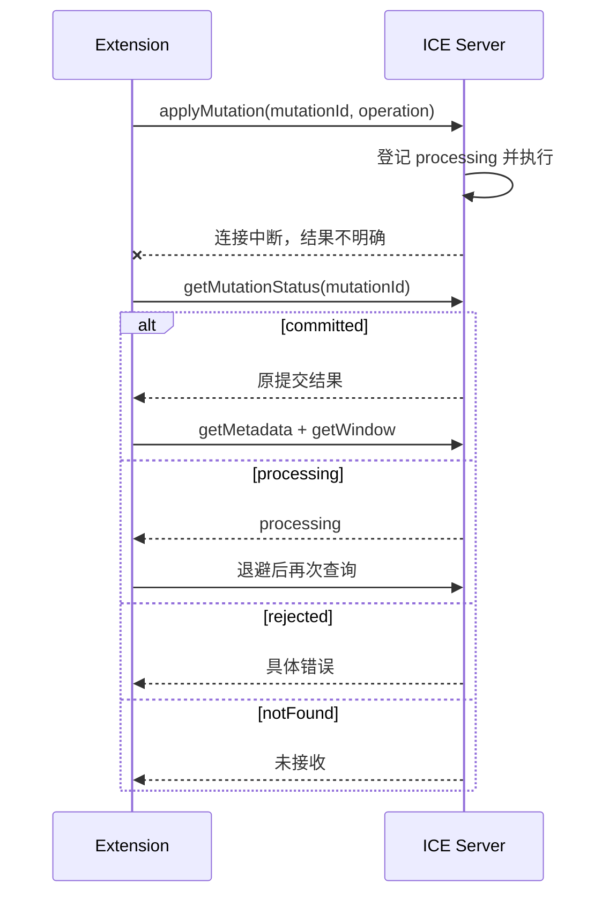

状态记录至少保留到文档会话关闭。数量较大时可以使用与历史相同的内存预算和
会话临时文件，但不能在仍可能查询时无提示删除。

### 15.4 自动恢复按四种情况处理

自动恢复不是对所有错误都重新加载整页：

| 失败情况 | 处理 |
| --- | --- |
| 输入值或只读列校验失败 | 恢复本地单元格旧值，显示错误，不读取整页 |
| 文档基本信息或页面读取失败 | 保留旧表格，自动重试安全读取 |
| Mutation 结果不明确 | 查询 `mutationId`，绝不直接重复写入 |
| ICE Server 已成功，但前端应用结果失败 | 读取最新文档基本信息和当前页，一次替换 |

恢复期间：

- 不把 VTable records 设置为空；
- 不使用覆盖表格的 Loading 遮罩；
- 暂停新的写操作；
- 保留横向位置和原逻辑位置；
- 自动恢复默认保留仍有效的选区；
- 恢复成功后自动解除只读状态。

### 15.5 日志链路


日志记录：

- 错误 ID、时间、命令和处理阶段；
- `requestId`、`revision`、当前页起点；
- ICE error code、message 和 stack；
- `mutationId` 状态查询结果；
- 自动恢复成功或最终失败。

日志禁止记录：

- 单元格内容；
- 完整行数据；
- Paste 文本；
- 完整页面响应；
- UTD 或 `.pat` 文件内容。

相同错误第一次立即记录，之后 30 秒内合并，并附带被合并次数。正常滚动、
绘制和 cache hit 不写日志。日志进入 VS Code `LogOutputChannel`，不额外创建
产品日志文件。

---

## 16. ICE Server 内部数据结构

> 本章保留当前技术方向，具体实现由前端与 ICE 团队后续单独评审。

### 16.1 当前 TypeScript 参考实现的定位

当前 synthetic store 使用 flat piece array，目的是验证窗口协议、事务语义和
亿级逻辑位置，不是生产级 C++ 性能结论。piece 数量持续增加后，线性扫描和
数组 splice 仍会变慢。

### 16.2 内存编辑会话：Piece Tree / Rope

推荐模型：

```text
不可变的原始 Pattern
        +
平衡的 Piece Tree / Rope
        +
每个子树保存行数和 Cycle 相关摘要
```

Piece Tree、Rope 和“带子树行数的平衡树”属于同一类思路，不要求实现三套结构：

- 叶子引用原始文件片段或新增缓冲区；
- Insert 通过切分/拼接节点完成；
- Delete 通过移除或缩短片段完成；
- 子树行数支持按逻辑位置快速定位；
- rowKey 索引支持按稳定身份定位；
- Cycle 摘要支持局部更新；
- 原始文件不因每次修改而整体复制。

具体选择 AVL、Red-Black Tree、B-Tree 形态或其他平衡方式，由 C++ 团队结合
已有基础库决定，但必须提供按行位置查询、区间读取、结构修改和子树统计。

### 16.3 磁盘分页或持久索引：B+ Tree

如果真实 `.pat`/UTD 文件很大、不能在打开时建立完整内存索引，或者希望下次
打开复用持久索引，可以增加 B+ Tree：

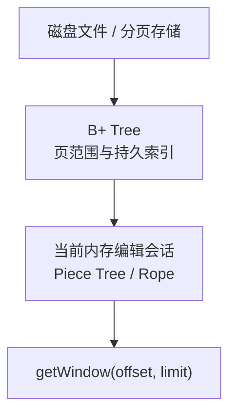

B+ Tree 适合：

- 按磁盘页范围读取；
- 保存持久索引；
- 快速定位大文件区间；
- 减少重新打开文件时的全量扫描。

它不替代 Webview 页面协议，也不表示所有项目必须同时维护两棵树。建议顺序：

1. 先实现正确的内存编辑会话；
2. 测量真实文件打开、索引和内存成本；
3. 只有需要磁盘分页或持久索引时再增加 B+ Tree 层。

### 16.4 数据结构最低能力

C++ 实现至少需要：

- `getWindow(offset, limit)`；
- `findPosition(rowKey)`；
- 按位置插入、按 rowKey/区间删除；
- 批量单元格修改和 Paste；
- Undo/Redo 所需 delta；
- 子树行数；
- 静态 Cycle 的依赖摘要或快速重算入口；
- Save 和 Reload。

---

## 17. 前端与 ICE Server 接口说明

### 17.1 调用关系

Webview 不能直接访问 ICE Server：

```text
Webview → VS Code Extension → ICE Client → ICE Server
```

Extension 负责把 Webview 请求转换为 ICE 调用，并将结果返回给原请求。它不
计算 Cycle、不修改行、不保存完整 Pattern。

### 17.2 建议接口

```ts
interface PatternBackend {
  open(filePath: string): PatternMetadata;
  getMetadata(): PatternMetadata;
  getWindow(request: PatternWindowRequest): PatternWindowResponse;
  findInstruction(
    request: FindInstructionRequest
  ): FindInstructionResponse;
  applyMutation(
    request: PatternMutationRequest
  ): PatternMutationResponse;
  getMutationStatus(mutationId: string): MutationStatusResponse;
  undo(): PatternHistoryResponse;
  redo(): PatternHistoryResponse;
  save(destination?: string): void;
  reload(): PatternMetadata;
  close(): void;
}
```

当前 TypeScript 参考实现尚未包含 `findInstruction`、`mutationId` 状态查询和
生产级 `save/reload`，这些是 C++ ICE 对接前需要共同确认的接口。

### 17.3 ICE Server 必须保证

- 同一打开文档内，仍存在的行 `rowKey` 稳定；
- `revision` 单调递增；
- 页面响应属于请求的 `expectedRevision`；
- 一笔修改全部成功或全部不生效；
- Paste 的覆盖和追加只产生一次 revision、一次历史；
- Undo/Redo 同时恢复结构、单元格和静态 Cycle；
- 无变化操作可以不增加 revision；
- `mutationId` 不会执行两次；
- 错误中不返回敏感行内容。

### 17.4 错误分类

| code | 含义 | Webview / Extension 处理 |
| --- | --- | --- |
| `VALIDATION_ERROR` | 输入、字段、选区或容量不合法 | 显示具体错误，局部回退，不读取整页 |
| `REVISION_CONFLICT` | 操作基于旧版本 | 读取最新文档基本信息和当前页 |
| `NOT_FOUND` | `rowKey` 在当前文档不存在 | 提示并读取最新状态 |
| `TIMEOUT` | ICE 调用超时 | 按第 15 节的请求类别处理 |
| `INTERNAL_ERROR` | ICE Server 内部失败 | 记录日志；安全读取可恢复，写入先确认状态 |

### 17.5 重要场景检查

| 场景 | 必须保证 |
| --- | --- |
| 当前区域前插入行 | 保持原逻辑位置，原数据自然下移 |
| 当前区域前删除行 | 保持原逻辑位置，原数据自然上移 |
| 删除后不足一屏 | 向前补足，不显示大片空白 |
| Paste 同时覆盖和追加 | 一笔操作、一次 revision、一次 Undo |
| Paste 中有非法值 | 整笔拒绝，不能只提交合法单元格 |
| 静态 Cycle 大范围变化 | 新页面的 Cycle 与新 revision 一致 |
| Mutation 成功但响应丢失 | 不直接重发，通过 `mutationId` 确认 |
| Save 后 Undo | 允许 Undo，VS Code 重新显示未保存圆点 |
| Reload 时旧页面请求晚到 | 旧请求不能覆盖重新加载后的页面 |
| ICE Server 暂时不可用 | 保留旧画面，暂停写入并重试安全读取 |
| 最后一行 | 行高、文字和底部网格线完整 |
| 页面隐藏后再显示 | 保留滚动、选区和交互状态 |
| 页面关闭时仍有请求 | 停止定时器，迟到结果不再更新页面 |
| VS Code 或系统异常退出 | 当前不支持 Hot Exit Backup，未保存修改可能丢失 |

---

## 18. VS Code API 与源码阅读附录

### 18.1 VS Code API 名称

| VS Code API | 本文中的业务含义 |
| --- | --- |
| `CustomEditorProvider` | Pattern 自定义编辑器入口 |
| `CustomDocumentEditEvent` | Extension 通知 VS Code 已完成一次可撤销操作 |
| `saveCustomDocument()` | Save |
| `saveCustomDocumentAs()` | Save As |
| `revertCustomDocument()` | Reload：丢弃未保存修改并重读原文件 |
| `backupCustomDocument()` | VS Code Hot Exit 接口；当前产品明确不支持 |
| `retainContextWhenHidden` | 页面隐藏时保留 Webview 界面上下文 |

### 18.2 推荐源码阅读顺序

业务接入按以下顺序：

1. `src/shared/protocol.ts`：行结构、revision、页面读取和统一修改。
2. `src/extension/patternBackend.ts`：ICE Server 需要提供的能力边界。
3. `src/pattern-domain/patternTableBinding.ts`：Pattern 字段与表格列的映射。
4. `src/webview/patternReadClient.ts`：Webview 如何请求 Extension。
5. `src/webview/usePatternViewport.ts`：修改、恢复和页面状态。
6. `src/webview/PatternTable.tsx`：列配置如何接入公共表格区域。
7. `src/webview/PatternEditorApp.tsx`：插件页面装配。
8. `src/extension/patternEditorProvider.ts`：请求转发和 VS Code 生命周期。

以下是稳定基础设施，迁移时通常只看接口：

9. `src/pattern-large-data-vtable/index.ts`
10. `src/pattern-large-data-vtable/DocumentTableSurface.tsx`
11. `src/pattern-large-data-vtable/vtableAdapter.ts`
12. `src/pattern-large-data-vtable/logicalViewport.ts`
13. `src/pattern-large-data-vtable/logicalViewportMath.ts`
14. `src/diagnostics/index.ts`

不迁移到真实产品 Webview：

- `src/dev-only/syntheticPatternBackend.ts`
- `src/dev-only/syntheticPatternStore.ts`
- `examples/acceptance`

### 18.3 参考资料

- [VTable 异步懒加载说明](https://visactor.io/vtable/guide/data/async_data)
- [VS Code Custom Editor API](https://code.visualstudio.com/api/extension-guides/custom-editors)
- [VS Code Webview API](https://code.visualstudio.com/api/extension-guides/webview)
- [VS Code Process Architecture](https://github.com/microsoft/vscode/wiki/source-code-organization)
