# Pattern 大数据 VTable 编辑器技术方案

> 受众：Pattern 前端、C++ ICE/文档会话开发、后续维护人员
> 运行形态：VS Code Custom Editor
> 当前参考实现：TypeScript synthetic backend
> 目标实现：C++ ICE＋UTD/`.pat`
> 本文目标：不阅读代码也能理解数据、滚动、编辑、历史、恢复和生命周期

## 1. 改造背景

现有 Pattern 前端使用 Datasource 方案。Datasource 初始化时会根据 `total`
创建同等长度的空数组，增删改查和 Undo/Redo 也主要由前端维护。

当数据规模进入千万到亿级后，问题不再只是“表格一次画多少行”：

- 全长数组的初始化和内存随 `total` 增长。
- Insert/Delete 会影响后续大量逻辑位置。
- 前端历史需要保留越来越多的数据变化。
- 前端与后端文件可能同时成为数据真源。
- 静态 Cycle 依赖完整 Pattern，当前局部数据无法可靠计算。

本方案将 Pattern 改为：

```text
后端文档会话保存完整 Pattern
前端按需读取当前小窗口
VTable 只绘制当前一个窗口
所有写事务和 Undo/Redo 在后端执行
```

面向领导和所有后端的通俗说明见
[Pattern 超大数据编辑器改造说明](./pattern-large-data-refactor-overview.md)。

## 2. 现有 Datasource 方案的问题

### 2.1 VTable 虚拟绘制不等于数据虚拟化

VTable 可以只绘制屏幕附近的 Canvas 内容，但如果 Datasource 已经创建
`total` 长度的数组，前端仍然承担完整数据结构的初始化和维护成本。


最后一步减少的是绘制，不是前面全长数组的成本。

### 2.2 前端维护结构和历史会形成双真源

如果前端负责数组 Insert/Delete、Undo/Redo，而后端负责 `.pat` 文件保存，就会
出现两套状态：

```text
前端数组状态
后端文档状态
磁盘文件状态
```

失败、Revert、超时或版本交错时，很难证明三者完全一致。正确边界应是后端文档
会话为唯一真源，前端是窗口化编辑器。

## 3. 目标与约束

### 3.1 目标

- 支持 1 亿级 Pattern 的滚动、定位和编辑。
- 前端内存不与 `totalVectors` 线性增长。
- React state 不保存当前窗口 rows。
- VTable 同时只接收一个小窗口。
- Insert/Delete/Update/Paste 使用统一事务边界。
- 后端维护 revision、Undo/Redo、dirty 和保存基线。
- 静态 Cycle 由后端计算。
- 失败时不白屏、不重复写操作，并自动恢复安全读。
- 未来只替换 Pattern 领域字段和 C++ ICE backend，不重写窗口 runtime。

### 3.2 固定约束

- 数据来自 UTD/`.pat`，不使用数据库。
- 同一文档只允许一个 Custom Editor。
- 不处理一个文件多个视图的实时同步。
- 外部直接修改源文件后不自动重载；用户主动 Revert/Reload。
- 不回退到创建全长数组的 CachedDataSource。
- 不让 React state 持有窗口 records。
- 不把 Timing 强行接入 Pattern 亿级 runtime。

## 4. 字段与术语字典

### 4.1 文档摘要

```ts
type PatternMetadata = {
  totalVectors: number;
  revision: number;
  isDirty: boolean;
  canUndo: boolean;
  canRedo: boolean;
};
```

| 字段 | 含义 | 维护者 |
| --- | --- | --- |
| `totalVectors` | 当前文档总 Vector 数 | 后端 |
| `revision` | 当前会话数据版本 | 后端 |
| `isDirty` | 是否与最近一次成功保存的基线不同 | 后端 |
| `canUndo` | 是否存在可撤销事务 | 后端 |
| `canRedo` | 是否存在可重做事务 | 后端 |

`metadata` 是文档摘要，不包含窗口 rows。

### 4.2 窗口读取

```ts
type PatternWindowRequest = {
  startVectorIndex: number;
  vectorCount: number;
  expectedRevision: number;
};

type PatternWindowResponse = PatternMetadata & {
  startVectorIndex: number;
  rows: PatternRenderRow[];
};
```

| 字段 | 含义 |
| --- | --- |
| `startVectorIndex` | 窗口第一条数据的 0-based 逻辑位置 |
| `vectorCount` | 希望读取的最大数量，不是结束位置 |
| `expectedRevision` | 前端期望读取的版本，防止混入新旧数据 |
| `rows` | 实际返回的小窗口 |

### 4.3 行数据

```ts
type PatternRenderRow = {
  rowKey: string;
  vectorIndex: number;
  cycleText: string;
  instruction: string;
  comment: string;
  signalValues: Record<SignalId, string>;
};
```

| 字段 | 含义 | 规则 |
| --- | --- | --- |
| `rowKey` | 打开会话内稳定身份 | 前端不得解析 |
| `vectorIndex` | 当前显示位置 | 前面增删后允许变化 |
| `cycleText` | 后端计算的静态 Cycle 显示文本 | 前端不自行推导 |
| 其他字段 | 当前 Vector 可编辑内容 | 由 Pattern binding 映射到列 |

### 4.4 写入与版本

| 字段 | 含义 |
| --- | --- |
| `baseRevision` | 写入开始时前端掌握的版本 |
| `previousRevision` | 后端提交前版本 |
| `revision` | 后端提交后版本 |
| `effects` | 实际插入、删除或更新的客观范围 |

有效事务满足：

```text
baseRevision == backend current revision
revision == previousRevision + 1
```

无变化操作可以不推进 revision。

## 5. 旧架构与新架构

### 5.1 旧架构

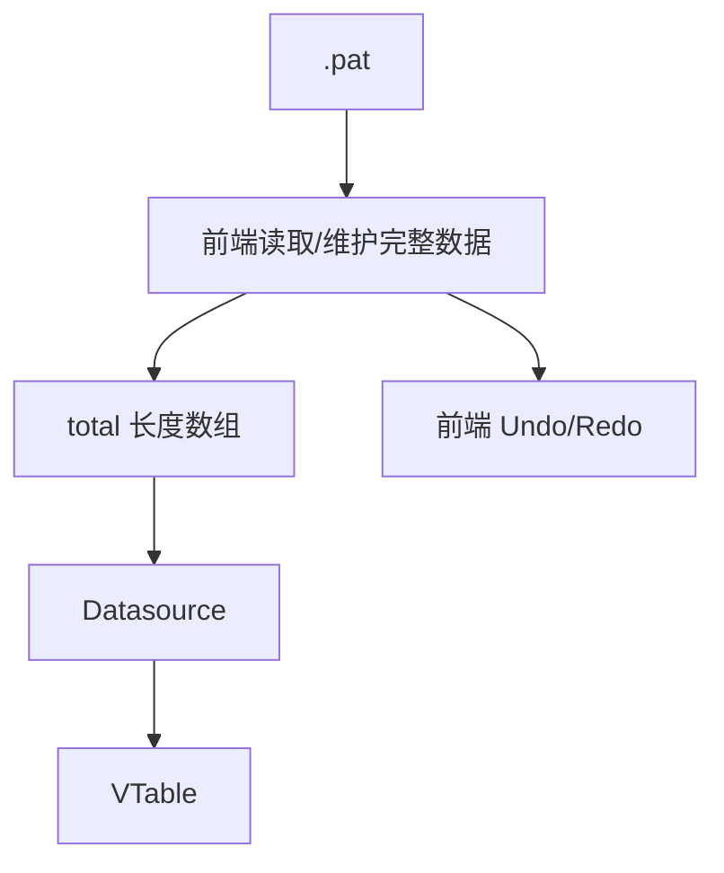

### 5.2 新架构

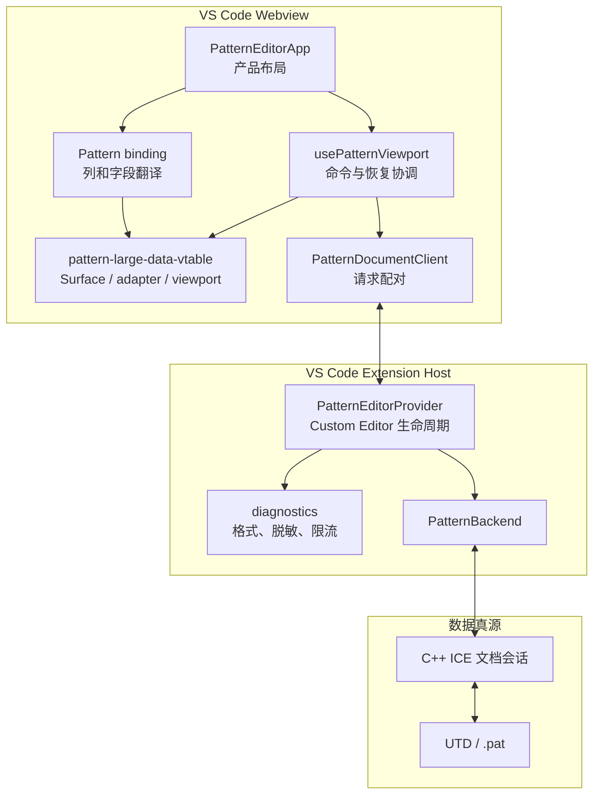

### 5.3 Pattern 大数据模块边界

```text
src/pattern-large-data-vtable/
  DocumentTableSurface.tsx
  vtableAdapter.ts
  logicalViewport.ts
  logicalViewportMath.ts
  index.ts
```

- `DocumentTableSurface`：React、DOM、焦点和三层表格区域。
- `vtableAdapter`：隔离 VTable imperative API、事件、选区和尺寸。
- `logicalViewport`：Pattern 亿级窗口、缓存和逻辑纵向滚动。
- `logicalViewportMath`：无副作用坐标和窗口计算。
- `index.ts`：迁移到真实 Pattern 项目的稳定入口。

Pattern 字段、Cycle、mutation、页面和 backend 不进入该目录。

## 6. 前后端职责

| 能力 | 前端 | 后端 |
| --- | --- | --- |
| 完整文档 | 不持有 | 唯一真源 |
| 当前窗口 | 请求、缓存、绘制 | 按版本返回 |
| rowKey | 比较和回传 | 生成和解析 |
| vectorIndex | 显示 | 按逻辑位置计算 |
| 静态 Cycle | 显示 | 计算 |
| mutation | 收集用户意图 | 校验并原子提交 |
| Undo/Redo | 发命令、重读窗口 | 维护历史 |
| dirty/保存基线 | 显示 | 维护 |
| Save/Revert/Backup | Custom Editor 生命周期 | 序列化/重建会话 |
| 错误恢复 | 保留画面、重试安全读 | 返回明确错误和当前版本 |

## 7. 文档打开

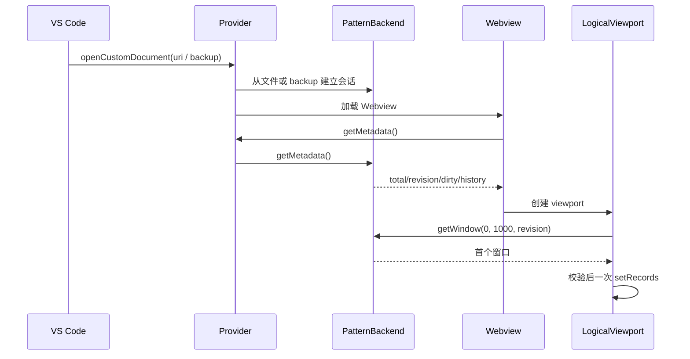

打开阶段不允许把完整 Pattern 传给 Webview。

## 8. metadata 与 window 协议

### 8.1 请求规则

- `startVectorIndex` 必须为非负整数。
- `vectorCount` 必须在后端允许范围内，当前参考上限为 1,000。
- `expectedRevision` 必须等于当前后端版本。
- 空文档返回 `rows=[]`、`startVectorIndex=0`。
- 非空窗口应返回从请求位置开始的完整可用数量，末窗可少于 1,000。

### 8.2 前端响应校验

前端在提交给 VTable 前校验：

- `response.revision === expectedRevision`。
- `response.totalVectors === 当前已知 totalVectors`。
- `response.startVectorIndex === 请求 offset`。
- rows 数量等于该位置应该返回的数量。
- 旧请求、旧 revision 和被新切窗替代的 response 不得覆盖当前画面。

### 8.3 超时

VS Code Webview client 对安全读设置 15 秒超时：

```text
getMetadata：可以超时并自动重试
getWindow：可以超时并自动重试
applyMutation：不由前端自动重试
runHistory：不由前端自动重试
```

底层请求无法取消时，迟到 response 会因 requestId、切窗序号和 revision 被丢弃。

## 9. 纵横滚动与键盘导航

### 9.1 两套纵向坐标

1 亿行、28px 行高约为 28 亿逻辑像素，不能创建同高度 DOM。runtime 将真实
逻辑位置映射到最大 1,600 万像素的原生 scrollbar。

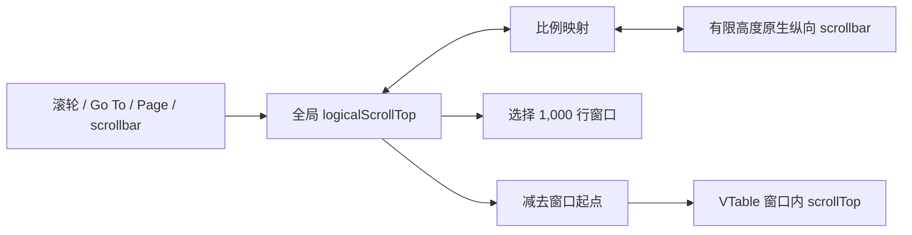

映射关系：

```text
scrollbarTop / maxScrollbarTop
    =
logicalTop / maxLogicalTop
```

### 9.2 横向滚动

横向继续使用 VTable 自身 scrollbar：

- VTable 知道真实列宽和冻结列。
- 不需要创建第二套横向逻辑坐标。
- Window 切换和结构 mutation 后恢复 `scrollLeft`。

### 9.3 键盘行为

- `ArrowUp/ArrowDown` 由 VTable 移动选区。
- 选区仍在可见区域内时，纵向 scrollbar 不动。
- 选区越过可见边缘后，adapter 监听 VTable 公开 `SCROLL` 事件。
- runtime 将窗口内 scrollTop 换成全局逻辑位置，同步原生 scrollbar。
- `ArrowLeft/ArrowRight` 继续由 VTable 和其横向 scrollbar 处理。
- 编辑框中的方向键只移动文本光标。
- `PageUp/PageDown/Home/End` 由 runtime 处理全局导航。

窗口重叠切换前保存：

```ts
{ rowKey, columnIndex }
```

新窗口仍包含该 `rowKey` 时，使用 VTable 公开选区 API 恢复单元格。

### 9.4 VTable 版本隔离

尺寸、冻结区高度和选区 API 只允许出现在 adapter。当前 VTable 版本中某些高度
属性虽然可被类型访问，但仍属于升级敏感点。业务代码不得直接调用
`tableY`、`getFrozenRowsHeight()` 或 `getBottomFrozenRowsHeight()`。

升级 VTable 时只回归 adapter：

- 分组表头真实高度。
- 底部横向 scrollbar 是否覆盖末行。
- 冻结列与横向滚动。
- 选区、Clipboard 和编辑事件。
- 最后一行是否完整显示。

## 10. 三窗口缓存

默认参数：

```text
rowHeight = 28
windowSize = 1,000
windowShift = 500
guardRows = 150
cacheWindowLimit = 3
```


规则：

- cache key 为 `revision:startVectorIndex`。
- 同一 key 的 pending 请求复用同一 Promise。
- resolved 与 pending 都计入 3 个 entry 硬上限。
- 淘汰 pending 只表示不再接纳结果，不要求底层一定可取消。
- 当前窗口成功切换前保留旧 Canvas。
- 预取失败会触发安全恢复，但不会清空当前表格。
- cache 统计只用于状态和诊断，不把 rows 放入 React state。

窗口重叠时 3 个 entry 最多保存 3,000 个物化记录，但不同逻辑位置通常更少。
真实内存仍与 Signal 列数、单行字符串和 VTable 内部对象有关。

## 11. rowKey、显示位置与静态 Cycle

### 11.1 rowKey

`rowKey` 是会话内稳定身份：

- 前面 Insert/Delete 不改变已有行 rowKey。
- 前端不把 rowKey 转数字或推导 offset。
- Update、Delete、Paste 起点、选择恢复和历史引用都使用 rowKey。
- 关闭文档后重新打开，是否复用同一 rowKey 由后端协议决定；当前只要求会话内稳定。

### 11.2 vectorIndex / displaySeq

显示序号代表当前逻辑位置，不是主键。前面插入 5 行后，原第 100 行显示为
第 105 行是正确行为。

### 11.3 静态 Cycle

`cycleText/staticCycle` 是后端派生字段。前端只显示窗口响应中的值，不缓存一套
全局 Cycle 索引，也不尝试根据当前窗口增量推导。

## 12. Insert/Delete 后保持当前看到的数据

结构 mutation 前保存：

```ts
type ViewportSnapshot = {
  firstVisibleVectorIndex: number;
  intraRowOffsetPx: number;
  horizontalScrollLeftPx: number;
};
```

后端返回客观 effects：

```ts
type PatternMutationEffect =
  | { kind: "rowsInserted"; startVectorIndex: number; count: number }
  | { kind: "rowsDeleted"; startVectorIndex: number; count: number }
  | {
      kind: "cellsUpdated";
      startVectorIndex: number;
      endVectorIndex: number;
      changedCellCount: number;
    };
```

前端映射规则：

- 当前可见位置前插入 N 行：目标位置加 N。
- 当前可见位置前删除 N 行：目标位置减 N。
- 当前看到的数据位于删除区：落到删除区起点。
- 新总行数不足一屏：按新的最大 scrollTop 向前补齐。
- 纯单元格更新：逻辑位置保持不变。

例：

```text
总共 100 行，首可见为第 5 行
删除第 6～100 行
新数据只剩第 1～5 行
前端请求 offset=0，显示第 1～5 行
```

后端不需要计算主观的 `anchorRow`。它只返回实际 effects 和新 total，前端结合
修改前 viewport snapshot 完成显示策略。

## 13. 统一 mutation

```ts
type PatternMutationOperation =
  | {
      kind: "insertRows";
      atVectorIndex: number;
      count: number;
    }
  | {
      kind: "deleteRows";
      rowKeys: string[];
    }
  | {
      kind: "updateCells";
      changes: PatternCellChange[];
    }
  | {
      kind: "paste";
      startRowKey: string;
      columns: PatternEditableColumnId[];
      values: string[][];
    };

type PatternMutationRequest = {
  baseRevision: number;
  operation: PatternMutationOperation;
};
```

所有写操作进入同一个后端入口：

```ts
applyMutation(request): PatternMutationResponse
```

统一入口不表示所有 operation 使用同一套内部算法，而是统一以下事务规则：

- 先校验 `baseRevision`。
- 全部校验通过后再提交。
- 一次有效操作推进一次 revision。
- 一次有效操作形成一个 history entry。
- 返回客观 effects、dirty 和 Undo/Redo 状态。
- 失败必须零副作用。

### 13.1 单单元格更新

单元格编辑使用一条 `updateCells.changes`。若后端返回唯一 `updatedRow`：

- runtime 可把当前 revision 的重叠缓存原子迁移到新 revision。
- 所有缓存中相同 rowKey 同时替换。
- 当前视口不重读，不产生闪动。

若本地 cache 应用失败，进入自动权威恢复。

### 13.2 批量更新和结构操作

批量 Update、Insert、Delete 和 Paste 默认读取新 revision 窗口，不猜测性修补
多个缓存。读取成功前保持旧 Canvas。

## 14. Paste 事务

### 14.1 为什么 Paste 必须是独立 operation

一次 Paste 可能同时：

- 更新已有行。
- 超过文档末尾并新增行。

如果前端先 Update 再 Insert，中间失败会留下半完成状态。因此 Paste 是统一
mutation 下的独立 operation，在后端一次事务中完成两部分。

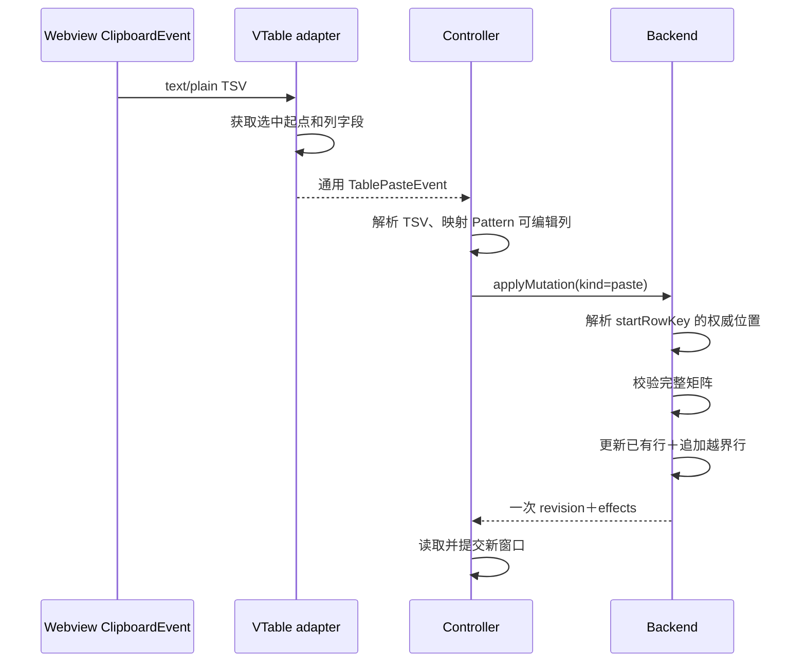

### 14.2 规则

- 必须从已有选中行开始。
- `columns` 必须全部可编辑。
- 不允许越过最后一个可编辑列。
- 矩阵必须规则。
- 空字符串表示覆盖为空。
- 单次最多 10,000 行、100,000 单元格。
- 新增行由后端默认行工厂补齐未粘贴字段。
- 已有行 rowKey 不变；新增行获得新 rowKey。
- 任一值非法则整次拒绝。
- 无变化可以不推进 revision。
- 一次 Undo 同时恢复旧单元格并删除新增行。

### 14.3 VS Code Clipboard

VTable 内建 Paste 写入被关闭，避免它先改当前窗口并截断越界数据。

adapter 使用原生同步 `copy`/`paste` 事件：

- Copy 从 VTable 公开选区取得 TSV，写入事件 `clipboardData`。
- Paste 读取 `text/plain`，不把 records 作为真源。
- `Ctrl/Cmd+A/C/V` 在 VS Code Webview 与浏览器 Demo 走同一事件链。
- adapter 输出通用事件，不包含 Pattern operation。

## 15. Undo/Redo 与保存基线

### 15.1 历史归属

Webview 不维护第二套历史栈。后端保存事务历史，VS Code 保存编辑命令入口。

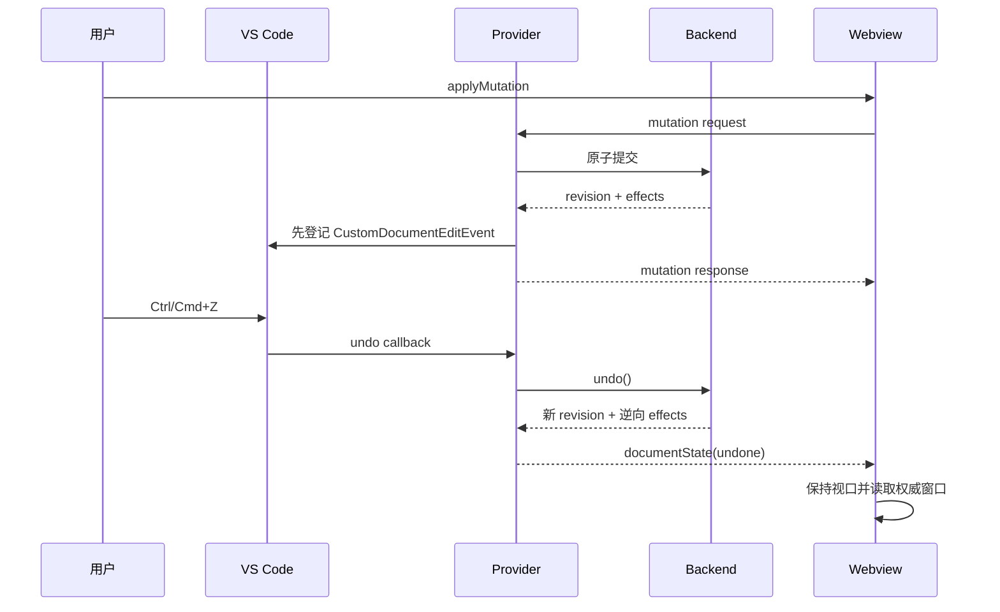

Provider 在后端提交成功后、回复 Webview 前登记历史。即使响应通道随后失败，
写入仍可 Undo，前端只进行安全读恢复，不重发 mutation。

### 15.2 保存基线

- `isDirty` 不等于“revision 大于 0”。
- Save 成功后后端调用 `markSaved()` 更新基线。
- Undo 回到保存内容时可以变为 clean。
- Redo 离开保存内容时重新 dirty。
- Save 后历史是否保留由后端产品策略决定。
- 历史条数和内存预算属于 C++ backend，不影响前端窗口协议。

## 16. 静态 Cycle 后端计算

### 16.1 为什么前端不能算

前端最多只有三个小窗口，静态 Cycle 可能依赖窗口外：

- 前面全部 Vector 的累积。
- Insert/Delete 后的结构变化。
- matchLoop 静态展开或边界。
- Paste 的跨行影响。

若前端只修当前窗口，会产生窗口间不一致。后端掌握完整文档和结构，必须成为
静态 Cycle 唯一计算者。

### 16.2 接口要求

- window response 对每条行返回可直接显示的 `cycleText/staticCycle`。
- mutation effects 应能说明哪些逻辑范围可能变化。
- 后端可内部增量计算，但不能要求前端维护全局索引。
- Undo/Redo 后返回与恢复版本一致的 Cycle。
- 计算失败应使整个相关事务失败，不能提交结构但保留错误 Cycle。

动态运行态 Cycle 不在本次 Pattern 窗口方案范围内，需要独立定义运行数据源和
刷新语义。

## 17. 自动恢复与 diagnostics

### 17.1 恢复状态

```text
healthy
recovering
disposed
```

触发恢复的情况：

- metadata/window 暂时失败或 15 秒超时。
- backend/ICE 返回内部错误。
- revision 不一致。
- mutation 已提交但本地 cache 迁移失败。
- VTable 应用新 records 失败。
- Undo/Redo/Revert 后窗口更新失败。
- 迟到 response 或旧 revision response。

### 17.2 恢复流程

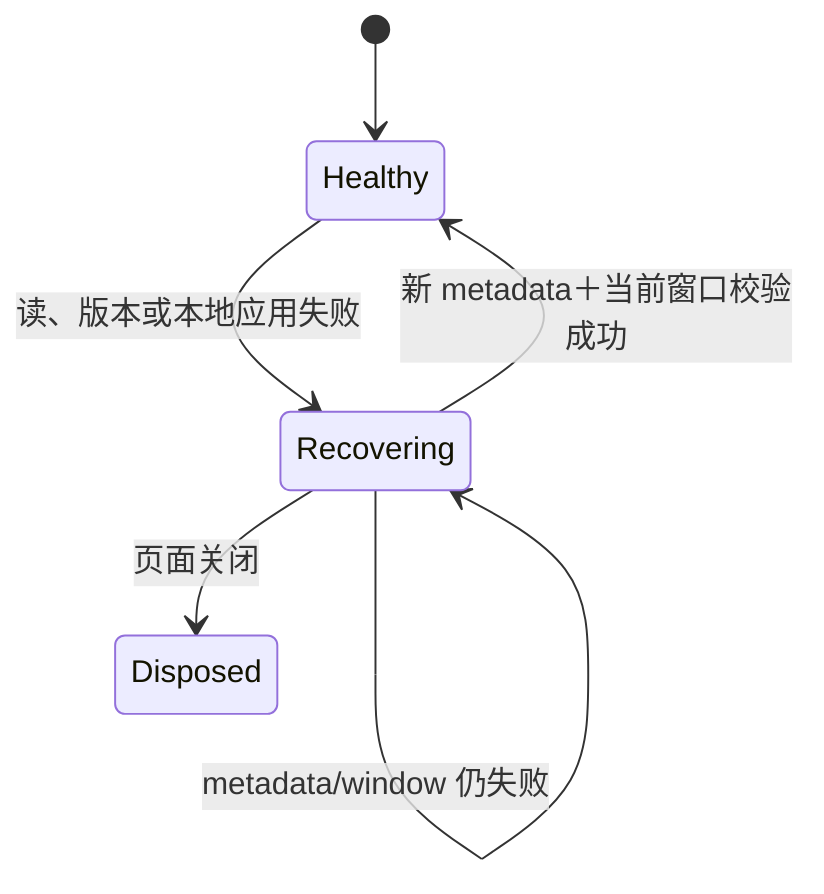

步骤：

1. 暂停 mutation 和 Undo/Redo。
2. 保留当前 Canvas、纵向位置和横向位置。
3. 读取最新 metadata。
4. 用最新 revision 读取当前窗口。
5. 校验 revision、total、offset 和 rows 数量。
6. 一次更新 cache、records 和 scrollbar。
7. 恢复编辑。

重试间隔：

```text
立即 → 500ms → 1s → 2s → 5s → 每 5s
```

每次加入 ±20% jitter，避免多个会话同时请求。

### 17.3 安全边界

- metadata/window 可以自动重试。
- Insert/Delete/Update/Paste 不自动重试。
- Undo/Redo 不自动重复执行。
- 多个错误复用同一个恢复 Promise。
- 页面关闭后取消 timer，忽略 pending response。
- 恢复期间不清空表格，不显示遮挡 Canvas 的 loading。

当前方案覆盖常见的暂时读取失败、版本交错和本地应用失败。它不保证：

- Extension Host 或 C++ 进程崩溃后的事务状态仍存在。
- 永久挂起的写事务能够确认是否提交。
- 磁盘损坏。
- 后端返回格式正确但业务内容错误。

生产 C++ 如需解决“写超时后是否已经提交”，应增加：

```text
mutationId
queryMutationStatus(mutationId)
幂等提交或事务结果持久化
```

### 17.4 diagnostics 模块

```text
src/diagnostics/
  editorDiagnostics.ts
  vscodeEditorDiagnostics.ts
  index.ts
```

记录：

- 关联 ID、时间、级别。
- area、operation、phase。
- requestId、revision、window offset。
- error code、message、stack。
- 自动恢复成功结果。

禁止记录：

- 单元格内容。
- 完整行和窗口 records。
- Clipboard/Paste 内容。
- UTD/`.pat` 文本。
- 完整请求 payload。

重复错误第一次立即输出，随后 30 秒内抑制；下一次输出附带抑制数量。正常滚动、
绘制和 cache hit 不写日志。日志只进入 VS Code `LogOutputChannel`，项目不会
创建额外日志文件。

## 18. VS Code Custom Editor 生命周期

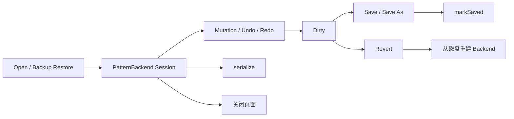

### 18.1 Open

- 从文件、Untitled 数据或 backup 建立 backend 会话。
- Webview 再通过 metadata/window 获取显示数据。

### 18.2 Save / Save As

- backend 序列化当前文档状态。
- Provider 写文件。
- 只有写盘成功后调用 `markSaved()`。
- 通知 Webview 更新 dirty 状态。

### 18.3 Revert / Reload

- 明确放弃未保存内容。
- 从磁盘重新建立 backend 会话。
- Webview 保持合理视口并读取新 revision。
- 不自动监听外部文件变化。

### 18.4 Backup

- 序列化当前未保存会话。
- 不能为了 backup 展开亿级基础数据。
- 当前 synthetic 使用稀疏 piece/override 快照；C++ 使用真实文档格式能力。

### 18.5 Dispose

- 释放 backend 会话。
- 取消恢复 timer。
- 拒绝 Webview pending request。
- 迟到 response 不得再修改表格。

注册配置：

```ts
supportsMultipleEditorsPerDocument: false
```

## 19. C++ ICE 对接合同

### 19.1 前端看到的最小 Backend

```ts
interface PatternBackend {
  getMetadata(): PatternMetadata;
  getWindow(request: PatternWindowRequest): PatternWindowResponse;
  applyMutation(request: PatternMutationRequest): PatternMutationResponse;
  undo(): PatternHistoryResponse;
  redo(): PatternHistoryResponse;
  serialize(): Uint8Array;
  markSaved(): void;
  dispose(): void;
}
```

真实项目中 Extension Host 可用 ICE proxy 实现该接口。Webview 不应直接知道
ICE object、UTD 指针或 `.pat` 解析结构。

### 19.2 C++ 会话必须保证

- 同一会话内 rowKey 稳定且不与位置绑定。
- revision 单调推进。
- `expectedRevision/baseRevision` 校验在事务内部完成。
- mutation 全部成功或全部失败。
- window 与 metadata 返回同一版本。
- Undo/Redo 恢复结构、单元格、静态 Cycle、dirty 和历史状态。
- Save 序列化的是当前权威状态。
- 大文档读取和 serialize 不展开不必要的全量中间数组。

### 19.3 错误分类

至少需要：

```text
REVISION_CONFLICT
VALIDATION_ERROR
INTERNAL_ERROR
```

- `VALIDATION_ERROR`：用户输入不合法，事务未提交，前端局部恢复乐观值。
- `REVISION_CONFLICT`：事务未提交，前端读取最新权威状态。
- `INTERNAL_ERROR`：不能证明本地状态正确，前端进入自动安全读恢复。

错误 message 不应包含完整行、单元格内容或文件文本，以免进入日志。

## 20. 当前限制与后续工作

### 20.1 当前参考实现限制

- synthetic backend 最大配置为 3 亿行，这是验证上限，不是产品协议极限。
- 当前演示列为固定 Pattern 字段和 12 个 Signal。
- TypeScript piece store 只验证语义，不替代 C++ 文档结构。
- 当前不恢复正在打开的单元格编辑框。
- 当前不保证进程崩溃后的 exactly-once mutation。

### 20.2 真实接入必须继续确认

1. 最大 Signal 数和单行 payload。
2. C++ window P95 延迟和序列化成本。
3. 静态 Cycle 依赖和重算策略。
4. Undo/Redo 历史预算、合并策略和保存基线。
5. mutationId 与事务状态查询。
6. Find/Replace 的后端搜索与批量事务接口。
7. failing cycle 错误定位、单元格样式和四周导航标识。
8. 单元格修改角标与保存基线展示。

这些功能应建立在当前后端真源和窗口协议上，不应让前端重新持有全量数据。

## 21. Pattern 与 Timing 复用评估

Timing 预计约 10 万行，默认不使用 Pattern 的：

- 亿级压缩 scrollbar。
- 前/当前/后三窗口缓存。
- 1,000 行重叠窗口切换。
- Pattern rowKey/vectorIndex/Cycle 协议。
- Pattern Paste 越界新增规则。
- Pattern 结构 mutation 后位置调整。

可复用程度是架构估计，不是代码行统计：

| 能力 | 预计复用 | 说明 |
| --- | ---: | --- |
| Custom Editor 生命周期 | 70%～90% | Open、Save、Revert、Backup 相似 |
| diagnostics | 90%～100% | 不依赖表格领域 |
| Webview 请求配对 | 60%～80% | Timing 使用自己的协议 |
| `DocumentTableSurface` | 60%～80% | 需增加搜索 UI 行 |
| adapter 基础部分 | 50%～70% | 尺寸、选区、Clipboard、事件 |
| TSV 解析 | 80%～100% | Timing 支持粘贴时 |
| revision/后端真源 | 概念复用 | 字段和 mutation 独立 |
| Pattern `LogicalViewport` | 0%～20% | 只有规模显著增加时再评估 |

Timing 第一选择：

```text
后端返回最多约 10 万条真实 records
        ↓
前端保存真实 records，不创建 total 长度空数组
        ↓
VTable setRecords＋自身虚拟绘制
```

前提是用真实列数和对象大小验证内存。若 10 万行过宽或筛选成本明显，再升级为
后端筛选＋简单分页/普通窗口，仍不需要 Pattern 压缩 runtime。

## 22. Timing 搜索行参考设计

本节只是未来参考，不在 Pattern 中实现。

已确认行为：

- 搜索行固定在表头下面。
- 多个列条件可以同时存在。
- 多条件默认 AND。
- Reset 清空全部条件。
- 视觉上在表格内容区。
- 业务上不是 Timing 数据。

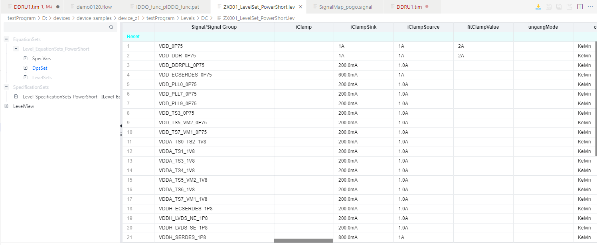

推荐渲染模型：

```ts
type TimingRenderRow =
  | {
      rowKind: "search";
      rowKey: "ui:search";
    }
  | {
      rowKind: "data";
      rowKey: string;
      // Timing fields
    };
```

搜索行：

- 不计入业务 `total`。
- 不参与业务 offset。
- 不参与 Delete、Paste、Undo/Redo 和保存。
- 不由 backend 生成 rowKey。
- 使用 frozen row 或专用 renderer 固定。
- adapter 在形成 mutation 前必须过滤 `rowKind="search"`。

后端筛选概念：

```ts
type TimingFilter = {
  fieldId: string;
  operator: string;
  value: string;
};

type TimingQueryRequest = {
  filters: TimingFilter[];
  offset: number;
  limit: number;
};

type TimingQueryResponse = {
  totalMatches: number;
  rows: TimingDataRow[];
};
```

完整 10 万行已在前端且实测可接受时，可先前端 AND 筛选。若字段多、筛选重或
数据由后端管理，则由后端组合筛选。该决策等 Timing 开发时测量，不污染 Pattern。

## 23. 完整总时序与新开发人员检查表

### 23.1 从打开到保存

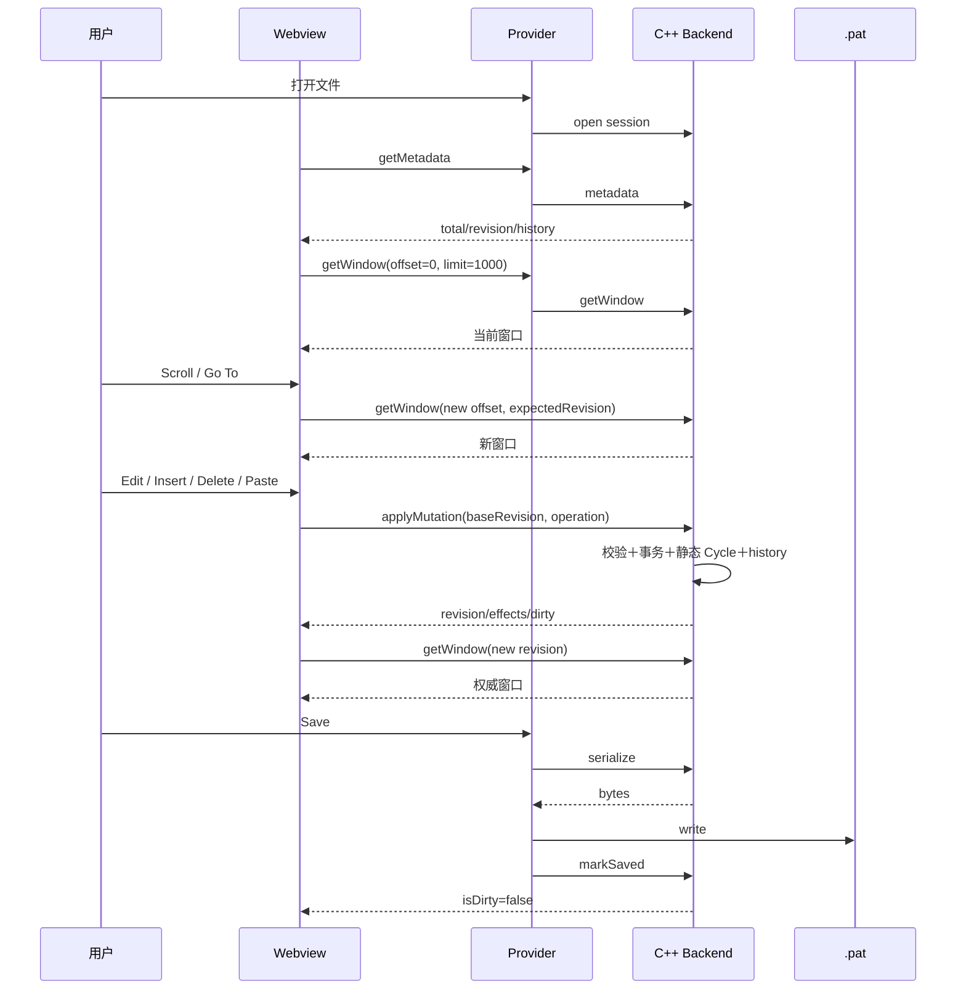

### 23.2 mutation 异常

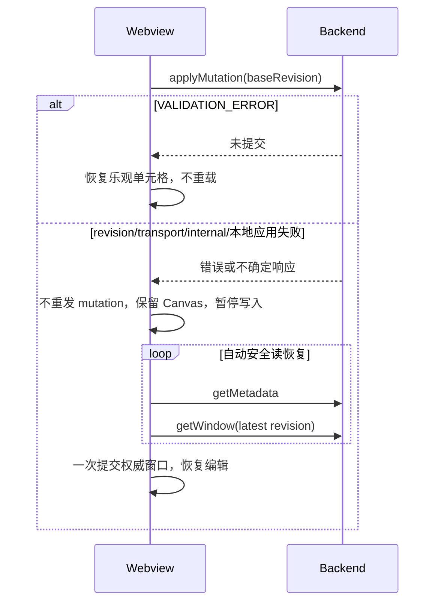

### 23.3 新开发人员阅读顺序

1. [通俗改造说明](./pattern-large-data-refactor-overview.md)。
2. 本文第 3～6 节：目标、字段、架构和职责。
3. `src/shared/protocol.ts`：接口字段。
4. `src/pattern-domain/patternTableBinding.ts`：列和 Pattern 字段。
5. `src/webview/PatternTable.tsx`：如何装配公共模块。
6. `src/webview/usePatternViewport.ts`：公开操作和恢复协调。
7. `src/extension/patternBackend.ts`：C++ ICE 替换边界。
8. `src/extension/patternEditorProvider.ts`：Custom Editor 生命周期。
9. 只需通过 `src/pattern-large-data-vtable/index.ts` 理解核心接口。
10. 只有排查滚动或缓存问题时再深入 `logicalViewport.ts`。

### 23.4 对接检查表

```text
[ ] metadata 不包含全量 rows
[ ] getWindow 支持 offset/limit/expectedRevision
[ ] rowKey 会话内稳定且前端不可解析
[ ] window 返回 vectorIndex 和静态 cycleText
[ ] mutation 校验 baseRevision
[ ] Insert/Delete/Update/Paste 全部原子
[ ] Paste 更新＋新增只产生一次 revision/history
[ ] effects 能描述实际结构和单元格变化
[ ] Undo/Redo 在后端执行
[ ] Save 成功后才更新保存基线
[ ] Revert/Reload 从磁盘重建会话
[ ] 安全读可超时重试，写操作不自动重放
[ ] diagnostics 不包含行、单元格、Paste 或文件内容
[ ] 关闭页面后释放会话并忽略迟到响应
[ ] 最大 Signal 数和真实 payload 已单独测量
```

## 附录：当前代码迁移分类

整体复制：

- `src/pattern-large-data-vtable/`
- `src/diagnostics/`
- Custom Editor Provider 生命周期骨架
- Webview requestId 配对方式

按真实 Pattern 替换：

- `src/shared/protocol.ts` 中领域字段。
- `src/pattern-domain/patternTableBinding.ts`。
- 产品页面和工具栏。
- `PatternBackend` 的 C++ ICE 实现。

不复制：

- `src/dev-only/`。
- synthetic backend/store。
- `examples/acceptance/`。
- 浏览器性能探针和开发故障注入。

当前不发布 npm package。先以内聚目录迁移，等出现第二个真实且相同的亿级使用方
并证明 API 稳定后，再评估独立包。
