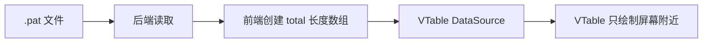
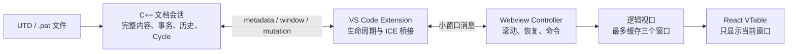
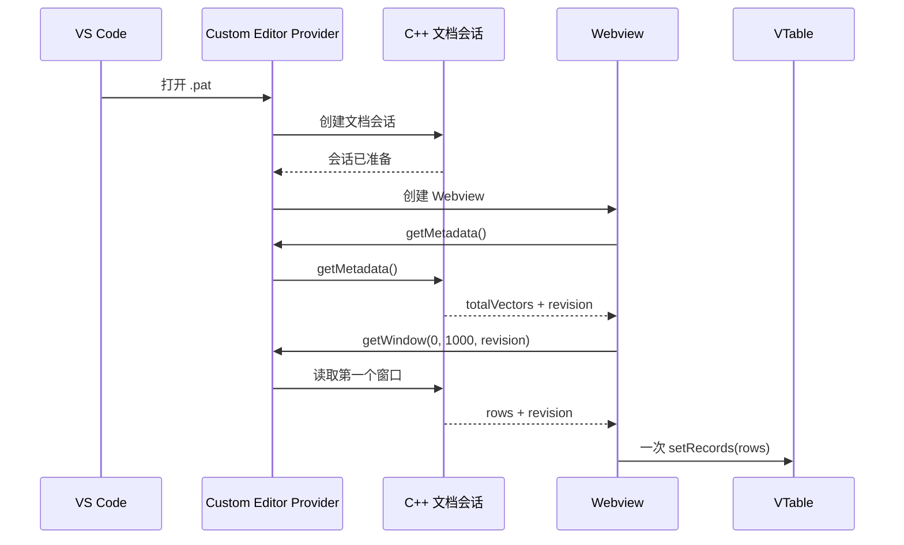
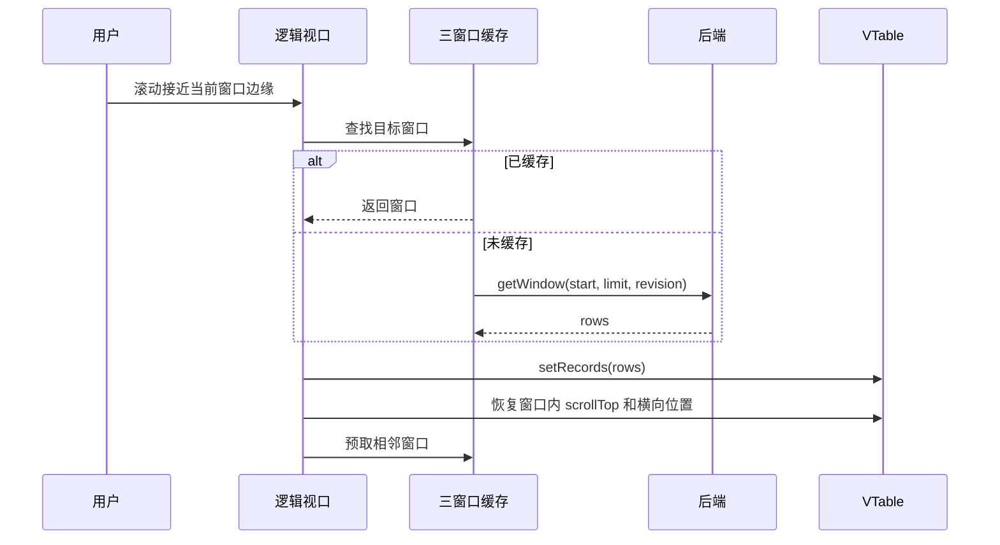
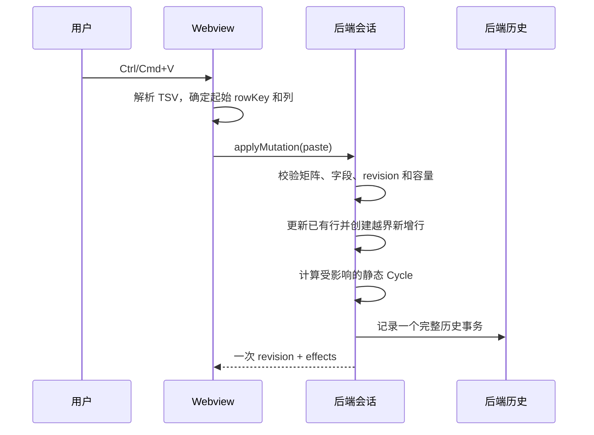
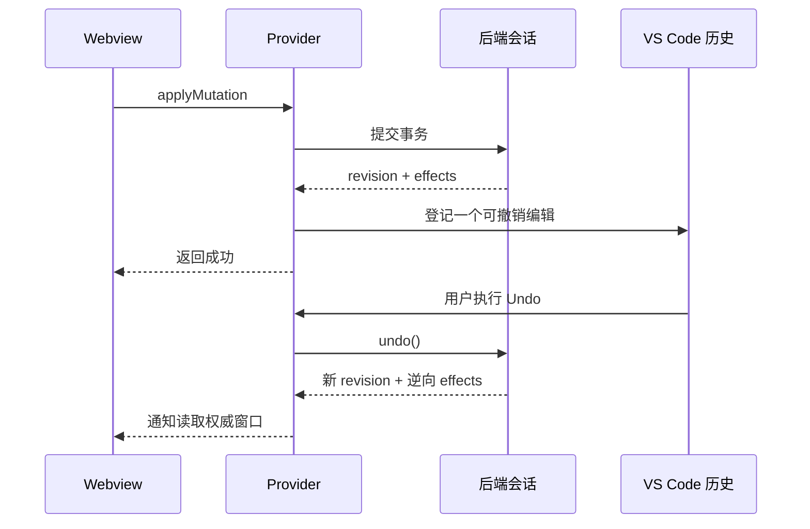
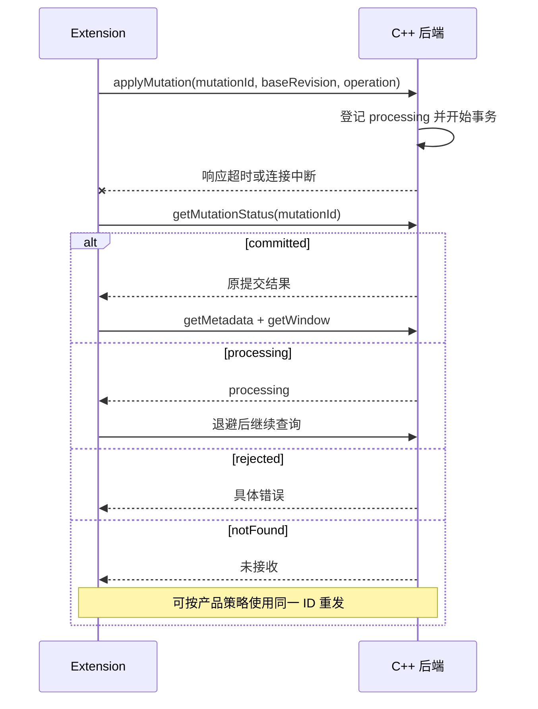
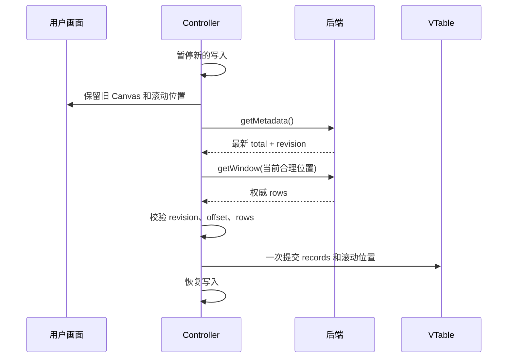
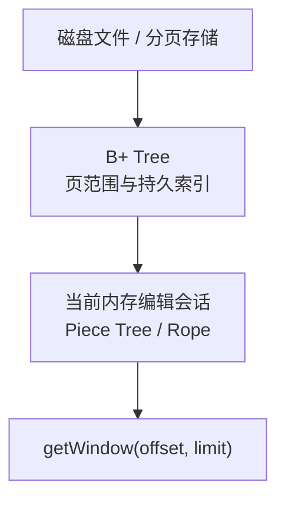

# Pattern 亿级可编辑表格技术方案

> 适用读者：第一次接触本方案的前端开发、C++ 后端开发和技术负责人
>
> 当前实现：VS Code Custom Editor + React VTable + TypeScript 参考后端
>
> 最终产品：VS Code Custom Editor + React VTable + C++ ICE 文档会话

这篇文档是当前项目唯一的正式方案说明。建议从头阅读：前半部分先解释为什么
需要改造以及前后端如何配合，后半部分再介绍协议、异常处理和 C++ 数据结构。
源码文件名只放在最后的阅读附录中。

---

## 1. 为什么必须重构 Pattern

### 1.1 先说明：问题不是 VTable 本身

VTable 的 DataSource/CachedDataSource 是官方提供的异步加载方案，适合分页读取、
局部加载和只显示当前区域的数据。现有 Pattern 选择它有合理原因。

这次改造针对的是另一层问题：当 Pattern 达到一亿甚至三亿行，并且还要支持
Insert、Delete、Paste、Undo/Redo、Save 和全局 Cycle 计算时，如果前端仍按
`total` 创建同等长度的数组，后续成本会变得不可控。

可以把旧方案理解为：



VTable 确实只绘制屏幕附近的单元格，但绘制之前创建的超长数组、数组中间插入
删除、历史数据和跨进程传输仍然存在。也就是说，表格画得少，不代表前端已经
不需要承担完整数据结构的成本。

### 1.2 全长空数组初始化

如果 `total = 100,000,000`，前端先创建一亿个空位置，即使每个位置还没有真实
行数据，也需要：

- 分配数组和索引空间；
- 初始化 DataSource；
- 让垃圾回收器跟踪这个大对象；
- 在页面重开、Revert 或重新加载时再次处理。

不同机器、VS Code 版本和 Electron 版本可承受的内存不同，不能把“某台开发机
暂时能打开”作为产品容量保证。

### 1.3 大数组上的 Insert/Delete

在普通数组中间插入或删除数据，需要调整后面大量元素的位置。数据越大，
操作耗时和临时内存越明显。

Pattern 的 Insert/Delete 还会带来更多变化：

- 后续 Vector 显示位置变化；
- 静态 Cycle 可能重新计算；
- 当前选择和当前看到的数据需要保持；
- Undo/Redo 需要记住这次结构变化；
- 缓存和旧请求需要失效。

因此它不是一次简单的 `array.splice()`。

### 1.4 Undo/Redo 不能长期保存前端大数组副本

如果每次操作都由前端保存大数组快照，历史越多，内存增长越快。只限制历史
条数也不能直接解决问题，因为 VS Code 仍可能持有对应的 Undo/Redo 命令。

正确做法是：

- VS Code 保存“可撤销命令”的入口；
- 后端保存真正的修改片段和逆向操作；
- 近期历史使用内存预算；
- 较旧历史写入当前文档会话的临时文件；
- 关闭文档后清理临时历史。

详细规则见第 10 节。

### 1.5 Webview 和 Extension Host 都不应保存全量 Pattern

VS Code Webview 和 Extension Host 是不同进程。它们没有一个稳定、统一的
“最多可以使用多少 GB”承诺，实际容量取决于：

- 操作系统和物理内存；
- VS Code/Electron/Node 版本；
- 同时打开的其他编辑器和插件；
- Pattern 的列数、字符串长度和对象结构；
- 垃圾回收时机。

大量行从 Extension 传到 Webview 时还需要序列化、复制和反序列化。即使某一端
能放下，传输和复制也可能造成卡顿。

所以本方案不以“碰到进程内存上限”为容量设计，而是从结构上限制：

- Webview 只接收小窗口；
- VTable 同时只使用一个窗口；
- 前端缓存最多三个窗口；
- Extension 不保存完整 JavaScript 行数组；
- 完整文档由 C++ 会话管理。

### 1.6 静态 Cycle 必须由后端计算

前端通常只有当前位置附近的一小段数据，而静态 Cycle 可能受窗口外 Instruction、
循环结构或其他 Pattern 语义影响。

如果前端根据局部窗口计算：

- 窗口边缘可能算错；
- Insert/Delete 后可能需要读取很大范围；
- 前端和后端可能得到不同结果；
- Undo/Redo、Save、Revert 后更难保证一致。

因此 `cycleText` 由后端文档会话计算，前端只负责显示。

### 1.7 失败和请求交错会造成内容不一致

旧方案中，前端可能先修改数组，后端再保存文件。遇到以下情况时，很难证明
前端画面、后端会话和磁盘文件仍然完全一致：

- 写操作超时，但后端其实已经提交；
- Revert 与旧窗口请求同时返回；
- 一个旧 revision 的响应晚于新响应；
- Save 或 Backup 中途失败；
- Webview 关闭时仍有 pending 请求；
- 本地缓存更新失败，但后端已经成功。

因此新的边界是：

> 后端文档会话保存完整、可编辑的 Pattern；前端只显示和编辑当前小窗口。

---

## 2. 新方案的一句话说明

后端保存完整文档和所有修改，前端每次只读取当前位置附近的一小段，VTable
也只渲染这一小段。



总行数可以是一亿，但一次窗口请求仍然只返回例如 1,000 行。总行数主要影响
滚动范围，不直接决定前端保存多少行对象。

---

## 3. 前端、Extension 和后端分别负责什么

| 能力 | Webview 前端 | VS Code Extension | C++ 后端会话 |
| --- | --- | --- | --- |
| 表格绘制和交互 | 负责 | 不负责 | 不负责 |
| 纵向逻辑滚动 | 负责 | 不负责 | 不负责 |
| 当前三个窗口缓存 | 负责 | 不负责 | 不负责 |
| 完整 Pattern 内容 | 不保存 | 不保存完整行数组 | 负责 |
| `rowKey` 生成 | 不生成、不解析 | 只转发 | 负责 |
| 静态 Cycle | 只显示 | 只转发 | 负责计算 |
| Insert/Delete/Update/Paste | 发出一次操作 | 路由、登记 VS Code 历史 | 校验并原子提交 |
| Undo/Redo | 接收结果并刷新窗口 | 接收 VS Code 命令 | 执行真实逆向操作 |
| Save/Save As | 不直接写盘 | 处理 VS Code 生命周期 | 提供可保存内容或执行保存 |
| Revert/Backup | 刷新界面 | 处理 VS Code 生命周期 | 重建或序列化会话 |
| 错误日志 | 上报安全上下文 | 写 LogOutputChannel | 返回明确错误 |

这里“原子提交”的意思是：一次操作要么全部成功，要么完全不改变文档。例如
Paste 同时修改已有行并新增越界行，不能只成功一半。

---

## 4. 第一次阅读必须理解的字段

### 4.1 文档摘要

```ts
type PatternMetadata = {
  totalVectors: number;
  revision: number;
};
```

| 字段 | 通俗解释 |
| --- | --- |
| `totalVectors` | 当前文档一共有多少条 Vector |
| `revision` | 当前打开会话的数据版本，每次有效事务成功后递增 |

Webview 不再维护 `isDirty`、`canUndo`、`canRedo`。标签页圆点、是否可以 Undo/
Redo 和 Save 后变为 clean 均由 VS Code Custom Editor 历史和文件生命周期控制。

### 4.2 窗口请求

```ts
type PatternWindowRequest = {
  startVectorIndex: number;
  vectorCount: number;
  expectedRevision: number;
};
```

| 字段 | 通俗解释 |
| --- | --- |
| `startVectorIndex` | 从第几条逻辑 Vector 开始读取，0-based |
| `vectorCount` | 希望最多读取多少条，不是结束位置 |
| `expectedRevision` | 前端认为自己正在查看的数据版本 |

响应还会带回：

| 字段 | 通俗解释 |
| --- | --- |
| `rows` | 当前小窗口的真实行 |
| `startVectorIndex` | 后端实际返回窗口的起始位置 |
| `revision` | 这些行属于哪个数据版本 |

### 4.3 行字段

```ts
type PatternRenderRow = {
  rowKey: string;
  vectorIndex: number;
  cycleText: string;
  instruction: string;
  comment: string;
  signalValues: Record<string, string>;
};
```

| 字段 | 通俗解释 |
| --- | --- |
| `rowKey` | 当前会话内这条数据的稳定身份 |
| `vectorIndex` | 当前逻辑位置，前面插入或删除后会变化 |
| `cycleText` | 后端计算好的静态 Cycle 显示文本 |
| 其他字段 | Pattern 实际显示和编辑的数据 |

`rowKey` 和 `vectorIndex` 不能混用：前者回答“是哪条数据”，后者回答“现在排在
哪里”。

### 4.4 写入字段

| 字段 | 通俗解释 |
| --- | --- |
| `baseRevision` | 用户操作开始时看到的版本 |
| `previousRevision` | 后端提交前版本 |
| `revision` | 后端提交后版本 |
| `effects` | 本次实际影响了哪些位置、多少行或多少单元格 |
| `updatedRows` | 单行更新成功后可直接返回的新行 |

正常有效事务满足：

```text
baseRevision == 后端提交前 revision
新 revision == previousRevision + 1
```

没有产生任何变化的操作可以不增加 revision。

---

## 5. 文档打开和第一个窗口



第一屏准备完成前不需要创建 `totalVectors` 长度的数组。空文件返回
`totalVectors = 0` 和空窗口，但仍可以 Insert。

---

## 6. 亿级纵向滚动、小窗口和缓存

### 6.1 默认窗口参数

```text
windowSize = 1000
windowShift = 500
guardRows = 150
cacheWindowLimit = 3
```

- VTable 同时只接收当前一个窗口，最多约 1,000 行。
- runtime 最多保留前窗、当前窗、后窗三个 entry。
- 窗口相互重叠，减少切换时的跳动。
- cache key 为 `revision:startVectorIndex`。
- 同一 key 正在读取时复用同一个 Promise。

这些参数是当前验证默认值，不暴露给普通用户。

### 6.2 为什么需要独立的纵向滚动层

浏览器原生滚动高度有上限，一亿行乘以行高会超过可靠像素范围。本方案保留
三种内部策略：

- `single-window`：小数据可以直接显示全部逻辑高度；
- `direct-pixel`：中等数据直接按真实像素滚动；
- `compressed`：超大数据把有限滚动高度映射为完整逻辑位置。

三种模式共用同一个 runtime 和请求协议，业务层不需要分别处理。

横向滚动继续由 VTable 管理，因为横向列宽仍是当前表格的真实像素宽度。

### 6.3 窗口切换



旧请求返回时还要检查窗口世代和 revision。已经被新滚动目标替代的响应不得
覆盖当前画面。

---

## 7. rowKey、显示位置和静态 Cycle

### 7.1 rowKey 生成规则

生产后端建议：

- 原始行：根据不可变源片段身份和源片段内位置生成；
- 新增行：使用会话内单调 ID 或 128-bit 唯一 ID；
- 后端维护 `rowKey -> 树节点/记录位置` 的索引；
- 前面 Insert/Delete 不改变已有行的 rowKey；
- 前端只能比较和回传，不能解析其格式。

本方案只要求当前打开会话内稳定。Reload、Revert、关闭后重新打开时允许重新
生成 rowKey；这时前端必须清空旧缓存和旧选择。

### 7.2 vectorIndex

`vectorIndex` 是当前逻辑位置。前面插入五行后，同一条数据的 vectorIndex 会
增加五；删除前面五行后会减少五。前端显示的 Vector 序号由当前位置决定，
不写入 rowKey。

### 7.3 静态 Cycle

后端是静态 Cycle 的唯一计算者。事务提交、Undo/Redo 和 Revert 返回的新窗口
必须包含与该 revision 一致的 `cycleText`。

后端可以在树节点中维护 Cycle 相关摘要，使 Insert/Delete 后只重算受影响的
区间和必要的父节点，而不是每次生成完整前端数组。

---

## 8. Insert、Delete、Update 和 Paste

### 8.1 一个统一写入口

```ts
type PatternMutationOperation =
  | { kind: "insertRows"; atVectorIndex: number; count: number }
  | { kind: "deleteRows"; rowKeys: string[] }
  | { kind: "updateCells"; changes: PatternCellChange[] }
  | {
      kind: "paste";
      startRowKey: string;
      columns: PatternEditableColumnId[];
      values: string[][];
    };

type PatternMutationRequest = {
  baseRevision: number;
  operation: PatternMutationOperation;
};
```

它们共用 `applyMutation()`，但保留不同 `kind`，因为每种操作的校验和历史数据
不同。统一入口便于做 revision 校验、日志、事务和错误处理；独立 kind 让后端
不需要猜测用户意图。

### 8.2 Paste 为什么是独立 operation

Paste 可能同时：

- 更新当前已有行；
- 超过文档末尾后新增行；
- 修改多个字段；
- 需要一次 Undo 全部恢复。

如果前端把它拆成 Update 和 Insert 两次请求，中间失败就会只完成一半。因此
Paste 是统一 mutation 中的一种独立 operation，并在后端一次事务内完成。



第一版规则：

- 只允许从已有选中行开始；
- 越界部分只能追加到末尾，不创建中间空洞；
- 矩阵不规则、只读列、非法值或超过容量时整次拒绝；
- 空白单元格覆盖为空字符串；
- 已有行 rowKey 不变，新增行获得新 rowKey；
- 一次最多 10,000 行、100,000 个单元格；
- 一次 Undo 同时恢复旧值并删除新增行。

### 8.3 前端成功后的处理

- 单个单元格更新：后端返回唯一 `updatedRow` 时，可原子迁移重叠缓存。
- 批量 Update、Insert、Delete、Paste：默认读取新 revision 的权威窗口。
- 无法证明只是安全局部变化时，不猜测性修补缓存。
- 后端成功而本地缓存迁移失败时，进入自动权威恢复，不能重发 mutation。

---

## 9. 结构变化后如何保持当前看到的数据

结构操作前，前端记录：

```text
当前第一条可见数据的 rowKey
它在可视区域内的像素位置
横向 scrollLeft
当前逻辑位置（rowKey 被删除时作为备用）
```

后端提交后：

1. 如果该 rowKey 仍存在，找到它的新位置；
2. 将它恢复到原来的屏幕像素位置；
3. 恢复横向 scrollLeft；
4. 如果该行被删除，使用 effects 和新 total 选择最近的有效位置；
5. 如果剩余数据不足一屏，从前面补足可显示行。

例如当前第一条可见数据原来位于第 100 行：

- 在它前面插入 5 行：同一条数据的新位置变为第 105 行，但屏幕上仍保持在
  原来的位置；
- 在它前面删除 5 行：同一条数据的新位置变为第 95 行，屏幕上仍保持不动；
- 它后面的数据被大量删除：若剩余内容不足一屏，窗口会向前补行，而不是让
  表格下面出现大片空白。

这就是“保持用户当前看到的那条数据”，不要求业务代码理解额外术语。

---

## 10. VS Code Undo/Redo 和文件生命周期

### 10.1 Undo/Redo 分工

每次 mutation 成功后，Provider 向 VS Code 提交一个
`CustomDocumentEditEvent`：



- VS Code 保存命令顺序，并控制标签页 dirty 圆点；
- 后端保存真正的数据变化和逆向操作；
- Webview 不保存历史栈，也不传输 `canUndo/canRedo/isDirty`；
- Webview 没有额外 Undo/Redo 按钮，统一使用 VS Code 菜单和快捷键。

### 10.2 大量 Undo/Redo 怎么限制

不能只在后端设置“最多 100 条，超过就删除”，因为 VS Code 可能仍然调用被
删除的旧历史。

生产建议：

```text
近期历史：内存中的紧凑 delta / piece 变化
较旧历史：当前文档会话的临时文件
文档关闭：清理临时历史
```

后端按内存字节预算管理，而不是只按操作条数管理。一个单元格修改和一次十万
单元格 Paste 的成本不同，不应都算作同样大小的一条。

如果产品必须彻底截断历史，需要 VS Code 历史与后端历史共同建立可确认的截断
协议；本版本不自行截断。

### 10.3 Save 和 Save As

Save 表示把当前会话内容成功写入磁盘。只有写盘成功，VS Code 才把标签页变为
clean。Save 不需要删除 Undo/Redo 历史，用户保存后仍可以 Undo；一旦内容再次
离开已保存状态，VS Code 会重新显示 dirty 圆点。

### 10.4 Revert

Revert 明确放弃未保存修改：

1. 从磁盘重新读取；
2. 创建新的后端文档状态；
3. 清空旧窗口缓存和旧 rowKey 选择；
4. 保留旧 Canvas，直到新窗口准备完成；
5. 一次替换画面。

### 10.5 Backup

Backup 用于 VS Code 异常关闭后的恢复。真实 C++ 后端不能为了 Backup 展开
一亿行前端数组，应保存会话的紧凑结构、修改片段或可恢复的临时状态。

### 10.6 隐藏页面

当前明确保留：

```ts
retainContextWhenHidden: true
```

用户在多个 Pattern 页面间切换时，Webview、选区、滚动位置和当前表格交互不会
反复重建。它保留的是界面上下文，不是数据真源。

每个隐藏页面仍会占用一个 VTable、当前窗口和最多三个缓存窗口；同时打开很多
Pattern 文件时内存会累加，需要在真实最大列数和真实行大小下测量。这是为了
切换体验主动接受的取舍。

---

## 11. 四类请求的超时和重试

| 请求 | 当前策略 | 原因 |
| --- | --- | --- |
| Metadata | 15 秒超时，可自动重试 | 只读，重复读取不会修改文档 |
| Window | 15 秒超时，可自动重试 | 只读，旧响应还会经过 revision/世代检查 |
| Mutation | 不自动重发 | 超时后无法仅凭前端判断后端是否已提交 |
| Undo/Redo、Save、Revert | 不自动重复执行 | 都会改变会话或文件生命周期 |

安全读取失败后的恢复间隔：

```text
立即 → 500ms → 1s → 2s → 5s → 每 5s
```

加入约 ±20% 随机偏移，避免多个页面同时重试。页面关闭后停止 timer，多个错误
共用同一个恢复 Promise。

当前 mutation 超时后只读取最新 metadata 和当前窗口，不重发原操作。该策略
不会重复写入，但无法单独证明超时事务到底有没有成功。生产 C++ 需要第 12 节
的事务状态查询。

---

## 12. mutationId 和事务状态查询

> 本节是生产 C++ ICE 必须评审的协议扩展，当前 TypeScript 参考实现尚未接入。

### 12.1 请求

```ts
type PatternMutationRequest = {
  mutationId: string;
  baseRevision: number;
  operation: PatternMutationOperation;
};
```

- Extension 为每次用户写操作生成唯一 mutationId，推荐 UUID；
- 同一个文档会话内，后端必须按 mutationId 去重；
- 同一个 mutationId 即使重复到达也不得执行第二次；
- mutationId 不包含行数据和用户内容。

### 12.2 状态查询

```ts
type MutationStatusResponse =
  | { status: "processing" }
  | {
      status: "committed";
      response: PatternMutationResponse;
    }
  | {
      status: "rejected";
      error: PatternRequestError;
    }
  | { status: "notFound" };

getMutationStatus(mutationId): MutationStatusResponse;
```

状态含义：

| 状态 | 含义 | 前端行为 |
| --- | --- | --- |
| `processing` | 后端已接收，仍在执行 | 继续查询，不重发 |
| `committed` | 已完整提交 | 使用结果并读取权威窗口 |
| `rejected` | 已明确拒绝，没有副作用 | 显示具体错误 |
| `notFound` | 当前会话从未接收该 ID | 未来可用同一 ID 安全重发 |

### 12.3 超时后的时序



事务状态至少保留到文档会话关闭。数量很大时可沿用历史的内存预算和会话临时
文件，不能在仍可能查询时无提示删除。

---

## 13. 自动恢复和日志

### 13.1 恢复覆盖范围

当前自动恢复处理：

- metadata/window 暂时失败或超时；
- revision 不一致；
- mutation 成功但本地缓存迁移失败；
- VTable 应用新 records 失败；
- Undo/Redo/Revert 后窗口更新失败；
- 迟到的旧 response；
- 页面关闭时仍有 pending 请求。

不保证：

- Extension Host 或 C++ 进程崩溃后未持久化事务一定可找回；
- 永久挂起且既不返回成功也不返回错误的写操作；
- 磁盘损坏；
- 后端返回格式正确但业务内容错误。

`mutationId`、事务查询、Backup 和 C++ 事务持久化用于继续缩小这些剩余风险。

### 13.2 无闪动恢复



恢复期间不先设置空 records，不用遮罩替换表格。恢复失败继续保留旧画面并按
安全读取策略重试。

### 13.3 diagnostics

独立 diagnostics 模块只记录：

- 内部错误 ID、时间、命令和阶段；
- requestId、revision、窗口起始位置；
- error code、message、stack；
- 自动恢复是否成功。

禁止记录单元格内容、完整行、Paste 文本、窗口 payload 和 `.pat` 文件文本。
相同错误第一次立即输出，之后最多每 30 秒输出一次，并记录期间抑制数量。
正常滚动、绘制和 cache hit 不写日志。

日志进入 VS Code `LogOutputChannel("Pattern Editor Lite")`，不额外创建产品日志
文件，因此不会在正常滚动路径持续写磁盘。

---

## 14. C++ 内存编辑结构和磁盘索引

### 14.1 当前 TypeScript 参考实现的定位

当前 synthetic store 使用 flat piece array，目的是验证窗口协议、事务语义和
亿级逻辑位置，不是生产级 C++ 性能结论。piece 数量持续增加后，线性扫描和
数组 splice 仍会变慢。

### 14.2 内存编辑会话：Piece Tree / Rope

推荐模型：

```text
不可变的原始 Pattern
        +
平衡的 Piece Tree / Rope
        +
每个子树保存行数和 Cycle 相关摘要
```

Piece Tree、Rope 和“带子树行数的平衡树”属于同一类思路，不要求实现三套结构：

- 叶子引用原始文件片段或新增缓冲区；
- Insert 通过切分/拼接节点完成；
- Delete 通过移除或缩短片段完成；
- 子树行数支持按逻辑位置快速定位；
- rowKey 索引支持按稳定身份定位；
- Cycle 摘要支持局部更新；
- 原始文件不因每次修改而整体复制。

具体选择 AVL、Red-Black Tree、B-Tree 形态或其他平衡方式，由 C++ 团队结合
已有基础库决定，但必须提供按行位置查询、区间读取、结构修改和子树统计。

### 14.3 磁盘分页或持久索引：B+ Tree

如果真实 `.pat`/UTD 文件很大、不能在打开时建立完整内存索引，或者希望下次
打开复用持久索引，可以增加 B+ Tree：



B+ Tree 适合：

- 按磁盘页范围读取；
- 保存持久索引；
- 快速定位大文件区间；
- 减少重新打开文件时的全量扫描。

它不替代 Webview 窗口协议，也不表示所有项目必须同时维护两棵树。建议顺序：

1. 先实现正确的内存编辑会话；
2. 测量真实文件打开、索引和内存成本；
3. 只有需要磁盘分页或持久索引时再增加 B+ Tree 层。

### 14.4 数据结构最低能力

C++ 实现至少需要：

- `getWindow(offset, limit)`；
- `findPosition(rowKey)`；
- 按位置插入、按 rowKey/区间删除；
- 批量单元格修改和 Paste 事务；
- Undo/Redo 所需 delta；
- 子树行数；
- 静态 Cycle 的依赖摘要或快速重算入口；
- 序列化、Save、Backup 和 Revert。

---

## 15. C++ ICE 对接合同

当前前端需要的最小能力：

```ts
interface PatternBackend {
  getMetadata(): PatternMetadata;
  getWindow(request: PatternWindowRequest): PatternWindowResponse;
  applyMutation(
    request: PatternMutationRequest
  ): PatternMutationResponse;
  undo(): PatternHistoryResponse;
  redo(): PatternHistoryResponse;
  serialize(): Uint8Array;
}
```

生产版本增加：

```ts
getMutationStatus(mutationId: string): MutationStatusResponse;
```

C++ 会话必须保证：

- 同一会话内 rowKey 稳定且不与当前位置绑定；
- revision 单调推进；
- window 响应属于请求的 expectedRevision；
- mutation 全部成功或完全不改变文档；
- Paste 更新和新增只产生一次事务；
- Undo/Redo 恢复结构、单元格和静态 Cycle；
- 无变化操作可以不推进 revision；
- 错误中不返回敏感行内容。

建议错误分类：

| code | 含义 | 前端处理 |
| --- | --- | --- |
| `VALIDATION_ERROR` | 输入、选区、字段或容量不合法 | 显示错误，局部回退，不重载 |
| `REVISION_CONFLICT` | 用户操作基于旧版本 | 读取最新 metadata/window |
| `NOT_FOUND` | rowKey 在当前会话不存在 | 读取最新状态并提示 |
| `TIMEOUT` | 安全读超时或 ICE 超时 | 按请求类别处理 |
| `INTERNAL_ERROR` | 后端内部失败 | 记录错误并自动权威恢复 |

---

## 16. 重要场景和 Corner Cases

| 场景 | 必须保证 |
| --- | --- |
| 当前区域前插入行 | 保持原第一条可见数据在屏幕上的位置 |
| 当前区域前删除行 | 同一 rowKey 上移后仍保持画面位置 |
| 删除后不足一屏 | 从前面补足，不显示大片空白 |
| 删除当前第一条可见行 | 选择最近仍存在的数据并钳位 |
| Paste 同时更新和新增 | 一次事务、一次 revision、一次 Undo |
| Paste 中有非法值 | 整次拒绝，不能只提交合法单元格 |
| 静态 Cycle 大范围变化 | 后端返回与新 revision 一致的窗口 |
| mutation 成功但响应丢失 | 当前不重发；生产通过 mutationId 查询 |
| mutation 后立即 Undo | VS Code 和后端历史顺序一致 |
| Save 后 Undo | 允许 Undo，VS Code 重新显示 dirty |
| Revert 时旧窗口晚到 | 旧世代/revision 响应不得覆盖新文档 |
| 后端暂时不可用 | 保留旧 Canvas，暂停写入并重试安全读 |
| 最后一行 | 行高、文字和底部网格线完整 |
| 页面隐藏后再显示 | retainContext 保持滚动、选区和交互 |
| 同时隐藏多个 Pattern 页面 | 每页缓存有上限，但总内存需要实测 |
| 关闭页面时有 pending 请求 | 停止 timer，迟到结果不得更新已销毁页面 |
| Reload/Revert 后 rowKey 变化 | 清空旧缓存和旧选择，不解析旧 rowKey |

---

## 17. 当前已经完成和仍需确认的内容

### 17.1 当前 TypeScript 版本已完成

- 0～3 亿 synthetic 逻辑行；
- 单窗口渲染和三窗口缓存；
- single-window、direct-pixel、compressed 三种滚动策略；
- 纵向原生逻辑 scrollbar 和 VTable 横向 scrollbar；
- Insert/Delete/Update/Paste 统一 mutation；
- Paste 更新加越界新增事务；
- VS Code 原生 Clipboard；
- VS Code Custom Editor Undo/Redo；
- Save、Save As、Backup、Revert；
- staged replacement 和自动权威恢复；
- 独立 diagnostics；
- `retainContextWhenHidden: true`。

### 17.2 真实 C++ 接入前必须确认

- 真实 Pattern 行模型、最大列数和单行平均大小；
- 静态 Cycle 的依赖范围和树节点摘要；
- Piece Tree/Rope 的具体平衡结构；
- 是否需要 B+ Tree 磁盘分页或持久索引；
- mutationId 状态保存和去重策略；
- Undo/Redo 内存预算、临时文件格式和清理规则；
- ICE 超时、取消和错误码映射；
- Save/Backup 的紧凑序列化方式；
- 真实 1 亿/3 亿数据的打开、滚动、编辑和内存验收。

### 17.3 当前不属于最终实现

- TypeScript flat piece array；
- synthetic 数据生成规则；
- 固定 12 个 Signal；
- 浏览器 Demo；
- 生产级 mutationId 状态查询；
- 生产级历史临时文件；
- Find/Replace、Failure 标识和修改角标。

---

## 18. 新开发人员代码阅读顺序

业务接入只需按以下顺序：

1. `src/shared/protocol.ts`：先理解字段、窗口和统一 mutation。
2. `src/extension/patternBackend.ts`：理解未来 C++ ICE 需要实现什么。
3. `src/pattern-domain/patternTableBinding.ts`：理解 Pattern 字段如何映射到表格。
4. `src/webview/patternReadClient.ts`：理解 Webview 如何请求 Extension。
5. `src/webview/usePatternViewport.ts`：理解命令、恢复和页面状态。
6. `src/webview/PatternTable.tsx`：理解列配置如何注入公共表格区域。
7. `src/webview/PatternEditorApp.tsx`：理解插件页面装配。
8. `src/extension/patternEditorProvider.ts`：理解 VS Code 文件和历史生命周期。

以下是稳定核心，迁移时通常只看接口：

9. `src/pattern-large-data-vtable/index.ts`
10. `src/pattern-large-data-vtable/DocumentTableSurface.tsx`
11. `src/pattern-large-data-vtable/vtableAdapter.ts`
12. `src/pattern-large-data-vtable/logicalViewport.ts`
13. `src/diagnostics/index.ts`

不需要迁移到真实产品 Webview：

- `src/dev-only/syntheticPatternBackend.ts`
- `src/dev-only/syntheticPatternStore.ts`
- `examples/acceptance`

---

## 19. 评审检查表

```text
[ ] 前端不会创建 totalVectors 长度的数组
[ ] React state 不保存窗口 rows
[ ] VTable 同时只接收当前窗口
[ ] cache 最多三个窗口
[ ] rowKey 会话内稳定且前端不解析
[ ] 静态 Cycle 只由后端计算
[ ] mutation 使用 baseRevision
[ ] Paste 更新和新增是一个事务
[ ] mutation 超时不会直接重发
[ ] 生产协议包含 mutationId 和状态查询
[ ] Undo/Redo 真实数据由后端保存
[ ] 历史按内存预算管理并可写会话临时文件
[ ] retainContextWhenHidden 的多页面内存已经实测
[ ] Save、Revert、Backup 经过真实 C++ 数据验证
[ ] 旧 revision 和迟到响应不能覆盖当前窗口
[ ] 日志不包含行、单元格、Paste 或文件内容
```

---

## 20. 参考资料

- [VTable 异步懒加载说明](https://visactor.io/vtable/guide/data/async_data)
- [VS Code Custom Editor API](https://code.visualstudio.com/api/extension-guides/custom-editors)
- [VS Code Webview API](https://code.visualstudio.com/api/extension-guides/webview)
- [VS Code Process Architecture](https://github.com/microsoft/vscode/wiki/source-code-organization)
